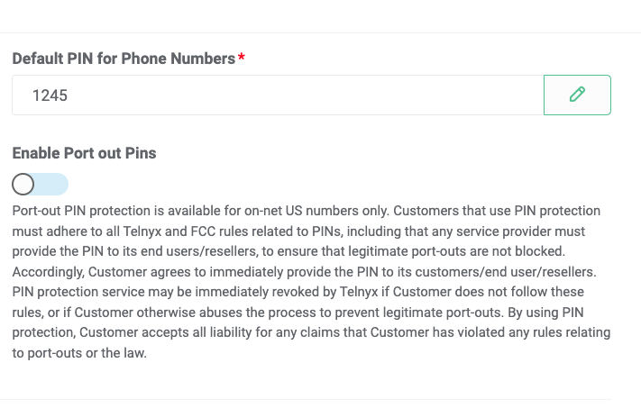
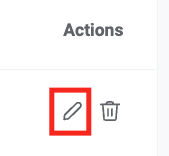
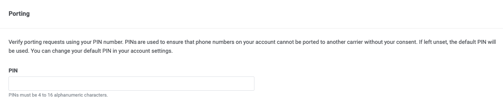
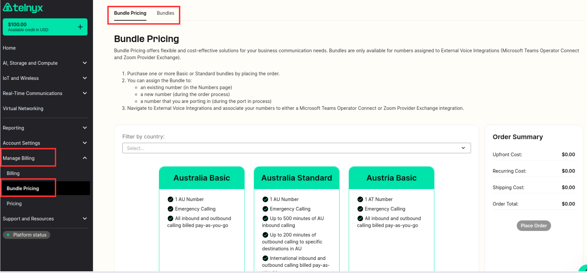

# Telnyx Number Porting Guide

*Part 3 of 5 — see also: [Part 1](telnyx-number-porting-guide--part-1.md), [Part 2](telnyx-number-porting-guide--part-2.md), [Part 4](telnyx-number-porting-guide--part-4.md), [Part 5](telnyx-number-porting-guide--part-5.md)*

A consolidated reference for porting phone numbers to and from Telnyx, covering best practices, FastPort® activation, port request statuses, common error messages, SMS porting behavior, Port Out PIN protection, bundle pre-configuration, and how to contact the Porting team.

## SMS for Ported-In Phone Numbers

For local and toll-free phone numbers in the US and Canada, porting voice and porting SMS are two completely separate processes. A porting order transitioning into a `ported` status indicates that voice has ported to Telnyx, but this status change does not take SMS into consideration. In some cases, messaging may continue to route through the losing carrier for a period of time after the port.

A NetNumber ID (NNID) is the identifier for the provider that owns the SMS routing of a telephone number. [NetNumber](https://netnumber.com/) manages NNIDs. A local or toll-free phone number in the US or Canada must always have an NNID assigned before sending and receiving messages.

At the FOC date/time when the phone number ports, the losing carrier is expected to release the NNID, and the phone number should update to the winning carrier's NNID. As a result, both voice and SMS route through the winning carrier. This is how porting works in the majority of cases.

If the losing carrier fails to release the NNID after the port, the losing carrier will continue to send and receive messages for the phone number. This can occur in three instances:

- A porting "translations" issue: the losing carrier may have unintentionally failed to release the NNID due to an error or bug, or their internal systems may need additional time to recognize the port and release the NNID.
- Some carriers have block policies that allow them to retain SMS for a brief period after a port. The winning carrier must open a support ticket to have the NNID overridden from the losing carrier.
- The customer plans to host SMS elsewhere and only port voice to Telnyx. In this case, the other carrier will reject any attempted NNID overrides.

Telnyx cannot guarantee that the losing carrier will immediately release the NNID when a phone number ports, but can provide additional visibility into when SMS successfully ports and act swiftly on messaging activation issues. See the [developer guide on messaging porting](https://developers.telnyx.com/docs/numbers/porting/messaging-porting) for more information.

### SMS Porting Timelines

- **US/CA local phone numbers:** Roughly 90% of port orders have SMS activated within 10 minutes of a phone number porting. The remaining 10% usually finish within 1–2 business days.
- **US/CA toll-free phone numbers:** SMS usually ports within 10 minutes of the phone number porting. If it does not activate within that window, it may take 4–5 business days.
- **All other phone numbers:** SMS is expected to port at the same time as voice.

If an order shows SMS ported but messages are failing to deliver, confirm that a working messaging profile ID is associated with the phone number. If one is and issues persist, open a support ticket for investigation.

## Port Out PIN Protection

Port Out PIN protection is a Telnyx Portal feature that validates the PIN provided by the losing carrier against account settings when a Port Out request is created. If the PIN matches, the order is created and sent for review as usual. If the PIN does not match (or is not provided), the order is automatically rejected. Auto-rejected orders can be viewed on the [Port Out Requests](https://portal.telnyx.com/#/app/numbers/port-outs) page in the Mission Control Portal. By default, this feature is turned off.

### Enabling PIN Protection and Setting the Default PIN

In the top right of the Portal, select the profile and choose `Account Settings` ([link](https://portal.telnyx.com/#/app/account/general)). Once the page updates, select `Security` and scroll to the Security section:

- **Default PIN for Phone Numbers:** The account-level port out PIN. If port out PINs are enabled and no unique Port Out PIN is associated with a phone number, this PIN applies for validation.
- **Enable Port out Pins:** Toggle Port Out PIN validation on or off for the account. By default, this is toggled off.

Port-out PIN protection is available for on-net US numbers only. Customers using PIN protection must adhere to all Telnyx and FCC rules related to PINs, including that any service provider must provide the PIN to its end users/resellers to ensure legitimate port outs are not blocked. Customers must immediately provide the PIN to their customers/end-users/resellers. PIN Protection service may be immediately revoked by Telnyx if the customer does not follow these rules or otherwise abuses the process to prevent legitimate port-outs. By using PIN protection, the customer accepts all liability for any claims that they have violated any rules relating to port-outs or the law.

### Individual PIN Settings

To set a Port Out PIN for an individual phone number:

1. Go to the [My Numbers](https://portal.telnyx.com/#/app/numbers/my-numbers-beta) page in the Portal.
2. On the right side of the table under the `Actions` header, click the `Edit` icon for the phone number to update.

   
3. On the `Settings` tab, scroll down to the `Porting` section. If there is no value for `PIN`, the default account PIN is applied.

   
4. Enter the code in the `PIN` field and click `Save Changes` at the bottom of the page.

   

This only updates the PIN for the currently selected number. If nothing is provided, the default account-level Port Out PIN is used.

### Applicable vs. Non-applicable Port Out Orders

Port Out PIN protection is available for on-net US numbers only. As a Port Out request is created, a new column titled `PIN Validation` lists either `Eligible` or `Non-Eligible`. PIN validation only occurs on `Eligible` Port Out requests.

## Bundles and Bundle Pricing

Bundles are a Telnyx pricing option. Customers can purchase numbers using bundle pricing, transfer existing numbers to bundle pricing, or update an existing phone number to bundle pricing. Bundle pricing is well suited to Operator Connect and Zoom Phone users who want to control telephony expenses on a per-user basis. Each bundle includes a US local number and E911.

Two bundle types are available:

- **Basic bundle:** 1 US number, E911 Emergency Calling, and all inbound and outbound calling billed pay-as-you-go.
- **Standard bundle:** 1 US number, E911 Emergency Calling, up to 1000 minutes of US inbound and outbound calling, and international inbound and outbound calling billed pay-as-you-go.

On-net calls consume the bundle's included minutes. Programmed voice calls are charged separately and do not affect bundle minutes. Premium numbers are not currently eligible for inclusion in any bundle. Pay-as-you-go calls are charged according to the Bundles rate-deck, available on the Pricing page.

### Getting Started with Bundles

Purchase bundles by logging into the [Mission Control Portal](https://portal.telnyx.com/) and navigating to the Bundles section in the left-side navigation.

[Bundles Page](https://portal.telnyx.com/#/app/bundles/order)

To add a bundle:

1. Select either a basic or standard bundle by clicking the green "Add" button.
2. Use the Search and Buy numbers tab to choose a number, then go to the Cart in the top right corner to link the number with the bundle.

Bundle offers are currently limited to Operator Connect and Zoom Phone users, including only US numbers and calls. For more information, contact [sales@telnyx.com](mailto:sales@telnyx.com). After selecting a number, go to the External Voice Integrations section under the Voice tab in the left-side menu to associate the new bundle number with the desired External Voice Integration.
