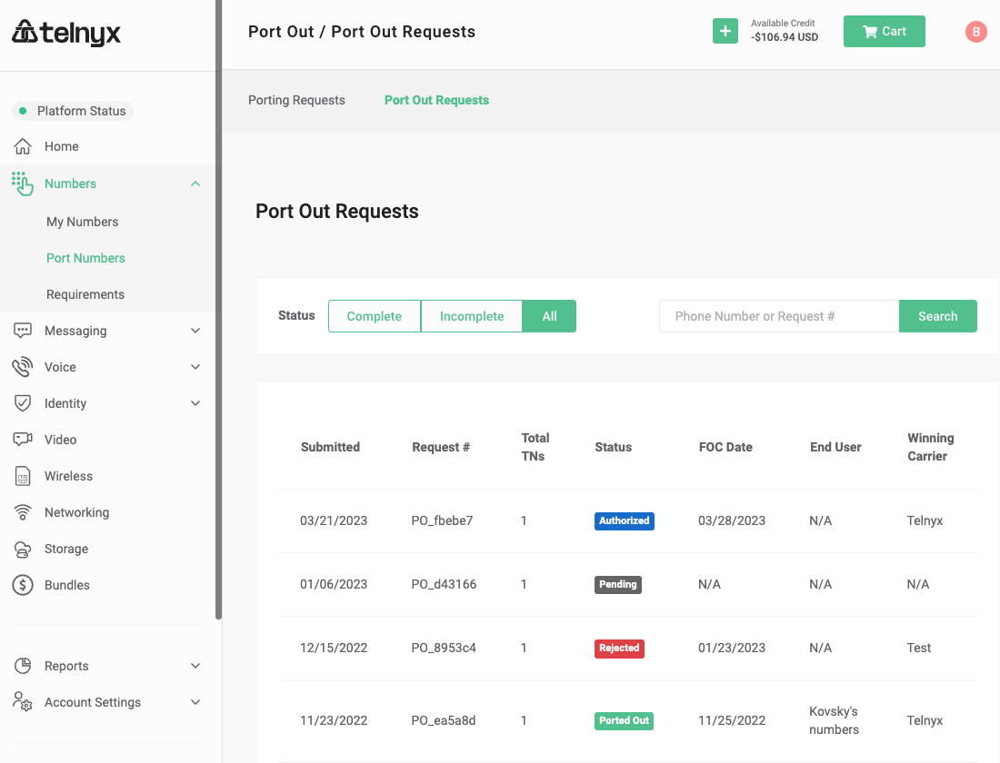

# Telnyx Number Porting Guide

*Part 3 of 4 — see also: [Part 1](telnyx-number-porting-guide--part-1.md), [Part 2](telnyx-number-porting-guide--part-2.md), [Part 4](telnyx-number-porting-guide--part-4.md)*

A comprehensive guide to porting telephone numbers to and from Telnyx, covering port-in best practices, FastPort® activation, common porting error messages, BTN/ATN mismatch resolution, porting PINs and passcodes, port-out notifications and tracking, Port Out PIN Protection, bundle pricing and pre-configuration, and best practices for contacting Telnyx support and the porting team.

## Port Out Tracking

When a port-out request is received, an email notification with a link to the request is sent. Emails go to the account owner by default. If port-out requests are expected but not received, ensure access to view and modify port-outs assigned to the permission set.

The Port Out tab displays a list of all port-out requests, including status, FOC date, total TNs in the request, request details, and winning carrier name. Requests can be filtered by status (`complete` or `incomplete`) and searched by telephone number or Request # (e.g., PO_a24719).

Clicking a request shows additional details, including submitted information, status, winning carrier, requested FOC date, and TNs in the request.

### Accepting the Request

After reviewing the request, accept or reject it. If accepted, the status changes from `Pending` to `Authorized`, and Telnyx notifies the gaining carrier.

### Rejecting the Request

A valid and reasonable reason must be provided to reject the port. If the reason is deemed invalid, the number will be ported out. Numbers cannot be purposely withheld without proper authority or for billing/payment issues. If no valid rejection reason is received, Telnyx may be forced to provide FOC to the gaining carrier.

### No Acknowledgment

If a port-out request is not acknowledged with an approval or rejection, the port will automatically be approved and notice given to the gaining carrier.

### Change in FOC Date

A webhook notification is received if the gaining carrier requests an FOC date change. The gaining carrier has a 10-day grace period, meaning the phone number can be ported at any point between the listed FOC date and the following 10 days. Most port-out orders occur on the listed FOC date, but this is not guaranteed.

### Completed Port Outs

Once confirmed, the port-out request shows a status of `Ported Out`, and the number is removed from the account immediately.

### Port Out Charges

After the port-out is confirmed, the port-out fee is billed. View port-out charges in the Pricing section of the portal. For questions about port-out fees, contact sales@telnyx.com.

## Port Out PIN Protection

Port Out PIN Protection validates the PIN provided by the losing carrier against account settings when a port-out request is created. If the PIN matches, the order is created and sent for review. If the PIN does not match (or is not provided), the order is automatically rejected. Auto-rejected orders can be viewed on the Port Out Requests page in the Mission Control Portal.

By default, this feature is turned off. If left off, no PIN validation occurs on port-out requests.

### Enabling PIN Protection and Setting the Default PIN

In the top right of the portal, select the profile and choose `Account Settings`. Once the page updates, select `Security`. Scroll down to the Security section to find:

- **Default PIN for Phone Numbers:** The account-level port-out PIN. If port-out PINs are enabled and no unique PIN is associated with a phone number, this PIN applies for validation.
- **Enable Port out Pins:** Toggle PIN validation on or off. By default, this is toggled off.

Port-out PIN protection is available for on-net US numbers only. Customers using PIN protection must adhere to all Telnyx and FCC rules related to PINs, including providing the PIN to end users, resellers, or service providers to ensure legitimate port-outs are not blocked. Telnyx may immediately revoke PIN Protection if these rules are not followed or if the process is abused to prevent legitimate port-outs. By using PIN protection, the customer accepts all liability for any related claims.

### Individual PIN Settings

To set Port Out PINs for individual phone numbers:

1. Go to the My Numbers page in the Portal.
2. On the right side of the table under the `Actions` header, click the `Edit` icon for the phone number to update.

3. On the `Settings` tab, scroll down to the `Porting` section. If no value is set for `PIN`, the default account PIN applies.

4. Enter the code in the `PIN` field and click `Save Changes`.

This updates the PIN only for the selected number. If nothing is provided, the default account-level Port Out PIN is used.

### Applicable vs. Non-Applicable Port Out Orders

Port Out PIN protection is available for on-net US numbers only. As port-out requests are created, a new column titled `PIN Validation` shows either `Eligible` or `Non-Eligible`. PIN validation only occurs on `Eligible` port-out requests.

## Bundles and Bundle Pricing

Bundle pricing is an option for purchasing numbers, transferring existing numbers to bundle pricing, or updating an existing phone number to bundle pricing. It is particularly useful for Operator Connect and Zoom Phone users to control telephony expenses on a per-user basis. Each bundle includes a US local number and E911.

Two bundle types are available:

- **Basic bundle:** 1 US number, E911 Emergency Calling, and all inbound and outbound calling billed pay-as-you-go.
- **Standard bundle:** 1 US number, E911 Emergency Calling, up to 1000 minutes of US inbound and outbound calling, and international inbound and outbound calling billed pay-as-you-go.

On-net calls consume the bundle's included minutes. Programmed voice calls are charged separately and do not affect bundle minutes. Premium numbers are not eligible for inclusion in any bundle. Pay-as-you-go calls are charged according to the Bundles rate-deck, downloadable from the Pricing page.

### Getting Started with Bundles

Purchase bundles by logging into the Mission Control Portal and navigating to the Bundles section in the left-side navigation.

[Bundles Page](https://portal.telnyx.com/#/app/bundles/order)

To add a bundle:

1. Select a basic or standard bundle by clicking the green "Add" button.
2. Use the Search and Buy numbers tab to choose a number, then go to the Cart in the top right corner to link the number with the bundle.

Bundle offers are currently limited to Operator Connect and Zoom Phone users, including only US numbers and calls. For more information, contact sales@telnyx.com.

After selecting a number, proceed to the External Voice Integrations section under the Voice tab in the left-side menu to associate the new bundle number with the desired External Voice Integration.
