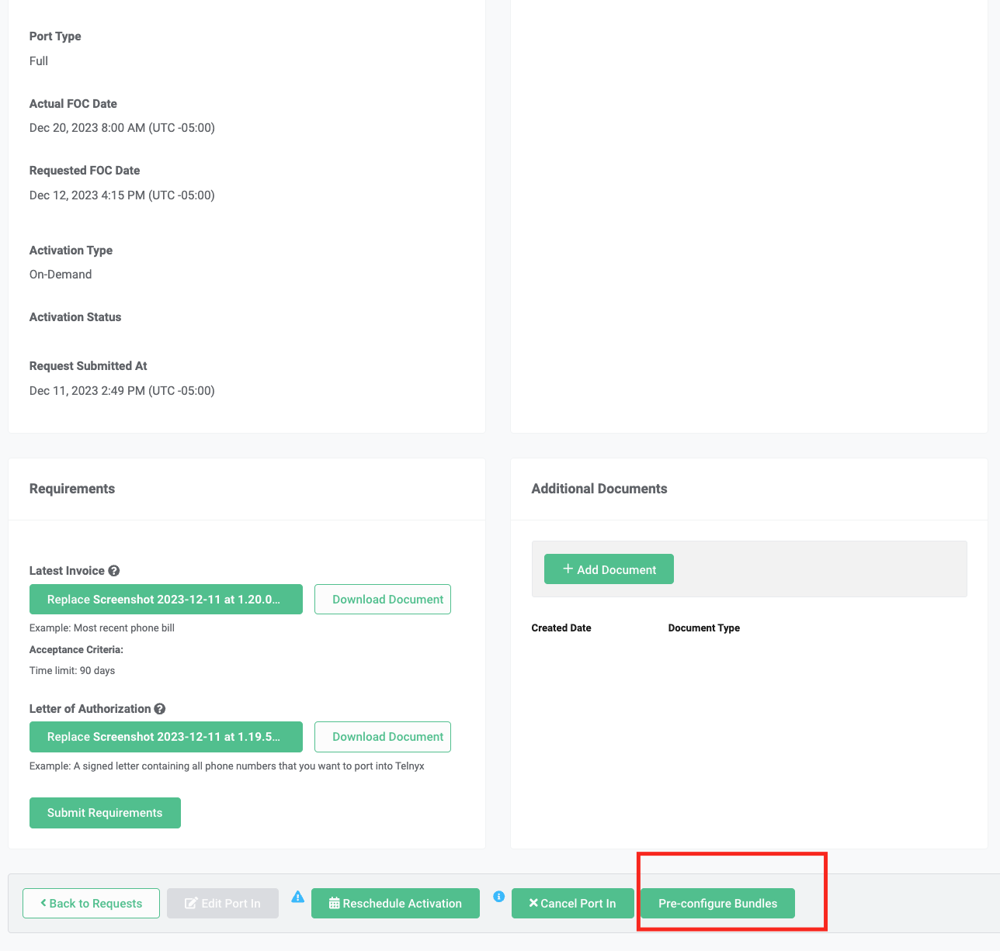
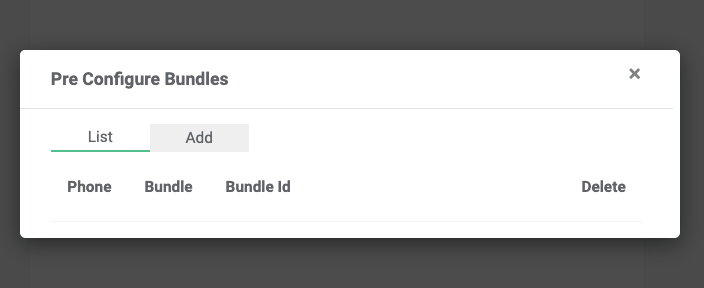
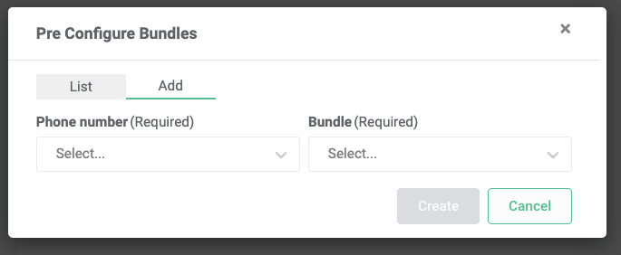
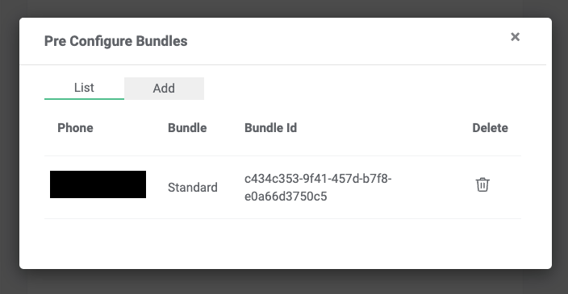

# Telnyx Number Porting Guide

*Part 4 of 4 — see also: [Part 1](telnyx-number-porting-guide--part-1.md), [Part 2](telnyx-number-porting-guide--part-2.md), [Part 3](telnyx-number-porting-guide--part-3.md)*

A comprehensive guide to porting telephone numbers to and from Telnyx, covering port-in best practices, FastPort® activation, common porting error messages, BTN/ATN mismatch resolution, porting PINs and passcodes, port-out notifications and tracking, Port Out PIN Protection, bundle pricing and pre-configuration, and best practices for contacting Telnyx support and the porting team.

## Porting + Bundles

Bundles can be pre-configured on a porting order. Notes:

- Pre-configure bundles on a porting order at any point as long as the order has not completed (i.e., it is in a `cancelled` or `ported` status).
- A bundle is not applied to a phone number until after the number ports in. After pre-configuring a bundle with a port order, do not use that same bundle in a number order.
- If an order is already ported, porting tooling cannot be used to associate bundles.
- Ensure the bundle is eligible for the port order (e.g., a US bundle being pre-configured with US phone numbers). Ineligible combinations (e.g., a US bundle with Australian phone numbers) cannot be pre-configured.

### Through the Telnyx Portal

1. Navigate to the Port Numbers page in the Telnyx Portal.
2. Click on any order to pre-configure bundles with. This opens the `Port In Details` page.
3. Scroll to the bottom of the `Port In Details` page and click the `Pre-configure Bundles` button.

### Preconfigure Bundles

A modal appears with two tabs: `List` and `Add`. By default, the modal loads on the `List` tab.

- **List:** Lists pre-configurations already created. Empty if none have been created.
- **Add:** Create new pre-configurations for bundles and phone numbers on the order.

Click the `Add` tab, specify a phone number from the port order and the bundle to pre-configure with it, then click `Create`.

The pre-configuration appears on the `List` page. Repeat for every phone number to pre-configure. To change the bundle associated with a phone number, click the trash can in the `Delete` column to delete the pre-configuration, then repeat the steps.

When the order ports, the pre-configured bundles are automatically applied with the specified phone numbers.

### Using the Porting API

Follow the [developers guide](https://developers.telnyx.com/docs/numbers/porting/bundles-porting) to integrate with the porting API for pre-configuring bundles to port orders.

## Contacting Support

### Telnyx Network Operation Center (NOC)

The NOC is available 24 hours per day, 7 days a week, 365 days per year.

- **Chat:** Click the "chat with us" link on the bottom of the left menu when signed into the Portal. The chat window appears on the bottom right of the Mission Control Portal.
- **Phone:** +18889809750 or any of the international numbers listed below.
- **Ticket:** Email support@telnyx.com.

At the beginning of a chat or email conversation, a ticket number is provided. Reference this ticket number for follow-ups.

### Reporting Call or Message Failures

Provide a specific call or message example. The best way is with a Call ID (SIP Call ID, Unique CDR ID, or Call UUID) or MDR ID, found in a call detail request generated within the Reporting section of the Portal. Alternatively, provide:

**Call Example:**

- SIP Connection Name & ID (found in SIP Connection settings)
- Direction: Inbound or Outbound
- CLI: Source number
- CLD: Destination number
- Date+Time: Including timezone

**Messaging Example:**

- Messaging Profile Name & ID (found in messaging profile settings)
- Direction: Inbound / Outbound
- From number / Alphanumeric Sender ID
- To number
- Date Timestamp: Including timezone
- Error Code: Found in the response or referenced in the [error documentation](https://developers.telnyx.com/api/errors)

The NOC can troubleshoot most call quality or messaging issues up to 72 hours since occurrence. Escalations with carrier partners require examples within 48 hours. Non-reproducible issues require examples within 24 hours to continue escalations.

### Reporting API Issues

Send as much of the following information as possible:

- **Issue:** The encountered issue in a few words, and the expected behavior from the endpoint(s).
- **Endpoint(s):** The exact public URL endpoints being requested.
- **Timestamp with timezone:** Preferably within the last 24 hours.
- **Request:** The payload of the request being sent.
- **Response:** The payload of the response received from the API.
- **Can you replicate the issue:** Yes/No

Additional context about the function being attempted is appreciated. Reference the [error documentation](https://developers.telnyx.com/api/errors) to determine the source of the error.

### Reporting Portal Issues

For Portal issues, a screenshot of the error is appreciated. Alternatively, access the console window using the "Inspect Element" tool in the browser (usually F12 or right-click → "Inspect Element"). Attach a screenshot to an open Intercom chat via the paperclip icon, or email it to support@telnyx.com. If a screenshot is not possible, provide a description of what was being done in the Portal and how it compares to what was experienced, including the URL of the page, error messages, buttons clicked, and text-boxes filled out.

### International Support Numbers

- Estonia: +3726991435
- Finland: +358753255300
- Ireland: +353818123457
- Israel: +972772200092
- Mexico: +525588974917
- Netherlands: +31853018256
- New Zealand: +6498844134
- Philippines: +63322346319
- Poland: +48221530079
- Singapore: +6531594436
- United Kingdom: +443301900175
- United States & Canada: +18889809750

### Notes About Contacting NOC Support

Customer emails to support@telnyx.com occasionally go to spam. Email providers are becoming stricter with domains lacking properly configured SPF/DMARC records. Other reasons include email content, sender reputation, and user behavior.

Recommendations:

- Add the Telnyx email address to contacts or safe senders list.
- Avoid spammy keywords or phrases in email content.
- Send emails from a reputable domain and IP address.

Telnyx performs a daily review of emails that may have ended up in spam and pushes them to the ticketing system.

## Contacting the Porting Team

The Porting team is available 9am - 7pm CT, Monday-Friday. Communications outside of that time are resolved the following business day.

- **Chat:** Click the chat icon on the bottom right of the screen when signed into the Portal.
- **Email:** porting@telnyx.com
- **Phone:** 1-888-980-9750

All requests should be posted on the individual order, not just via chat or support ticket, to ensure cross-company visibility and clear communication.

For status updates, chat or phone provides quick resolution. For expedites or context about a port, a support ticket is best.
