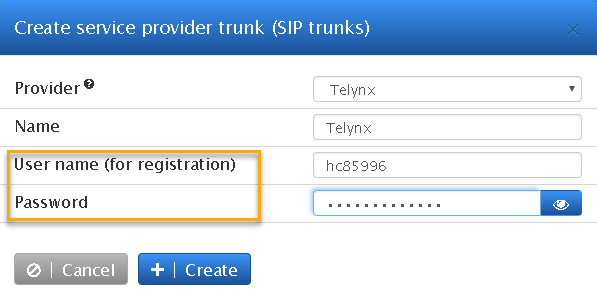
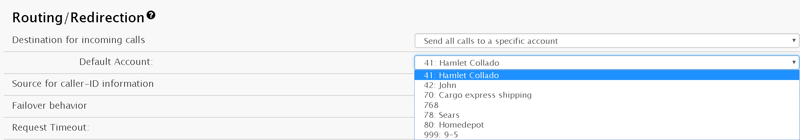
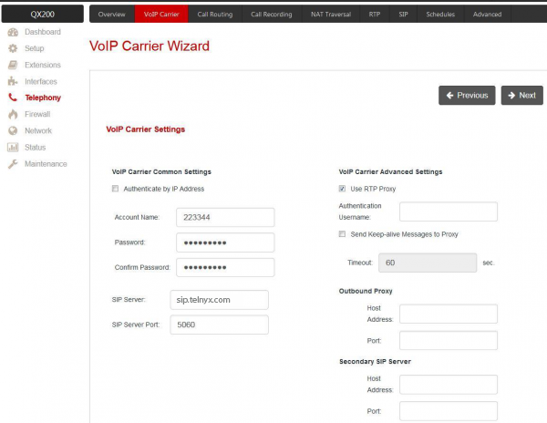
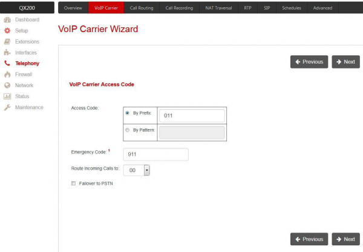
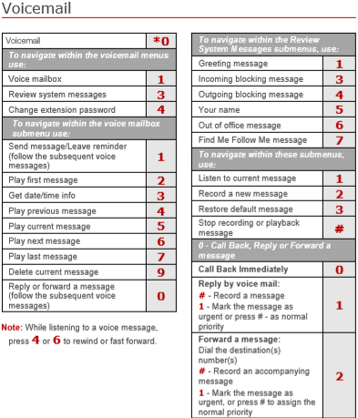

# Telnyx PBX and IP Phone Setup

*Part 2 of 4 — see also: [Part 1](telnyx-pbx-and-ip-phone-setup--part-1.md), [Part 3](telnyx-pbx-and-ip-phone-setup--part-3.md), [Part 4](telnyx-pbx-and-ip-phone-setup--part-4.md)*

Consolidated Telnyx setup guides for Yeastar P-Series, Yeastar S-Series, Vodia Multi-Tenant PBX, Epygi QX IP PBX, Positron IP PBX, ScopTEL IP PBX, and Positron IP phones, plus a reference table of Cisco/Linksys star codes. Each section covers prerequisites, trunk creation, outbound routing, and inbound routing so the device can place and receive calls using Telnyx as the SIP provider.

## Vodia Multi-Tenant PBX

Vodia PBX runs on Windows, Linux, or macOS and supports automatic provisioning for Polycom, Snom, Cisco, Grandstream, Yealink, and other SIP phones. A built-in Telnyx template removes the need to enter SIP outbound proxy or trunk header details, and Vodia automatically creates a dial plan for the domain.

### Create a SIP trunk

1. Log in to Vodia PBX, navigate to your Domain, and choose **TRUNKS > VoIP Providers**.
2. Click **Add**.
3. From the **Provider** dropdown, select *Telnyx*.

   
4. Enter your Telnyx username and password.

   
5. Click **Create**.

### Configure inbound routing

1. Navigate to your registered Telnyx trunk and scroll to **Routing/Redirection**.
2. Vodia supports the following inbound methods:
   - Send all to the destination request URL
   - Send all calls to a specific account
   - Send to a 10-digit DID
   - Match extension after a prefix
   - Use a list of expressions

   For this exercise, choose **Send all calls to a specific account** so all inbound calls route to the specified extension.

   
3. To route multiple Telnyx DIDs, switch to Admin mode and navigate to **DID management**.

   
4. Use DID management to assign multiple DIDs to specific extensions.

   
5. To use a request URL instead, navigate to your Telnyx trunk, scroll to **Routing/Redirection**, and choose **Send all to the destination request URL**.

Additional resources:

- [Vodia documentation](https://doc.vodia.com/)
- [Supported phones](https://web.vodia.com/supported-phones)
- [Vodia forums](https://forum.vodia.com/)
- [Vodia support](https://vodia.zammad.com/#login) (requires login)
- [Vodia portal login](https://portal.vodia.com/)

## Epygi IP PBX (QX Series)

Epygi's QX VoIP Carrier Wizard supports both IP-based authentication and SIP registration. The instructions below use SIP registration and apply to QX20, QX50, QX200, QX500, QX2000, QX3000, QX5000, QXISDN4+, ecQX, UC20, and UC80.

### Register the Epygi QX

1. From a computer on the same LAN as the Epygi QX, open a browser and go to `http://172.30.0.1`.
2. Log in with the default credentials (change them immediately):
   - **Username:** `admin`
   - **Password:** `19`
3. In the left-hand menu, select **Telephony** to open the VoIP carrier wizard:
   - **VoIP Carrier:** Manual
   - **Description:** Telnyx (suggested)
4. Click **Next**.

   
5. Configure carrier settings:
   - **Account Name:** Telnyx account username
   - **Password:** Telnyx account password
   - **SIP Registrar:** `sip.telnyx.com`
   - **SIP Server Port:** `5060`
   - **Use RTP Proxy:** Enabled
6. Click **Next**.

   
7. Define access codes:
   - **Access Code:** e.g., `011` — defines how to make outgoing calls through Telnyx and the QX extension that receives all incoming calls.
   - **Emergency code:** e.g., `911` or `999`.
   - **Route Incoming Calls To:** Extension for inbound calls (default is the auto-attendant extension).

   
8. Click **Next**, review the settings, then click **Finish**.

### Place a call

- **Internal extensions:** Dial the extension.
- **External call:** `9` + 10-digit number.
- **Emergency call:** The emergency number configured above (e.g., `911`).

### Additional features

Epygi QX supports voicemail features and star codes accessible from the PBX features section.

Additional resources:

- [Epygi website](https://www.epygi.com/about-us/)
- [Epygi quick install guide](https://www.epygi.com/wp-content/uploads/2019/03/Install-Guide-20_500IPPBXs-v02.pdf)
- [Epygi product warranty information](http://206.81.0.143/warranty/)

## Positron IP PBX

Positron IP PBX combines voice and data into a single device for small and medium businesses. Note that Positron's vendor documentation is dated (2013) and not publicly available to non-partners.

### Configure the Positron PBX

1. Log in to the Positron PBX portal.
2. Go to **PBX > Trunks/Lines > Trunks/Lines** and click **Add**.
3. Provide:
   - **Name:** e.g., `Telnyx`
   - **IP Address/Domain:** `sip.telnyx.com`
   - **Username:** Telnyx SIP account username
   - **Password:** Telnyx SIP account password
   - **Port:** `5060`

   
4. Click **Save**, then click **Edit** on the new trunk:
   - **From User:** Remove the username from this field.
   - **P-Asserted-Identity:** Select *Custom* and enter your provisioned DID.

   
5. Click **Save**, then **Apply**. The trunk should now be applicable in the VoIP section of the status screen.

### Configure outbound rules

1. Go to **PBX > Trunks/Lines > Outgoing Line Groups** and create a new group.
2. Select your Telnyx trunk from the dropdown.
3. Go to **PBX > Call Handling > Outgoing Call Rules** and choose the ruleset your extensions will use.

It is a good idea to create a few test rules to confirm the outgoing line group behaves as expected.

### Configure inbound rules

1. Go to **PBX > Trunks/Lines > Incoming Call Rules** and create a new group.
2. Link the new group to your trunk using the checkboxes.
3. Click **Edit** on the new group, enter your provisioned DID in the **DID** field, and choose the destination extension (IVR, ring group, or simple extension).

If you have another SIP trunk through another provider, go to **PBX > PBX Settings > SIP** and set the **SIP Registration Timer** to a minimum of `600`.
