# Telnyx PBX and IP Phone Setup

*Part 3 of 4 — see also: [Part 1](telnyx-pbx-and-ip-phone-setup--part-1.md), [Part 2](telnyx-pbx-and-ip-phone-setup--part-2.md), [Part 4](telnyx-pbx-and-ip-phone-setup--part-4.md)*

Consolidated Telnyx setup guides for Yeastar P-Series, Yeastar S-Series, Vodia Multi-Tenant PBX, Epygi QX IP PBX, Positron IP PBX, ScopTEL IP PBX, and Positron IP phones, plus a reference table of Cisco/Linksys star codes. Each section covers prerequisites, trunk creation, outbound routing, and inbound routing so the device can place and receive calls using Telnyx as the SIP provider.

## ScopTEL IP PBX

ScopTEL is a multi-tenant IP PBX with a unified communications system and call contact center. Minimum software release: `scopserv-telephony25-6.9.1.6.20191218-1`.

### Configure the SIP channel

1. From the ScopTEL portal, click **Configuration** to open **Telephony Settings: Channels**.
2. Click the **Channels** tab, then the **SIP Channel** tab.

   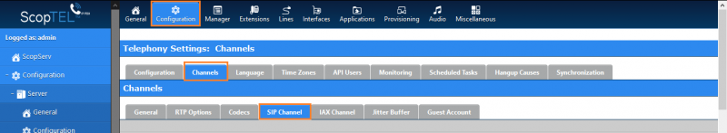
3. Click **Edit** at the bottom of the page.
4. In the **Miscellaneous** section, configure as needed:
   - **Enable Session Progress and In-Band Audio** — for Asterisk Early Audio with SIP channels.
   - **Enable Premature Media?** — prevents the SIP channel from automatically initiating early media if it receives audio before a progress indication.

   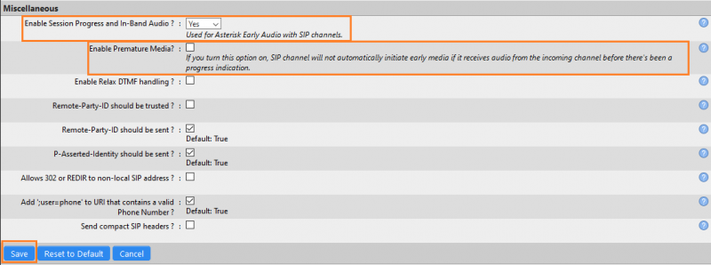
5. Click **Save**.

### (Recommended) Configure SIP TLS/SRTP

If you do not want to use TLS, skip to the next section. You must have activated SIP traffic encryption on your Telnyx Mission Control Portal first.

1. From **Configuration > Telephony Settings: Channels > SIP Channel**:
   - **Enable support for SIP TLS (secure)?:** Check.
   - **Don't verify servers certificate when acting as client?:** Check.

   
2. Click **Save**.

### Create a new SIP trunk

1. Click **Interfaces** in the top navigation to open the **Interfaces Manager**.
2. Click the **VoIP Accounts** tab, then **Add a new VoIP Account**.
3. On the **General** tab:
   - **Type:** SIP
   - **Trunk Type:** Friend
   - **Name:** Unique alphanumeric name. To receive calls, set this equal to the username (e.g., `TelnyxTrunk`).

   
4. On the **Server** tab:
   - **Username:** Telnyx account/sub-account username
   - **Password:** Telnyx account/sub-account password
   - **Host:** `sip.telnyx.com`
   - **Port:** `5060`
   - **Register as User Agent:** Check
   - **Enable TLS registration:** Check if you completed the TLS step above.
   - **Contact Extension:** Telnyx account/sub-account username

   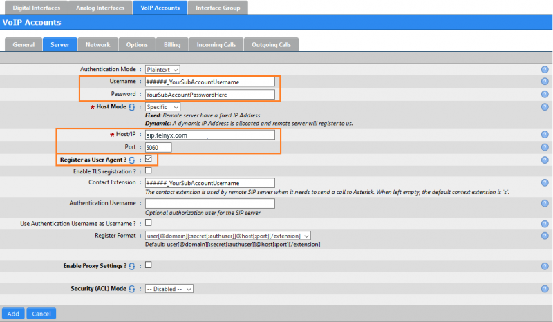
5. On the **Network** tab:
   - **Transport mode:** UDP, TCP, or both — unless you created a TLS trunk, in which case select only TLS.
   - **Insecure:** Check *Invite*.

   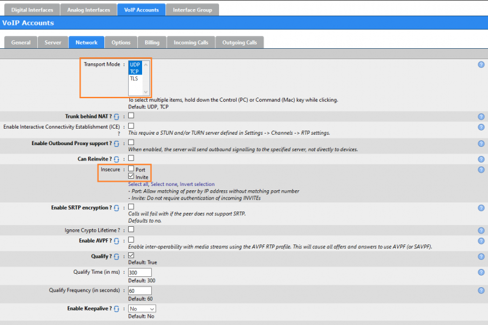
6. On the **Options** tab:
   - **DTMF Mode:** Automatic (RFC 2833)
   - **Send Remote-Party-ID:** Check
   - **Codecs:** Select Telnyx-supported audio codecs (`ulaw/g711u`, `alaw/g711a`, `g722`, `g729`) and video codec (`H264`).
   - **Disallowed Methods:** Check *UPDATE*.

   
7. Click **Add**.

### Create inbound rules

1. Click **Lines** in the top navigation.
2. In **Lines Manager: Incoming Lines**, click the **Incoming Lines** tab, then **Add a new Incoming Line**.
3. On the **General** tab:
   - **Extension (DNIS):** Your provisioned Telnyx DID.
   - **Trunk:** Select the trunk you just created.

   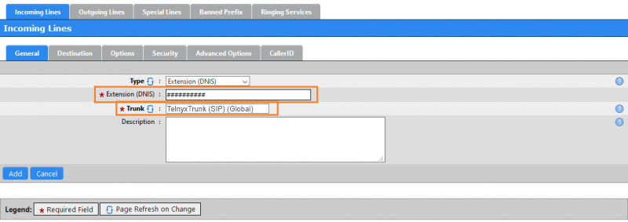
4. Click **Add**.

Additional resources:

- [ScopServ IP PBX user guides](http://www.scopserv.us/support/documentation/)
- [ScopServ API](https://help.shipserv.com/en/articles/5480733-api)
- [ScopServ trainings](https://www.shipserv.com/category/technical-training/11984)

## Positron IP Phone (IP304/IP304C, IP408/IP408C, IP410C/IP410G)

Positron IP phones are SIP phones with wideband audio, dual Ethernet ports, and integrated PoE. Configuration steps are identical across the supported models aside from minor cosmetic UI differences.

### Get the phone's IP address and log in

1. On the phone, press **Menu > Status > Information** and note the IP address.

   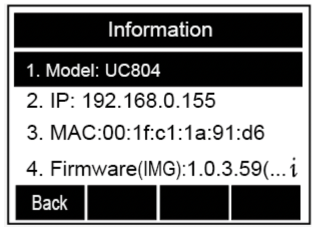
2. From a computer, open a browser and enter `http://<phone-ip>`.
3. Log in with the default credentials (change them after first login):
   - **Username:** `admin`
   - **Password:** `admin`

   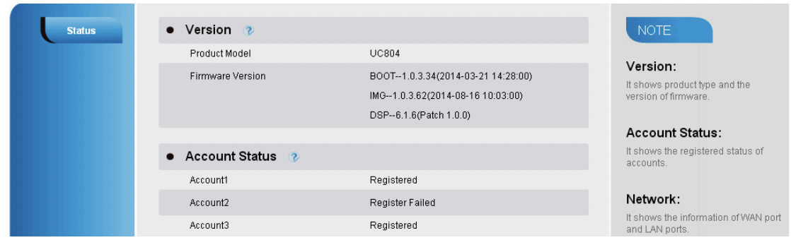

### Configure the SIP profile via the web portal

1. Click **Account** in the top navigation, then **Basic** in the left-hand nav.
2. Configure:
   - **Account:** Select the account to set up (typically *Account 1*).
   - **Account Active:** Yes.
   - **Primary SIP Server:** `sip.telnyx.com`
   - **SIP Transport:** UDP (default). Choose TLS if you have set up call encryption on your Telnyx portal.
   - **SIP User ID:** Telnyx account ID
   - **Authentication ID:** Telnyx account ID
   - **Authentication Password:** Telnyx account password

   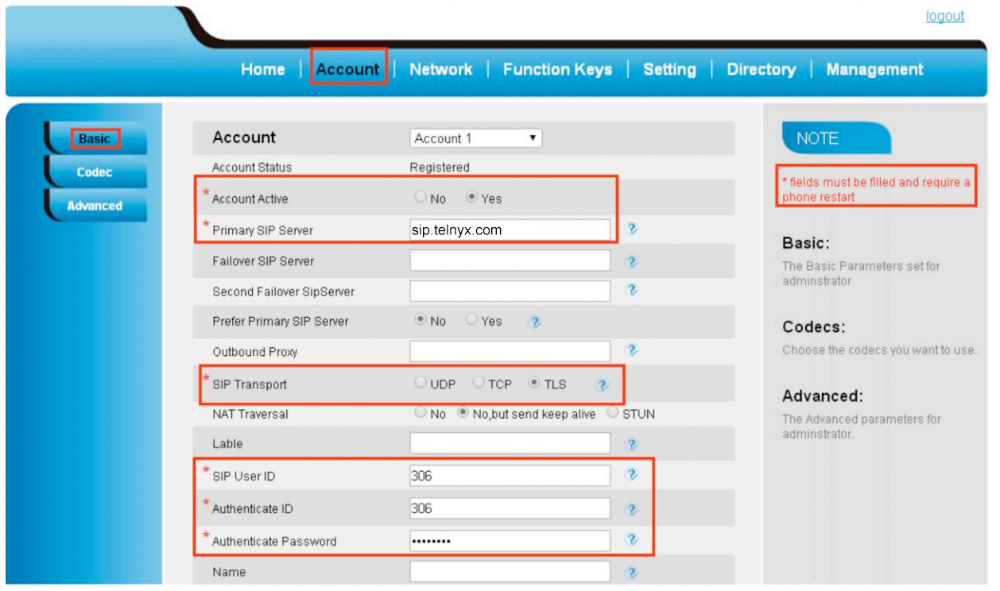
3. Click **Save**.

### (Alternative) Configure the SIP profile from the phone

1. Press **Menu > Settings > Advanced Settings > Accounts**.
   - **Account:** Select the account to set up.
   - **Account Active:** On.
   - **Primary SIP Server:** `sip.telnyx.com`
   - **Proxy SIP Server:** `sip.telnyx.com` or leave blank.
   - **SIP User ID:** Telnyx account ID
   - **Authentication ID:** Telnyx account ID
   - **Authentication Password:** Telnyx account password

   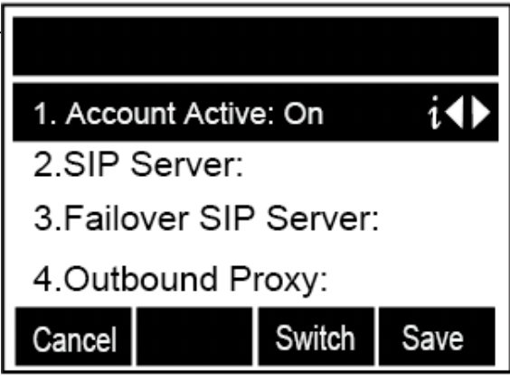

### (Optional) Import a TLS certificate

1. From the web portal, click **Management** in the top navigation.
2. Click **TLS Certs** in the left-hand nav and upload your certificate.

   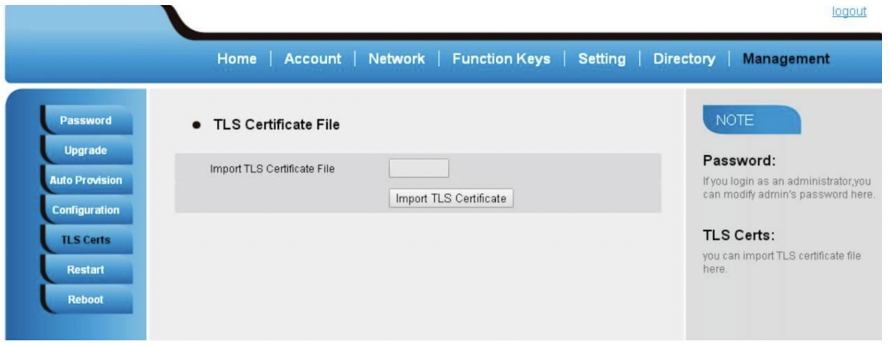

### (Recommended) Change the default admin credentials

1. On the phone, press **Menu > Settings > Advanced Settings > Password > Phone Settings > Set Password**.
2. Enter the current password, the new password, and confirm the new password.
3. Click **Save** or the checkmark.

   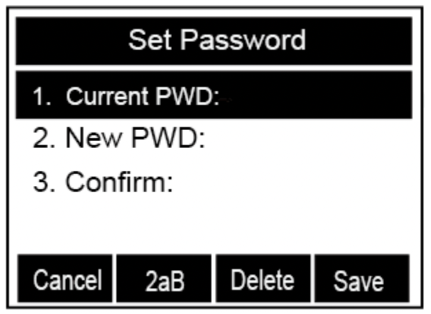
