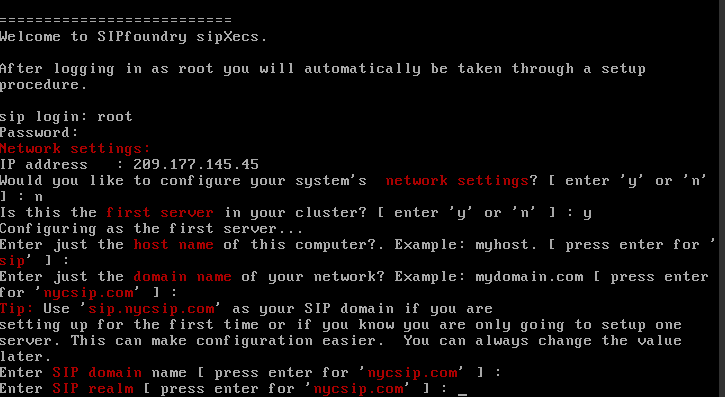
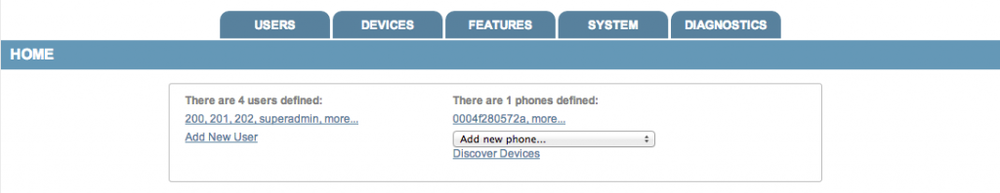
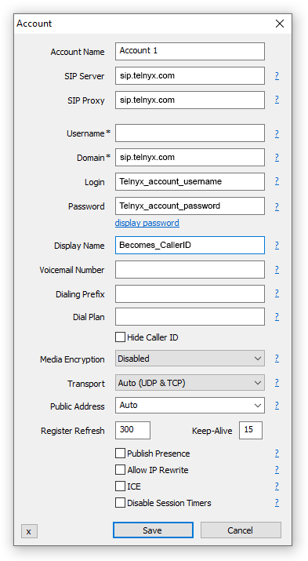
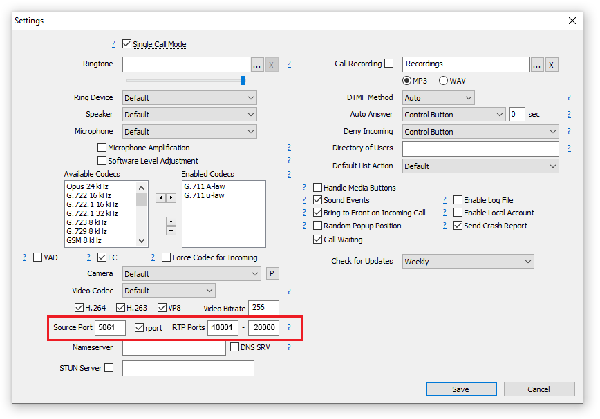
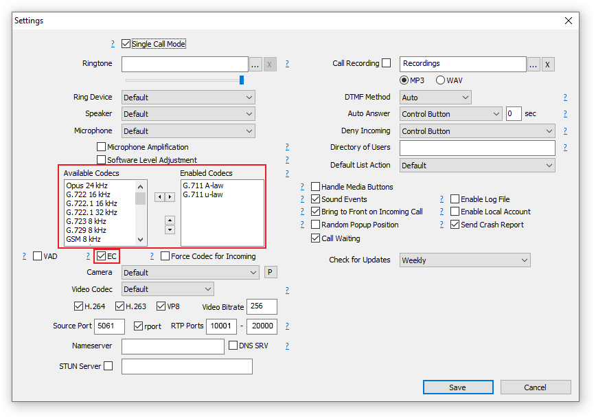

# Telnyx Platform Overview and SIP Technical Reference

*Part 4 of 4 — see also: [Part 1](telnyx-platform-overview-and-sip-technical-reference--part-1.md), [Part 2](telnyx-platform-overview-and-sip-technical-reference--part-2.md), [Part 3](telnyx-platform-overview-and-sip-technical-reference--part-3.md)*

Telnyx is a global Communications Platform as a Service (CPaaS) provider offering voice, messaging, real-time communications, AI inference, storage, and workflow automation over a privately-owned IP network. This page consolidates Telnyx's network specifications, supported SIP protocols and methods, interoperability partners, and configuration guidance for common PBX and softphone integrations.

## PBX and Softphone Configuration Examples

### Bicom PBXware

[Bicom Systems](https://www.bicomsystems.com/) is a software suite that includes PBXware (an open standards turnkey telephony platform), SERVERware (server virtualization), sipPROT (SIP protection), gloCOM and gloCOM GO (unified communication apps), and sipMON (network packet sniffer for SIP and RTP VoIP).

The SMS feature on Bicom PBXware allows users to select Telnyx as a provider in their configuration so that messaging service is fully utilized. Bicom Systems has created a [detailed custom document for integration with Telnyx](https://go.telnyx.com/rs/telnyx/images/Content_Guide_BicomPBXwareTelnyxconfiguration.pdf).

**Pre-requisites:**

- Configure your Telnyx Mission Control Panel to set up a connection, provision a DID, and create an outbound voice profile.
- Port your number to Telnyx.
- Set up hosted SMS with Telnyx.

### sipXecs PBX

[SIPfoundry's sipXecs](http://www.sipfoundry.org/) is an open source unified communications and collaboration project, ideal for an all-software, open-source, modern communications PBX solution that scales to mid-size and large enterprise.

**Pre-requisites:**

- Telnyx Portal correctly set up and configured for use.
- SIP credentials (username/password for your main SIP account or SIP sub-account).
- DIDs available to assign.
- Installed/configured computer or virtual server meeting minimum system requirements:
  - **Physical server:** Dual or quad core CPU, 4 GB RAM (minimum), 40 GB hard drive (minimum), 1 network card. Install a minimum version of CentOS 6 or RHEL 6.
  - **Virtual machine:** Clean VM (e.g., Google or Amazon), avoiding instances with CPanel installed. Two compute cores, 2 to 4 GB RAM, 16 GB storage (excluding voicemail storage). Start from a minimum image of CentOS 6 or RHEL 6.
- A network segment, preferably a separate routed network segment so that sipXecs can install and run its own DHCP server for phone auto-discovery and provisioning.
- Phone hardware: Polycom desk phones (preferred), Counterpath Bria softphones (preferred), or Counterpath Bria mobile apps.
- (Optional) PSTN connectivity via a PSTN gateway (Audiocodes preferred) or a SIP trunk.
- (Optional) Firewall/SBC for internet connectivity. Sangoma SBC is recommended for production deployments; Ingate, Audiocodes, and ACME Packet are also good choices.

**Installation:**

Install sipXecs by running the following script:

```
bash -c "$(curl -L http://rpms.sipfoundry.org/canary-release/sipxecs-install)"
```

Alternatively, install the repo file into `/etc/yum.repos.d`, install the EPEL repository with `yum install -y epel-release`, then run `yum install sipxecs`. Once completed, run the `/usr/bin/sipxecs-setup` script.

**SIP Trunk Configuration:**

During the `/usr/bin/sipxecs-setup` configuration script, provide:

- **IP Address:** Take note of this for later use.
- **Configure network:** *No* (if your network is configured already).
- **First server:** *Yes*.
- **Host name:** Choose the hostname you'd like to use (e.g., *sipxecs*).
- **Domain:** *sip.telnyx.com*.
- **SIP Domain:** *sip.telnyx.com*.
- **SIP Realm:** Enter the name of the realm to which the SIP interface is connected.



**Admin Console Setup:**

Open a browser and enter the IP address from the setup script. Acknowledge the certificate warning, assign a password for the superadmin user, and log in.



Enable the services your organization will require under **System > Servers**, and add at least one user under **Users > Users** before adding phones.

**Adding Phones:**

If sipXecs is configured on an isolated subnet with DHCP and Phone Auto-Provisioning enabled, supported devices will be auto-discovered. Navigate to **Devices > Phones** to find them. To provision a phone to a user, go to **Users > Phones** and choose an existing but unassigned phone from the **Add New Phone** dropdown. Press **Send Profile** to generate the phone profile.

For manual configuration, the necessary parameters are typically:

- **Account Name:** A friendly name for the account that only you see.
- **User ID:** The user's numeric extension.
- **Domain:** *sip.telnyx.com*.
- **Password:** The Telnyx account or sub-account password.
- **Display Name:** The caller ID. Use capital letters, no special characters (spaces allowed), and consider that some Canadian providers will not show more than 15 characters.
- **Auth Name:** The user's numeric extension.

**Supported Codecs:**

sipXecs supports any codec, but you should use a Telnyx-supported codec:

- **Audio:** ulaw (g711u), alaw (g711a), g722, g729
- **Video:** H264

**Troubleshooting:**

If a manually configured phone isn't working, you likely have a DNS issue. Perform DNS tests by going to **System > DNS** and selecting **Advisor**.

### MicroSIP Softphone

[MicroSIP](https://www.microsip.org) is an open source portable SIP softphone based on the PJSIP stack, available only for Windows. It supports high quality VoIP calls, video (H.264, H.263+, VP8), SIMPLE messaging and presence, DTMF (In-band, RFC2833, SIP-INFO), TLS/SRTP for control and media, and is designed with accessibility in mind (screen reader support such as NVDA).

**Pre-requisites:**

- Telnyx Portal correctly set up and configured for use.
- SIP credentials (username/password for your main SIP account or SIP sub-account).
- DIDs available to assign.
- A PC running Windows.
- MicroSIP downloaded and installed.

**Adding Telnyx as SIP Provider:**

1. Run MicroSIP and click the arrow at the top-right of the home screen.
2. Click **Edit Account** to open the account screen.
3. Provide the following information:
   - **Account Name:** Your choice.
   - **SIP Server:** *sip.telnyx.com*.
   - **SIP Proxy:** *sip.telnyx.com*.
   - **Username:** Your main Telnyx account or sub-account.
   - **Domain:** *sip.telnyx.com*.
   - **Login:** Your main Telnyx account or sub-account username.
   - **Password:** Your main Telnyx account or sub-account password.
   - **Display Name:** Your caller ID. Use capital letters, no special characters (spaces allowed), and consider that some Canadian providers will not show more than 15 characters.
   - **Media Encryption:** If using UDP or TCP transport, leave as *Disabled*. If using TLS encryption, select *Mandatory SRTP (RTP/SAVP)*.
   - **Transport:** Either *Auto (UDP/TCP)* or *TLS*.



**Encrypting Calls (Optional):**

If using TLS as your transport protocol, navigate to **MicroSIP > Settings** and configure:

- **Source Port:** *5061*.
- **RTP Ports:** Set this range between *10001 - 20000*.



**Audio Settings:**

Navigate to **MicroSIP > Settings** and choose Telnyx-supported audio codecs:

- ulaw (g711u)
- alaw (g711a)
- g722
- g729

Check the **EC** checkbox to enable echo cancellation.



## Debugging and Further Reading

- Telnyx provides a [debugging tool](https://support.telnyx.com/en/articles/4304872-telnyx-debugging-tools) available on your account for debugging SIP call flows.
- Further information on SIP Responses is available at [telnyx.com](https://telnyx.com/resources/sip-response-codes-need-know-2-minutes).
- SIP trunking explained at [telnyx.com](https://telnyx.com/resources/sip-trunking-explained).
- [DUCKS GO QUACK. SIP GOES PRACK](https://andrewjprokop.wordpress.com/2013/10/02/ducks-go-quack-sip-goes-prack/) by Andrew J Prokop.
- [What the Prack?!](https://www.youtube.com/watch?v=NCH06mYUajQ) by Lalo Nunez.
