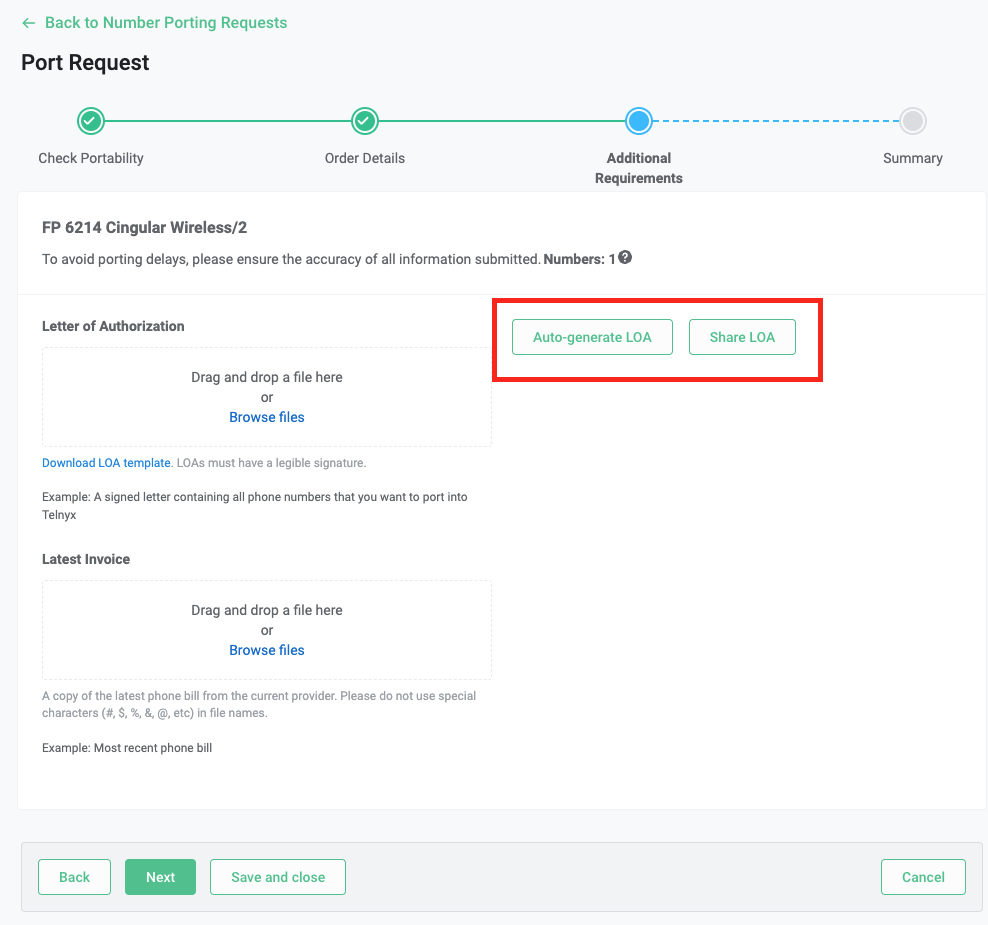
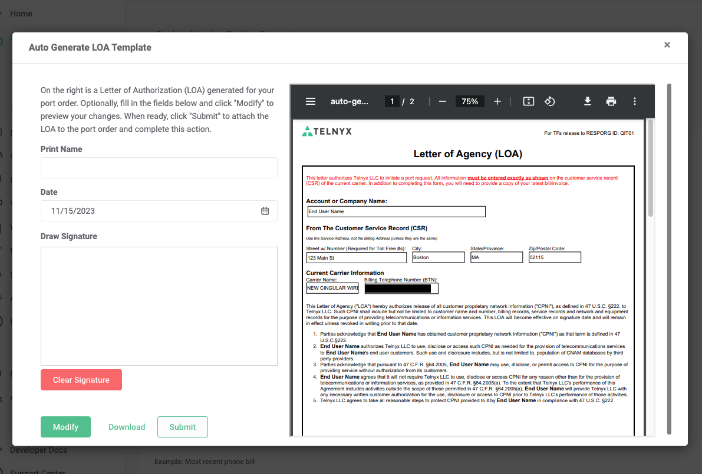
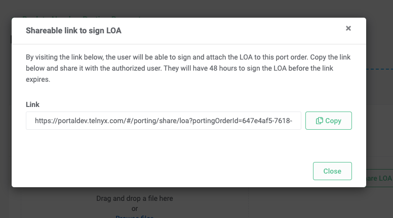
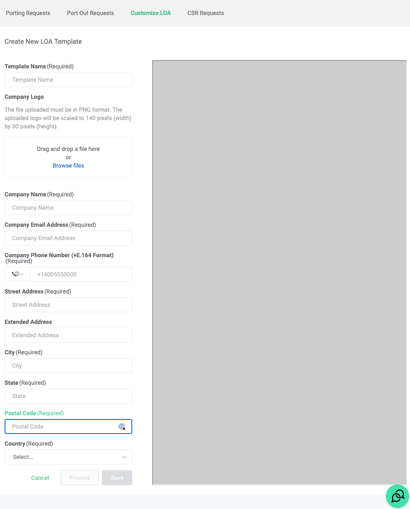
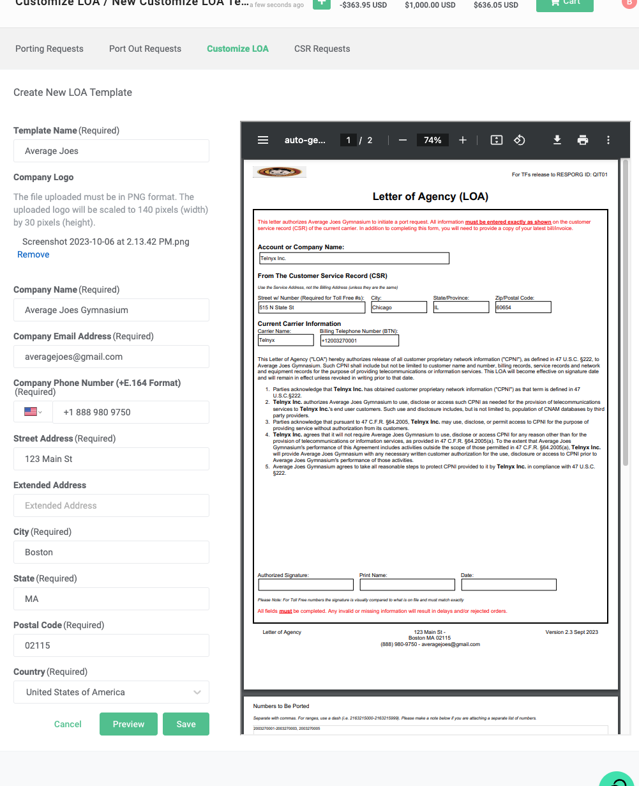
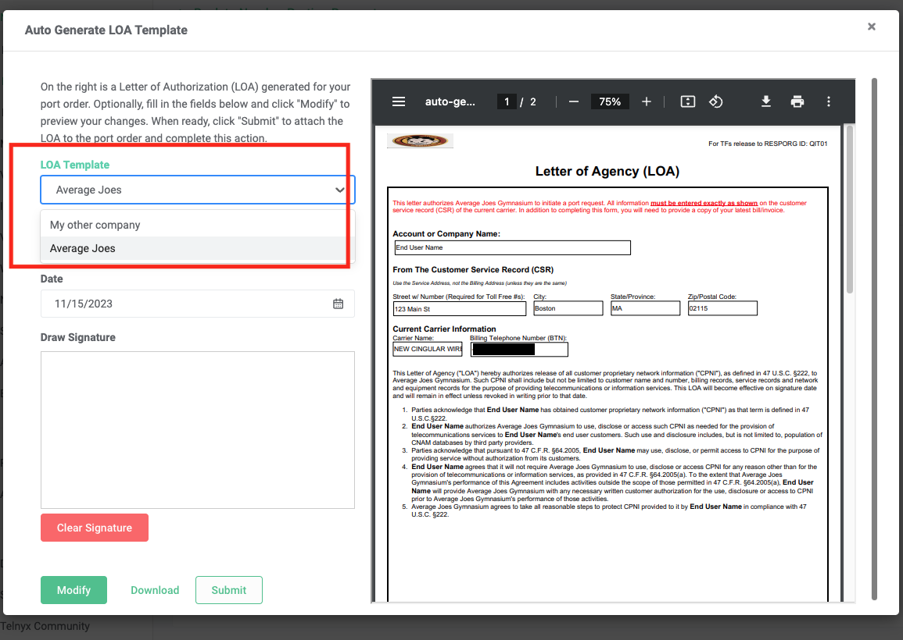

# Telnyx Porting, Billing, and Messaging Automation

*Part 2 of 7 — see also: [Part 1](telnyx-porting-billing-and-messaging-automation--part-1.md), [Part 3](telnyx-porting-billing-and-messaging-automation--part-3.md), [Part 4](telnyx-porting-billing-and-messaging-automation--part-4.md), [Part 5](telnyx-porting-billing-and-messaging-automation--part-5.md), [Part 6](telnyx-porting-billing-and-messaging-automation--part-6.md), [Part 7](telnyx-porting-billing-and-messaging-automation--part-7.md)*

This page consolidates Telnyx support documentation covering number porting (CSRs, LOAs, automated validation, porting requirements, and the auto-generated LOA feature), billing models (per-minute billing increments and channel billing with zone-based pricing), CLI/CLD validation for North American calls, and Zapier-based SMS automations including forwarding texts to mobile or email, automated replies, and the Textable integration.

## How to Fill Out an LOA

An LOA (Letter of Agency/Authorization) is a document required to give one carrier permission to port numbers from the current carrier on behalf of the end-user. The LOA must be filled out completely and must have a legible signature from the authorized person on the account, otherwise it may be rejected.

If you are unsure of the information required on the LOA, reach out to your current carrier for a CSR. A CSR holds all of your account information and will help you fill out the LOA accurately.

The fields required on the LOA are:

- **Account or Company Name:** The name of the end-user account or company name on record with the current carrier.
- **4 Address Fields (Street w/ Number, City, State/Province, Zip/Postal Code):** These should be the service address on file for the number(s), not the billing address (unless they are the same). Verify this with the losing carrier or request a CSR to validate the address.
- **Carrier Name:** The current carrier's name.
- **Billing Telephone Number (BTN):** The BTN on record with the losing carrier. This is one individual telephone number, usually the number on record on the account with the losing carrier.
- **Numbers to be ported:** The number(s) being ported need to be put in NPA-NXX-XXXX format and separated by commas. For a large amount of TNs, attach an Excel spreadsheet with the numbers in each cell in each row within the same column.
- **Authorized Signature:** The signature of the authorized person on the account. This must be clear and legible.
- **Print name:** The authorized person's name in capital/block letters.
- **Date:** The date that the LOA was agreed to and signed on.

If you have any questions or issues relating to filling out your LOA, or any general porting questions, please get in touch with the porting team at porting@telnyx.com.

## Auto-generated Letter of Authorization (LOA)

On select port orders, Telnyx provides users with the ability to auto-generate a Letter of Authorization (LOA). This LOA is pre-populated with the same information entered on the porting order form. These LOAs can be custom branded with your own company logos and information, and the LOA can be easily shared with the authorized user to sign.

### Eligibility

This feature is only available currently for ports that meet the following criteria:

- Port orders with `US` `local` phone numbers
- Port orders with `CA` `local` phone numbers

### How to Use the Auto-generate LOA and Share LOA Features

1. Go to the `Port Numbers` page and click on `New Port Request`.
2. Run the portability check on your phone numbers. Hit `Next` to create a port order.
3. Fill in the `Order Details` page. Hit `Next`.
4. On the `Additional Requirements` page, there will be 2 buttons: one for `Auto-generate LOA` and one for `Share LOA`.

#### Auto-generate LOA

When you click on the `Auto-generate LOA` button, a modal will pop up. The left side of the modal includes all of the interactive components:

1. **LOA Template:** If you have multiple branded templates, you can select which one to apply.
2. **Print Name:** The printed name of the authorized user signing the LOA.
3. **Date:** The date that the LOA is signed.
4. **Draw Signature:** The user can actually draw their signature in the box, which will then be transferred to the LOA.

There are 3 buttons:

1. **Modify:** Saves the changes you made in the inputs. This is relevant if you want to preview the changes before taking any further actions.
2. **Download:** Downloads the LOA to your local computer. If you made any changes in the inputs, these will be included in the LOA (even if you forget to hit **Modify**).
3. **Submit:** Attaches the LOA to the porting order. If you made any changes in the inputs, these will be included in the LOA (even if you forget to hit **Modify**).

The right side of the modal shows the preview of what the auto-generated LOA looks like. You can verify that the LOA is filled out correctly before downloading or attaching the LOA to your order.

#### Share LOA

Even though you are creating the porting order, you may not be the individual authorized to sign the LOA. If that's the case, you can use the `Share LOA` button to generate a link to share with the authorized user. The authorized user can visit that link to easily sign and attach the LOA to the porting order.

To use this feature:

1. Click on the `Share LOA` button.
2. A modal will pop up. Copy the link and send it to the authorized user.

3. Save the port order into a "draft" status by clicking on the `Save and Close` button.
4. The authorized user signs the LOA and attaches it to the port order.
5. Return to the port order, edit it, and finish submitting it.

A few things to note about this feature:

- You cannot submit your porting order until an LOA has been attached. Click the `Save and Close` button in the portal to save your port order as a "draft" while you wait for the authorized user to sign and attach the LOA.
- The link will expire after 48 hours. If it expires, you will need to generate a new link to send to the authorized user again, or you can avoid the feature altogether and manually upload a signed LOA.
- The authorized user does not need a Telnyx Portal account. As long as they have the link and the link has not expired, they will be able to sign and submit the LOA to that porting order.

There will also be email notifications for key LOA events:

- Once the authorized user signs and attaches the LOA to the porting order, the Telnyx user will be emailed so that they may revisit the "draft" port order and finish submitting it.
- If the link expires before an LOA is attached to the order, the Telnyx user will be emailed. That way, they can decide whether to upload an LOA manually, or to generate and share a new link with the authorized user.

### Customizing LOAs with Your Own Company Branding

By default, the auto-generated LOA is branded with Telnyx's logo and company information. If you would like, you can customize the auto-generated LOAs to reflect your own company's branding and information.

To do so, visit the Customize LOA page in the portal. Then, click on the button in the top right of the page called `New LOA Template`.

The left side of the page is comprised of all the interactive elements. Fill out the form with your own company name, email address, phone number, and physical address. Once the form is completed, there are 3 buttons that you can press:

1. **Cancel:** LOA template is not created, and you are brought back to the previous page.
2. **Preview:** Before saving the template, you can preview what the LOA will ultimately look like. The preview appears on the right side of the page.

3. **Save:** Saves the template.

Once the template is saved, it will start to be automatically applied to your auto-generated LOAs, replacing the Telnyx branded LOA template. You can create 1 or more templates. If you have multiple templates, the most recently created template will be used by default with the auto-generated LOA. Once the LOA has been generated, you may change the LOA template by using the `LOA Template` dropdown in the modal.

