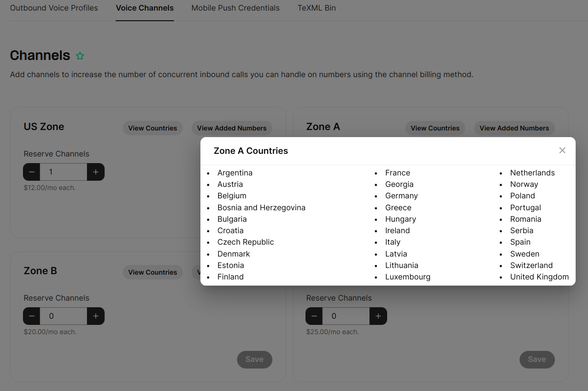

# Telnyx Porting, Billing, and Messaging Automation

*Part 4 of 7 — see also: [Part 1](telnyx-porting-billing-and-messaging-automation--part-1.md), [Part 2](telnyx-porting-billing-and-messaging-automation--part-2.md), [Part 3](telnyx-porting-billing-and-messaging-automation--part-3.md), [Part 5](telnyx-porting-billing-and-messaging-automation--part-5.md), [Part 6](telnyx-porting-billing-and-messaging-automation--part-6.md), [Part 7](telnyx-porting-billing-and-messaging-automation--part-7.md)*

This page consolidates Telnyx support documentation covering number porting (CSRs, LOAs, automated validation, porting requirements, and the auto-generated LOA feature), billing models (per-minute billing increments and channel billing with zone-based pricing), CLI/CLD validation for North American calls, and Zapier-based SMS automations including forwarding texts to mobile or email, automated replies, and the Textable integration.

## Channel Billing

Channel Billing is an alternative billing method that allows you to pay a flat fee for unlimited inbound minutes. Instead of being billed based on your inbound minutes of usage, you select the number of concurrent calls you would like to be able to support for your inbound traffic and pay per channel.

Each channel allows for one concurrent (or simultaneous) inbound call. You can use as many inbound minutes as you want with no additional charges; however, you can only support one call at a time per channel provisioned.

**Please Note:** Channel billing is only applicable for standard DIDs. Toll-free or international DIDs only have the option for pay per minute.

### Example

You have the following setup with 3 numbers and 2 channels all set to channel billing.

**Numbers:**

- 555-111-1111 (channel billing)
- 555-222-2222 (channel billing)
- 555-333-3333 (channel billing)

**Channels Provisioned: 2**

If you receive a call on your 1111 number and one of your peers answers the phone, you now have 1 concurrent/simultaneous call in progress. If you receive another call to any of your numbers it will ring and you will be able to answer the call per usual. When you answer this second call, you will now have 2 concurrent/simultaneous calls in progress. With only 2 channels provisioned, you have now maxed out your channels and cannot support any additional inbound calls. If someone were to dial your number while you have 2 simultaneous calls in progress, they will receive a busy tone and have to try you again later.

### Important Notes about Channel Billing

**Channels can be shared across multiple numbers.** You do not need to have one channel for each number. When you enable channel billing for a number, it will share the total channels provisioned with all the other numbers with channel billing enabled. So, you could have 5 channels shared across 10 numbers and use unlimited inbound minutes on these 10 numbers with no additional charges. This means you can only support a maximum of 5 simultaneous calls across all 10 numbers at any time.

**You can have more channels than numbers.** You may purchase a single phone number but want to be able to support multiple simultaneous calls to that number. If you purchased 5 channels and set a single number to channel billing, then that number would be able to receive up to 5 calls at the same time. If you then added another number to channel billing, you'd have 2 numbers which both have unlimited inbound minutes at no charge and you'd be able to support up to 5 simultaneous calls across both numbers.

**You can set some numbers to pay per minute and others to channel billing on the same account.** All of the numbers set to pay per minute will be billed based on minutes of usage and will NOT affect your channel limit. Only those numbers set to channel billing will have unlimited usage and concurrent calls will be limited by the channels you have provisioned.

### Setting Up Channel Billing

You need to first add channels before you can set a number to channel billing.

1. Log in to your [Mission Control Portal](https://portal.telnyx.com/#/app/home) account.
2. Navigate to the Channels tab within the "Numbers" section on the left hand navigation menu.

   

3. Use the plus (+) or minus (-) buttons to add or remove channels and click "Update".
4. Navigate to your number's settings page and scroll down to the billing section. You can now select "Channel" as an option in the drop-down for billing method.

   

5. Share channels across multiple numbers by enabling the channel billing method for all the numbers you'd like.

### Channel Zones and Pricing

Channel Billing offers flexible pricing options for managing voice channels in different regions. The following are per-channel costs; the more channels you have, the lower the per-channel cost. Calls themselves will show up as $0; the actual cost will appear in your Monthly Recurring Charges (MRC) as a fixed per-channel cost.

**US Zone:**

- 0-10 channels: $12
- 10-50 channels: $11
- 50-250 channels: $9.00
- 250+ channels: $8.00

**Zone A:**

- 0-10 channels: $15
- 10-50 channels: $14
- 50-250 channels: $12
- 250+ channels: $10

**Zone B:**

- 0-10 channels: $20
- 10-50 channels: $19
- 50-250 channels: $15
- 250+ channels: $14

**Zone C:**

- 0-10 channels: $25
- 10-50 channels: $23
- 50-250 channels: $19
- 250+ channels: $17

### Reserving Channels in Different Zones

When you enable channel billing for a specific number, the total channels provisioned for that zone will be shared among all numbers in that zone where channel billing is enabled. Channels from the same zone can be shared across multiple numbers, even if they belong to different regions, as long as the country number is included in the zone.

For example, you have the flexibility to distribute 5 channels among 10 numbers within the same zone. This allows you to utilize unlimited inbound minutes on these 10 numbers without incurring any extra charges. However, you can only handle a maximum of 5 simultaneous calls across all 10 numbers at any given time.

In the "Real-Time Communications" menu, go to "Voice" > "Settings", where you'll see the "Voice Channels" tab.

In the Voice Channels screen customers will be able to reserve channels on the respective zone and view countries associated with each zone.

### What Happens When All Channels Are in Use

Whenever all available channels are currently being used, any new inbound call will be rejected with a "User Busy" hangup cause.

### Supported Countries per Zone

**US Zone**

- United States (US)

**Zone A**

- Argentina (AR)
- Austria (AT)
- Belgium (BE)
- Bosnia and Herzegovina (BA)
- Bulgaria (BG)
- Croatia (HR)
- Czech Republic (CZ)
- Denmark (DK)
- Estonia (EE)
- Finland (FI)
- France (FR)
- Georgia (GE)
- Germany (DE)
- Greece (GR)
- Hungary (HU)
- Ireland (IE)
- Italy (IT)
- Latvia (LV)
- Lithuania (LT)
- Luxembourg (LU)
- Netherlands (NL)
- Norway (NO)
- Poland (PL)
- Portugal (PT)
- Romania (RO)
- Serbia (RS)
- Spain (ES)
- Sweden (SE)
- Switzerland (CH)
- United Kingdom (UK)

**Zone B**

- Australia (AU)
- Bahrain (BH)
- Brazil (BR)
- Canada (CA)
- Chile (CL)
- Colombia (CO)
- Costa Rica (CR)
- Cyprus (CY)
- Dominican Republic (DO)
- Ecuador (EC)
- Iceland (IS)
- Kazakhstan (KZ)
- Kenya (KE)
- Malta (MT)
- Mexico (MX)
- Nicaragua (NI)
- Panama (PA)
- Peru (PE)
- Puerto Rico (PR)
- Singapore (SG)
- Slovakia (SK)
- South Africa (ZA)
- Thailand (TH)
- Turkey (TR)
- U.S. Virgin Islands (VI)
- Uganda (UG)
- Ukraine (UA)
- Venezuela (VE)

**Zone C**

- Israel (IL)
- Japan (JP)
- New Zealand (NZ)
- Slovenia (SI)
