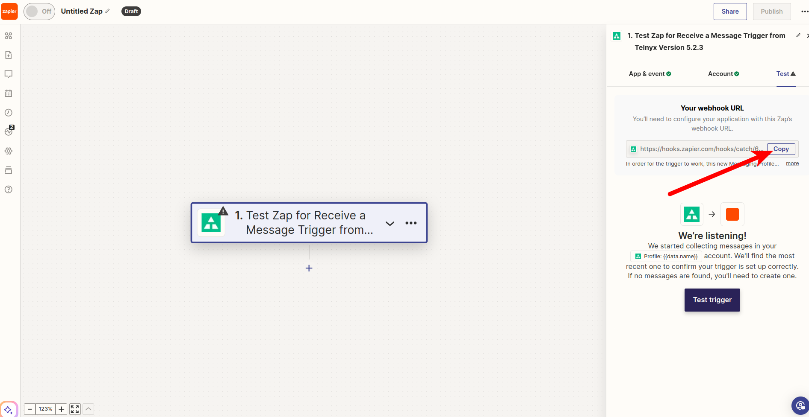
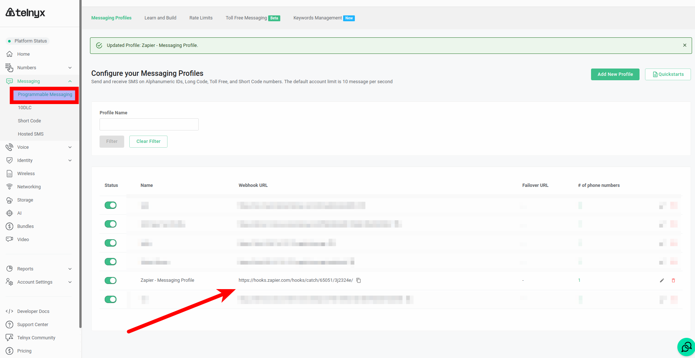
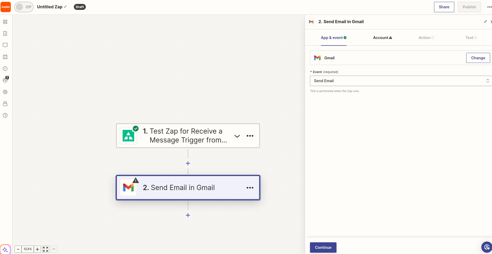

# Telnyx Porting, Billing, and Messaging Automation

*Part 6 of 7 — see also: [Part 1](telnyx-porting-billing-and-messaging-automation--part-1.md), [Part 2](telnyx-porting-billing-and-messaging-automation--part-2.md), [Part 3](telnyx-porting-billing-and-messaging-automation--part-3.md), [Part 4](telnyx-porting-billing-and-messaging-automation--part-4.md), [Part 5](telnyx-porting-billing-and-messaging-automation--part-5.md), [Part 7](telnyx-porting-billing-and-messaging-automation--part-7.md)*

This page consolidates Telnyx support documentation covering number porting (CSRs, LOAs, automated validation, porting requirements, and the auto-generated LOA feature), billing models (per-minute billing increments and channel billing with zone-based pricing), CLI/CLD validation for North American calls, and Zapier-based SMS automations including forwarding texts to mobile or email, automated replies, and the Textable integration.

## Automated Replies for Messages using Zapier

This guide walks you through setting up an automated reply for all inbound SMS messages to your Telnyx number using Zapier.

Visit [Zapier's Telnyx integration page](https://zapier.com/apps/telnyx/integrations) to connect your Telnyx account.

1. Click **Make a Zap!**.
2. Choose **Telnyx** as the trigger App. Then under **Choose Trigger Event**, click on **Receive a Message** and click **Continue**.
3. Click on the account you'd like to use for receiving messages.

*Note that all messages received by another number associated with the messaging profile will be used for this Zap. For this reason we highly recommend only attaching a single number to a messaging profile you use for Zaps.*

4. Click **Continue** and click **Find Message** on the next page to pull in a sample inbound message webhook to use to set up the action stage.
5. Moving onto the action stage. Search for **Telnyx** and choose **Send SMS** under the **Choose Action Event** dropdown and click **Continue**.
6. Now choose the account you'd like to use for sending the message and click **Continue**.
7. Now use information from the incoming message again to populate some of these fields.
8. Under **Source Number**, enter the number you'd like to send from.
9. Under **Destination Number**, click the drop down and click on **From Phone Number**. This makes the source number that sent the original message the receiver of the message that we're going to send out now.
10. Under **Message Content** enter the automated message you'd like to send out.

**Note:** If you're sending automated SMS replies to US numbers, ensure your Telnyx number is associated with a registered 10DLC campaign and an active messaging profile. Unregistered A2P traffic may be filtered or blocked by carriers.

Example message content:

```
Hi there, this is an automated reply!
```

11. Click **Continue** and then **Send Test**. You're all set now. Make sure the Zap is on, then go ahead and send a message to the Telnyx number you entered in the Source Number Field.

You should see your reply come through automatically!

### Final Step, Turn Zap On

**Turn your Zap on** and you're all set! You've set up a quick way to auto-reply to inbound messages to your Telnyx number.

## Zapier: Forward Texts to Email

Zapier connects 5,000+ apps so conversations flow automatically. This article explains how to forward inbound text messages to your email account.

**IMPORTANT:** The steps outlined in this article do not currently function. Telnyx is aware that the Zap for "Receive a Message" is outdated and working on fixing it again.

### Prerequisites

- **Zapier:** Make sure you've [signed up for a Zapier account](https://zapier.com/sign-up). Follow this [link](https://zapier.com/apps/telnyx/integrations) to find the Telnyx Zapier integration and click the connect button to get started.
- **Telnyx Mission Control Portal:**
  - Make sure you have [bought at least one phone number](https://support.telnyx.com/en/articles/4380325-search-and-buy-numbers) that is messaging enabled.
  - Make sure you've created a [messaging profile](https://support.telnyx.com/en/articles/3562059-setting-up-a-messaging-profile) and assigned it to the number you have purchased.
  - Make sure you've created an [API V2 Key](https://support.telnyx.com/en/articles/4305158-api-keys-and-how-to-use-them).

### 1. Making Your First Zap

1. Make sure you're at the Zapier [homepage](https://zapier.com/app/dashboard).
2. In the top right corner, click the **Make a Zap!** button and configure the following:
   1. **Trigger app:** *Telnyx*.
      - If Telnyx is not already in your list of triggers, you can search for it.
   2. **Choose Trigger Event:** Select *Receive a Message*.
   3. Click **Continue**.
   4. **Choose Account:** Select the account you'd like to use for receiving messages.
      - Allow Zapier to access your Telnyx Account.
      - Input your Telnyx API V2 Key.
   5. Click **Continue**.
3. Copy the **webhook URL** that Zapier will provide and assign it to your Telnyx Messaging Profile you created in your Telnyx account.

   

   

4. Click **Test Trigger** to test your connection and pull in a sample inbound message webhook to set up the action stage.
   - You should send a test message to your Telnyx number in order for the sample inbound message to reach your Zapier Webhook.
   - If successful, Zapier will display the inbound message record as seen below.

   

   - Click **Continue with selected record**.

### 2. Integrate Your Zap with Your Email

Here you can search for your email provider, for example, Gmail.

1. Choose the *Send an email* action.
2. Click **Continue**.

   

3. Choose an existing Gmail account, or follow the directions to link a new account.
4. Enter the email where you'd like to receive copies of your inbound messages.
5. Add Cc or Bcc as you wish.
6. Choose your email address as the **To** address.
7. For **Subject**, enter something unique (you most likely will want to filter this subject out from your inbox).
8. In the body enter something like this:
   - **From:** FROM_PHONE_NUMBER_ZAPIER_VARIABLE
   - **To:** TO_PHONE_NUMBER_ZAPIER_VARIABLE
   - **Body:** TEXT_ZAPIER_VARIABLE

   

9. Click **Continue**.

   

   Review the data and then click **Test Step**.

### 3. Test Your Zap

If the test step was successful, you should have received the email with the message contents.


At this point you can click **Publish** to turn on the Zap.


You've now set up a quick way to forward inbound messages from your Telnyx number to your real number.
