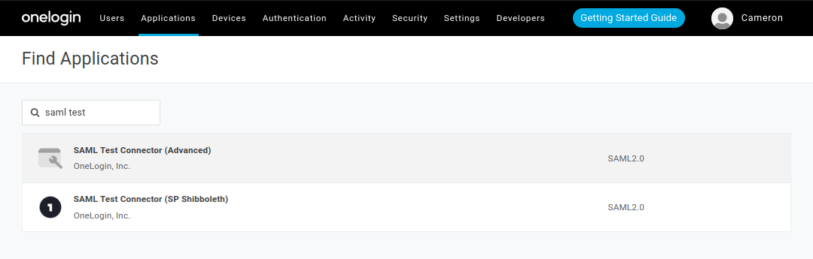
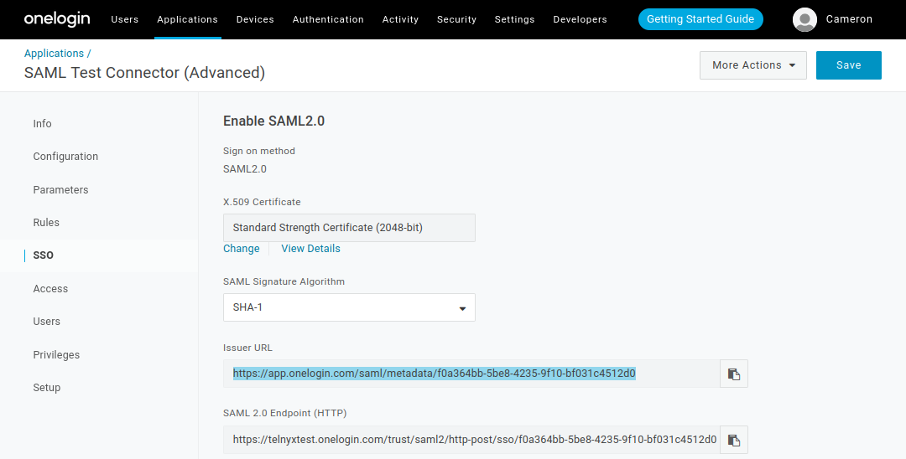
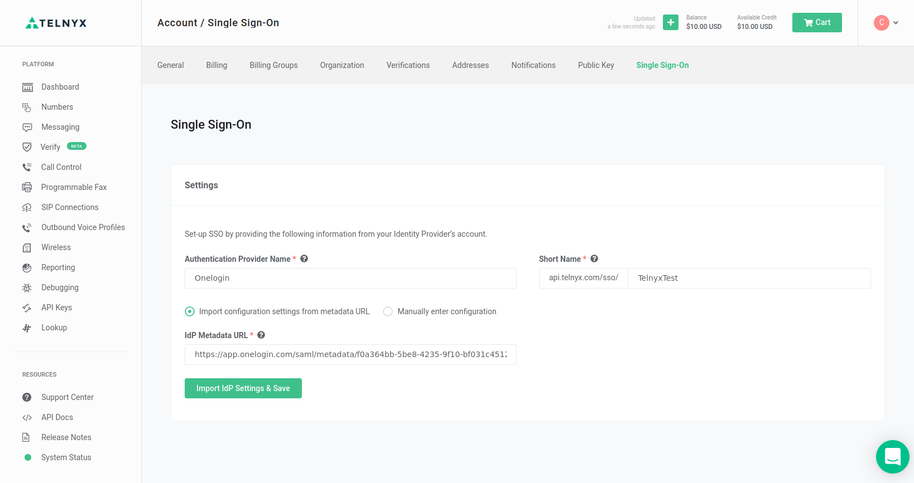
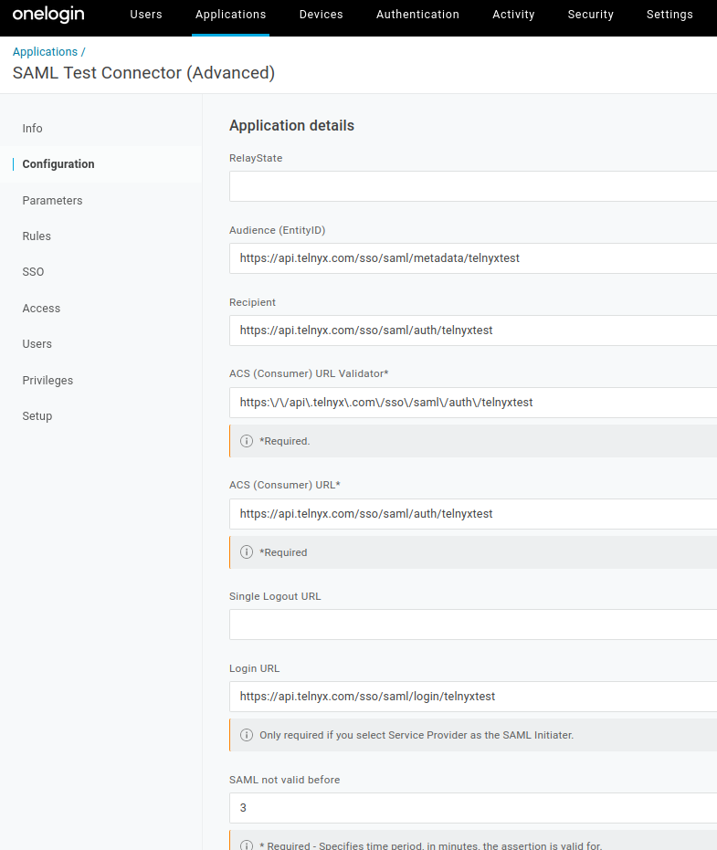
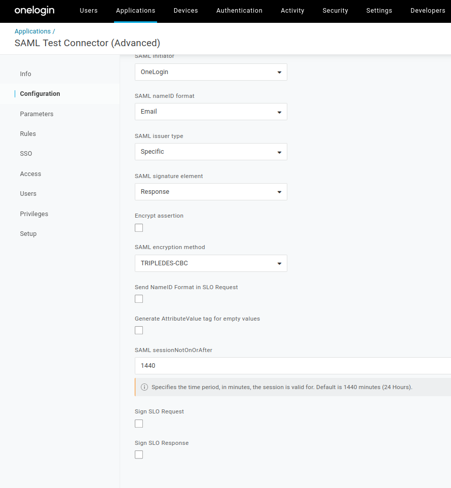
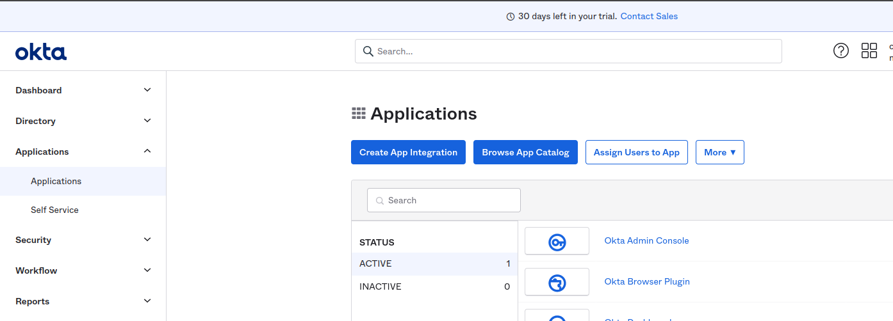
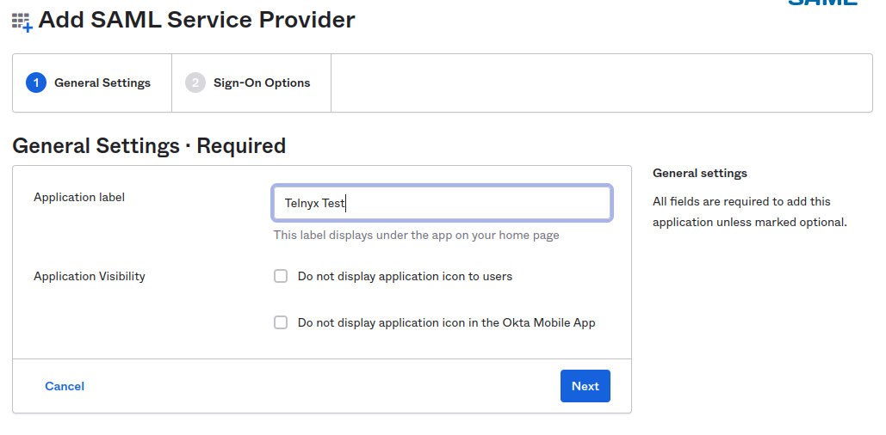
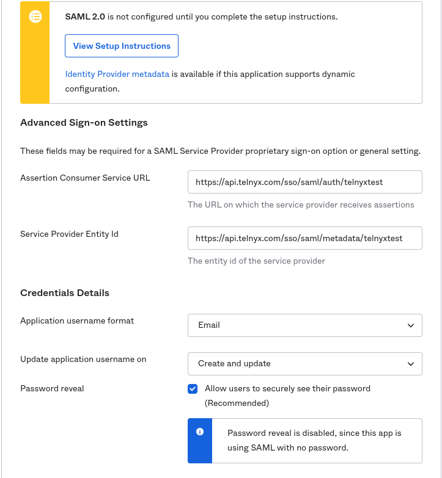

# Telnyx Security, Compliance, and SSO Integration

*Part 2 of 4 — see also: [Part 1](telnyx-security-compliance-and-sso-integration--part-1.md), [Part 3](telnyx-security-compliance-and-sso-integration--part-3.md), [Part 4](telnyx-security-compliance-and-sso-integration--part-4.md)*

This page consolidates Telnyx's security, compliance, and identity management documentation. It covers Telnyx's SOC 2 Type I, SOC 2 Type II, and SOC 3 certifications, the security practices validated by these audits, and how to request reports via the Trust Center. It also provides step-by-step instructions for configuring SAML-based Single Sign-On with the Telnyx Mission Control Portal using OneLogin, Okta, LastPass, Microsoft Azure AD, Auth0, and GSuite.

## OneLogin SAML Identity Setup

[OneLogin](https://www.onelogin.com/) is an identity management system that uses single sign-on (SSO) and a cloud directory to manage user access to on-premises and cloud applications.

### Create an SSO App on OneLogin

1. Log into your [OneLogin admin panel](https://telnyxtest.onelogin.com/login2/).
2. From the top navigation, click the **Applications** drop-down and select **Applications**.
3. Click the blue **Add App** button in the top right corner.

   
4. On the Find Applications page, search for *SAML test* and select the **SAML Test Connector (Advanced)** option.

   
5. Enter your desired **Display Name**.

   
6. Click **Save**.
7. Click the **SSO** tab from the left-hand side menu.

   
8. From the SSO page, copy the **Issuer URL** link. It should resemble: `https://app.onelogin.com/saml/metadata/<onelogin-idp-id>`.

   

### Configure Telnyx with OneLogin

1. Log into your Telnyx Mission Control Portal.
2. Navigate to the **Single Sign-On** section and click **Enable Single Sign-On**.

   
3. Enter an **Authentication Provider name** and **Short Name** (the Short Name will be part of the SSO URLs).
4. Paste the **IdP Metadata URL** (the Issuer URL from OneLogin).

   
5. Click **Import IdP Settings & Save**.
6. Note the **Assertion Consumer Service URL** and **Service Provider Entity ID** from the **Authentication Provider Generated Config** section.

   

### Complete OneLogin Configuration

1. Return to your OneLogin admin portal and click **Configuration** in the left-hand menu.
2. Fill in the following fields:
   - **Audience (Entity ID)**: Service Provider Entity ID from Telnyx.
   - **Recipient**: Assertion Consumer Service URL from Telnyx.
   - **ACS (Consumer) URL\***: Assertion Consumer Service URL from Telnyx.
   - **ACS (Consumer) URL Validator\***: `https:\/\/api\.telnyx\.com\/sso\/saml\/auth\/telnyxtest`
   - **Login URL**: `https://api.telnyx.com/sso/saml/login/YOUR_SHORT_NAME`
   - **SAML nameID format**: Select *Email*.

   

   

   
3. Click **Save**.
4. In the Telnyx Mission Control Portal, select **Enable Single Sign-On** and click **Save Changes**.

   

If you experience technical difficulties, check the status of OneLogin's features at [status.onelogin.com](https://www.onelogin.com/status).

## Okta SAML Identity Setup

[Okta](https://www.okta.com/) is an identity management system that uses single sign-on (SSO) and a cloud directory to help companies manage and secure user authentication into applications.

### Create an SSO App on Okta

1. Log into your Okta Admin panel.
2. Click **Applications** in the left-hand navigation and click **Browse App Catalog**.

   
3. Search for *SAML* and choose **SAML Service Provider**.

   
4. Click **Add**.

   
5. Change the **Application Label** to your desired name.

   
6. Click **Next**.
7. On the **Sign-On Options** page, select **SAML 2.0**.
8. Set the **Default Relay State** to `https://portal.telnyx.com`.
9. Click **View Setup Instructions** and retrieve your **Identity Provider Entity Id**. The link should resemble: `https://<okta-org>.okta.com/app/<okta-idp-id>/sso/saml/metadata`.

   

### Configure Telnyx with Okta

1. Log into your Telnyx Mission Control Portal.
2. Navigate to **Single Sign-On** and click **Enable Single Sign-On**.

   
3. Enter an **Authentication Provider name** and **Short Name**.
4. Paste the **IdP Metadata URL** (the Identity Provider Entity ID from Okta).
5. Click **Import IdP Settings & Save**. **NOTE:** After saving, the *IdP Entity ID* field may show "not found"; extract the `<okta-idp-id>` from the IdP Metadata URL and paste it into this field manually.

   
6. Click **Save Changes**.
7. Note the **Assertion Consumer Service URL** and **Service Provider Entity ID** from the **Authentication Provider Generated Config** section.

   

### Complete Okta Configuration

1. Return to your Okta Admin page and fill in the **Advanced Sign-On** settings and **Credential** details using the values from Telnyx.
2. In the **Application username format** field, select *Email*.

   
3. Click **Save**.
4. In the Telnyx Mission Control Portal, select **Enable Single Sign-On** and click **Save Changes**.

   

If you experience technical difficulties, check the status of Okta's features at [status.okta.com](https://status.okta.com/).
