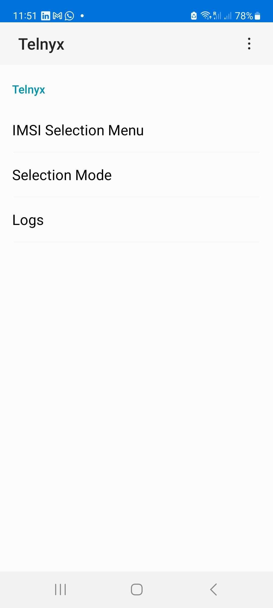

# Telnyx SIM and eSIM Configuration Guide

*Part 1 of 4 — see also: [Part 2](telnyx-sim-and-esim-configuration-guide--part-2.md), [Part 3](telnyx-sim-and-esim-configuration-guide--part-3.md), [Part 4](telnyx-sim-and-esim-configuration-guide--part-4.md)*

This page consolidates Telnyx guidance on SIM and eSIM provisioning, activation, and security. It covers manual eSIM activation, QR-code eSIM setup, SIM theft prevention via IMEI authorization, manual IMSI selection for engineering troubleshooting, and the underlying VoIP/SIP/SDP/codec concepts that govern how Telnyx SIM-backed devices interoperate with the network.

## Overview

Telnyx provides a range of SIM and eSIM products for IoT, mobile, and router use cases. This page consolidates the procedures for purchasing, activating, securing, and troubleshooting Telnyx SIMs and eSIMs, and explains the underlying VoIP and SIP signaling concepts that govern how Telnyx SIM-backed devices interoperate with the Telnyx network.

## eSIM Activation

### Purchasing and activating via QR code

To set up a Telnyx eSIM using a QR code:

1. Log into your account and visit the [wireless dashboard](https://portal.telnyx.com/#/wireless/dashboard).
2. Click **Purchase eSIMs** in the top right. In the pop-up window:
   - Select the number of eSIMs to purchase.
   - Choose a SIM Card Group to associate the eSIM with.
   - Set the SIM Card Status (Disabled, Enabled, or Standby). The status must be **Enabled** to proceed with activation.
   - Add SIM Card Tags for reporting segregation.
3. Click **Purchase**. The window is replaced with one containing the QR code.
4. Scan the QR code with the camera of the device you want to activate. The camera will highlight "mobile plan" beneath the QR code; tap it to proceed.
5. Follow the on-screen prompts. Activation may take a few minutes to connect to the network.
6. Verify that the APN has been set correctly to `data00.telnyx`.

For bulk eSIM purchases, contact [sales@telnyx.com](mailto:sales@telnyx.com) for discount pricing. The QR code can also be retrieved later from the SIM card settings in your account.

### Manual eSIM activation

Manual activation is used when QR-code scanning is not feasible — for example, on devices without cameras (IoT devices, modems, routers) or when the QR code cannot be displayed or printed.

After purchasing an eSIM, retrieve the activation code using the [Get SIM card activation code API](https://developers.telnyx.com/api-reference/sim-cards/get-sim-card-activation-code):

- Pass the UUID of the eSIM as the `id` parameter. The UUID is shown in the SIM card view in the portal, just above the QR code.
- If you cannot retrieve the activation code via the API, [contact Telnyx support](https://telnyx.com/contact-us) for assistance.

The activation code contains both the **SM-DP+ address** and the **matching ID**. Entering these into your device (via AT commands or a GUI, depending on the device) connects it to the SM-DP+ server, which authenticates the device and authorizes the eSIM profile download.

> **Note:** The manual setup method depends on the modem manufacturer, not the eSIM provider.

#### Manual setup on mobile phones

**iOS:**
1. Go to **Settings** → **Cellular** or **Mobile Data**.
2. Tap **Add eSIM** and select **Enter Details Manually**.
3. Input the SM-DP+ address and activation code.
4. Complete the setup by following the on-screen prompts.

**Android:**
1. Open **Settings** → **Network & Internet** → **SIMs**.
2. Choose **Add eSIM** or tap the **+** sign.
3. Manually enter the SM-DP+ address and activation code as prompted.
4. Follow the instructions to activate the eSIM.

#### Manual setup on modems and routers

Because modems lack screens and cameras, their eSIM activation process differs and may involve entering commands or using a graphical interface.

- **AT-command modems (e.g. Quectel):** Log into the modem's interface and enter the required AT commands for eSIM activation, including the SM-DP+ address and activation code. See the [Quectel eSIM AT command set](https://forums.quectel.com/t/esim-at-command-set/13313).
- **GUI-based routers (e.g. Peplink):** Open the router's GUI, go to the cellular settings, and manually enter the SM-DP+ address and activation code. See the [Peplink setup video](https://www.youtube.com/watch?v=igReb-oENS4).

> Steps vary by modem and manufacturer; consult the specific setup guide provided by your modem's manufacturer.

### eSIM activation concepts

- **Activation code** — A unique code comprising two parts: the SM-DP+ address and the matching ID. It contains everything needed to retrieve and activate the eSIM.
- **SM-DP+ address** — A unique code that identifies an SM-DP+ server. The device uses it to locate and connect to the server that manages eSIM profiles.
- **Matching ID** — A unique code that identifies a specific eSIM on an SM-DP+ server.

During activation, the device uses the SM-DP+ address to locate the SM-DP+ server, requests the necessary data, and once verified, the server authorizes the eSIM profile download.

## SIM Card Theft Prevention

Telnyx allows you to add up to **5 authorized IMEIs** to the SIMs in your SIM fleet so they can only be used by your authorized devices. An [IMEI (International Mobile Equipment Identity)](https://en.wikipedia.org/wiki/International_Mobile_Equipment_Identity) is a unique identifier for a mobile device.

To configure Telnyx SIM cards to auto-disable when an unauthorized IMEI is recognized, use the SIM Card drill-down section in the Mission Control Portal.

### Handling unauthorized IMEIs

- Allow up to **5 minutes** for SIM cards to be disabled after an unauthorized IMEI is recognized.
- An email is dispatched to your account when an unauthorized IMEI is detected.
- If no authorized IMEIs are added to a SIM card, all devices are considered authorized. This is the default configuration.

## Manual IMSI Selection

> ⚠️ **For engineering use only.** Perform only if instructed by Telnyx support.

Telnyx SIM cards use **Multi-IMSI** technology to maximize global coverage and resilience. By default, the SIM automatically selects the most appropriate IMSI (e.g. IMSI1, IMSI2) based on internal logic. Manual IMSI selection may be necessary in specific engineering scenarios for troubleshooting.

A SIM Toolkit (STK) application is installed on the device when the Telnyx SIM is enabled. The STK displays a menu that allows the user to manually select the IMSI to use for mobile services.

### Changing IMSI on Android

On Android devices, look for the **Telnyx** or **SIM Toolkit** app when your Telnyx SIM is active:

1. Open the **SIM Toolkit** or **Telnyx** app.
2. Click on **Roaming Services** or **Telnyx**.
3. Tap **IMSI Selection Menu** and select the desired IMSI (e.g. IMSI1, IMSI2) as instructed by Telnyx support.
4. Wait a few minutes for the device to read the new IMSI and reconnect to the network.
5. Return to **Selection Mode** and switch back to **Automatic** for normal operation.

The app may appear as **Telnyx UICC** or **SIM Toolkit** when the Telnyx SIM is in use.

### Changing IMSI on iOS

1. Go to **Settings** → **Mobile Service** (or **Mobile Data**, or **Cellular**) → **SIM Applications**.
2. Tap **IMSI Selection Menu** and select the desired IMSI (e.g. IMSI1, IMSI2) as instructed by Telnyx support.
3. Wait a few minutes for the device to read the new IMSI and reconnect to the network.
4. Return to **Selection Mode** and switch back to **Automatic** for normal operation.

> On multi-SIM devices, make sure to select the Telnyx SIM from the list of available SIMs to access the SIM Toolkit (STK) associated with it.

### When to use manual IMSI selection

✅ **Only when:**
- Directed by Telnyx engineering for support or troubleshooting.
- Diagnosing connectivity issues with a specific IMSI.

❌ **Avoid when:**
- Not under Telnyx instruction.
- Mobility and seamless coverage are required.

Always switch back to **Automatic** once testing is complete (unless instructed otherwise). Failure to do so may result in loss of connectivity when the device moves geographically.
