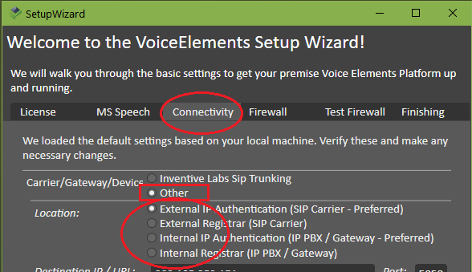

# Telnyx SIP and Messaging Error Codes

*Part 3 of 4 — see also: [Part 1](telnyx-sip-and-messaging-error-codes--part-1.md), [Part 2](telnyx-sip-and-messaging-error-codes--part-2.md), [Part 4](telnyx-sip-and-messaging-error-codes--part-4.md)*

A consolidated reference for Telnyx SIP response codes, the SIP 603+ carrier rejection standard, Voice Elements integration with Telnyx SIP, and Telnyx messaging error codes, including guidance on causes, workarounds, and best practices for reducing false-positive call blocking.

## Voice Elements Integration with Telnyx SIP

Voice Elements is a Microsoft .NET development environment for building automated telephone systems, released by Inventive Labs Corporation in 2008 based on their original CTI32 toolkit. Software developers who use C#, VB.NET, or Delphi use Voice Elements to write telephony-based applications, such as Interactive Voice Response systems, voice dialers, auto attendants, call centers, and more.

The Voice Elements Dashboard has several SIP and PBX connection options to choose from. The following steps cover how to connect to Telnyx and leverage it as a SIP provider.

Additional resources:

- [Voice Elements documentation](https://www.voiceelements.com/docs/)
- [Contact Voice Elements support](https://www.voiceelements.com/contact/)
- [Try Voice Elements for free](https://www.voiceelements.com/demo/)
- [Getting started with Telnyx](https://sip.telnyx.com/#signaling-addresses)

### Pre-requisites

- Your Telnyx Portal must be correctly set up and configured for use.
- Download and install Voice Elements.
- **(Optional)** If you're planning to use TLS encryption, you'll need to enable TLS encryption in your Telnyx portal. To learn more about TLS and other VoIP security topics, see the TLS and SRTP article.

### Create a Telnyx SIP Trunk in Voice Elements

1. Open the Voice Elements wizard and select the **Connectivity** tab.
2. In the **Carrier/Gateway/Devices** section, select the *Other* option.
3. In the **Location** section, select the *External IP Authentication (SIP Carrier - Preferred)* option.

   
4. Enter Telnyx's connection information in the text boxes below:
   1. **Destination IP/URL:** `sip.telnyx.com` (In the USA; for other countries, use your top-level domain extension. If you're uncertain, see the [signaling addresses](https://sip.telnyx.com/#signaling-addresses).)
   2. Public and local IPs will be populated already. You can leave these alone.
5. Once you enter Telnyx's IP or URL, you'll be asked to provide additional information:
   1. **Registrar IP/URL:** `sip:sip.telnyx.com`
   2. **AuthURI:** `your_telnyx_username@sip.telnyx.com`
   3. **Username:** The SIP connection username (see the Credentials Connection Setup section of the SIP Connection Types article).
   4. **Pwd:** The SIP connection password (see the Credentials Connection Setup section of the SIP Connection Types article).
   5. **A note about ports:** Port 5060 should typically be used for UDP or TCP transportation. If you're using TLS to encrypt your traffic, use port 5061 and ensure that you have configured your portal properly.

### Test Your Firewall

Using a firewall with any external service is a critical step. Because this isn't a Telnyx-side configuration activity, consult Voice Elements' [firewall configuration documentation](https://www.voiceelements.com/docs/programmable-voice/configuration/firewall/).

> **A WARNING ABOUT SIP SNIFFERS:** SIP sniffers are bots that seek out SIP servers on the internet and try to break in hoping to find weaknesses that would allow them to place free calls over your system. To combat this, it is HIGHLY recommended that you only permit [Telnyx IP addresses](https://support.telnyx.com/en/articles/1130687-whitelisting-telnyx-ip-addresses) to have access to this port.
