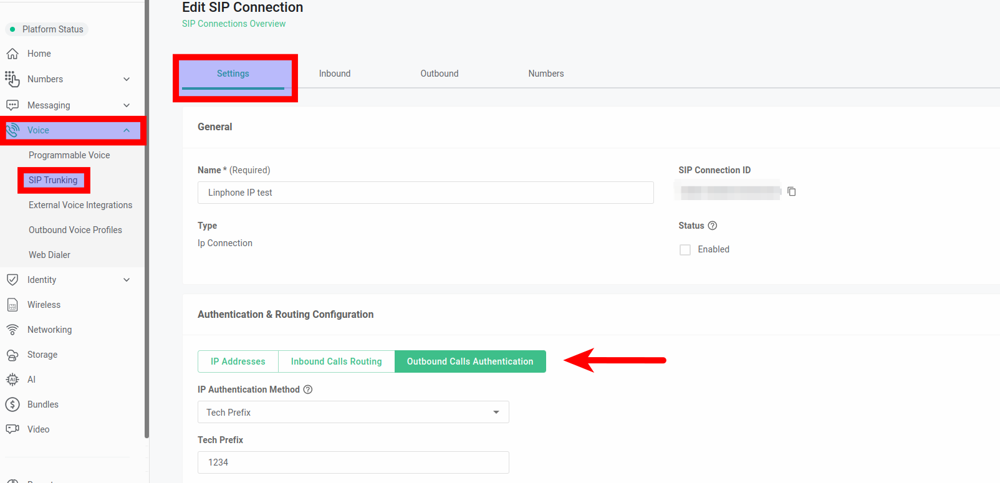

# Telnyx SIP Connection Configuration Guide

*Part 1 of 5 — see also: [Part 2](telnyx-sip-connection-configuration-guide--part-2.md), [Part 3](telnyx-sip-connection-configuration-guide--part-3.md), [Part 4](telnyx-sip-connection-configuration-guide--part-4.md), [Part 5](telnyx-sip-connection-configuration-guide--part-5.md)*

This page consolidates Telnyx guidance on configuring SIP connections, including IP and credentials-based authentication, failover and retry behavior, multi-device registration, tech prefixes, X-Telnyx-Token authentication, P-Charge-Info headers, and PBX-specific setup examples for FreePBX, FreeSWITCH, and FusionPBX.

## Overview

Telnyx Mission Control is designed for multi-tenant environments, allowing you to create as many SIP connections as needed to support customers and end-users. A SIP connection defines how Telnyx authenticates and routes traffic to your endpoints, and the configuration you choose depends on your network topology, the number of clients sharing an IP, and the PBX or device you are integrating.

## Connection Types and Multi-Device Registration

Telnyx supports both IP/FQDN-based and credentials-based connections. With a credentials-based connection, you can register it to any device, but only one device can be actively registered at any one time. For example, if you register a connection to an IP phone in your office and then register the same connection to a softphone while on the go, calls will only come and go from the softphone; the IP phone becomes an unregistered device.

If you need multiple devices to ring simultaneously or to share a single set of credentials, you should create additional connections rather than reuse one credentials-based connection.

## IP/FQDN Failover Configuration

Failover can only be configured when multiple IP addresses or FQDNs are defined within a single SIP Connection. To configure failover:

1. Navigate to the [SIP Connections page](https://portal.telnyx.com/#/voice/connections) and click **Add SIP Connection**.
2. Enter a **Connection Name** and select **Type** as *IP* or *FQDN*, then click **Create**.
3. Click **Add IP** and add your endpoints in order: the first entry is the primary IP/FQDN, and the second entry is the secondary IP/FQDN used for failover.
4. Use the dropdown to define the routing order: **Primary → Secondary → (optional) Tertiary**. Failover follows this sequence if a route becomes unreachable or fails.
5. Click **Next**, then **Done** to finalize the SIP Connection.

Failover is triggered when an endpoint is unreachable or fails to respond. Ensure all configured endpoints are properly provisioned and reachable, and regularly test failover behavior to confirm proper routing.

## Fail-over and Retry Behavior

Telnyx SIP Connections allow you to define multiple retries in case a call fails to connect. The fail-over and retry policy is designed to ensure calls always connect regardless of issues on either side.

### Key Concepts

- **IP1 / IP2:** Primary and secondary signaling IP addresses of the SIP region (for the US SIP region these are 192.76.120.10 and 64.16.250.10).
- **Routes:** Each connection can have multiple routes. For IP Auth connections each IP address is a route; for FQDN connections each FQDN is a route.
- **Route preferences:** If a connection's routing method is **Sequential**, each route can be set as Primary, Secondary, or Tertiary. Number-level settings override connection-level settings. If the routing method is **Round Robin**, each route is attempted in random order.
- **Call Connected:** A call attempt is considered "connected" (not "answered") if it receives 486 Busy, 404 Not Found, 603 Declined, rings (180/183) without answer, or is answered (200 OK).

### Inbound Retry Patterns

- **Single route:** Telnyx sends an attempt from IP1 to the single route. If it does not connect, Telnyx retries from IP2.
- **Multiple routes:** Telnyx attempts IP1 → route 1, IP1 → route 2, IP1 → route 3, then IP2 → route 1, IP2 → route 2, IP2 → route 3.
- **Cred Auth connections:** Telnyx sends call attempts only from the IP that the SIP device registered to (IP1 or IP2). The SIP device can register against an IP address, an FQDN pointing to IP1 (sip-anycast1.telnyx.com), an FQDN pointing to IP2 (sip-anycast2.telnyx.com), or an FQDN with SRV records pointing to IP1 as primary and IP2 as secondary (sip.telnyx.com). Call attempts go through a KSS (SIP registrar) with three instances per US region, attempting primary, secondary, then tertiary KSS.
- **Call Forward on Failure:** After exhausting connection routes, Telnyx attempts the Call Forward PSTN Number through up to 10 termination carriers in route order.
- **Call Forward Always:** Telnyx attempts the PSTN Number through up to 10 termination carriers in route order.
- **SRV records:** When an inbound call is routed to an FQDN connection that uses SRV records, Telnyx honors the SRV records as long as no port is specified in the SIP URI. Telnyx performs an SRV lookup and routes based on priority and weight. If the first SRV target fails with a SIP 503 response, Telnyx attempts the next highest priority target. If no SRV record exists, Telnyx falls back to an A-record lookup using port 5060 for UDP/TCP or 5061 for TLS. If the domain cannot be resolved, the call fails with SIP 478 Unresolvable Destination. If a port is included in the SIP URI, Telnyx bypasses SRV lookup and performs an A-record lookup instead.

### Outbound Retry Pattern

For outbound calls to a PSTN number, Telnyx attempts the call through the first termination carrier in route, then the second, and so on, up to a maximum of 10 termination carriers.

### Preventing Retries on Inbound Rejection

If you do not wish to retry SIP INVITEs on inbound calls, return a **603 Declined** response, which is the SIP response code Telnyx honors for not retrying.

### Primary and Secondary Proxies

- **Inbound:** Ensure your SIP endpoints and network ACLs allow calls from both the primary and secondary Telnyx SIP proxy IPs.
- **Outbound (IP):** Use 192.76.120.10 as primary and 64.16.250.10 as secondary for the US region.
- **Outbound (FQDN with A record):** Use sip.telnyx.com as primary and sip-anycast2.telnyx.com as failover for the US region.
- **Outbound (FQDN with SRV records, recommended):** Use sip.telnyx.com for the US region; failover is automatically configured.
- For other regions (sip.telnyx.eu, sip.telnyx.ca, sip.telnyx.com.au, etc.), change the domain accordingly. See all available regions at [sip.telnyx.com](https://sip.telnyx.com/).

## IP Authentication with Tech Prefix

The tech prefix setting is found under the **Settings** tab of your [SIP Connections](https://portal.telnyx.com/#/app/connections) Authentication & Routing Configuration section.

In environments where a single IP address is used for multiple outbound voice profiles, it is vital to distinguish each client's traffic uniquely. Telnyx supports this by allowing multiple IP connections to share the same IP. To differentiate each client, apply a unique 4-digit tech prefix to each connection. For outbound calls sent to Telnyx, this tech prefix must be included; otherwise, the call will not be recognized, leading to a SIP 407 Proxy Authentication response and call rejection.

A tech prefix is a 4-digit number prefixed to the number you are dialing. For example, with a tech prefix of "1234" and a destination of "18005678912", you would dial "123418005678912". The prefix does not need to be entered manually each time; your phone system's outbound settings can be configured to automatically prepend it.

Telnyx also supports tech prefixes at the [number level](https://support.telnyx.com/en/articles/4349113-my-numbers-page#h_d4c4ba170f) for more granular control of call routing and identification.

While connections can share the same IP address, they must be uniquely identified to avoid the "[Termination Endpoint](https://support.telnyx.com/en/articles/4320411-more-about-outbound-voice-profiles#h_8af1e9166d)" error, which occurs when another connection with the same IP address is already assigned to an outbound voice profile. Ensure each connection has a unique combination, achieved through a tech prefix, token, or P-Charge-Info.
