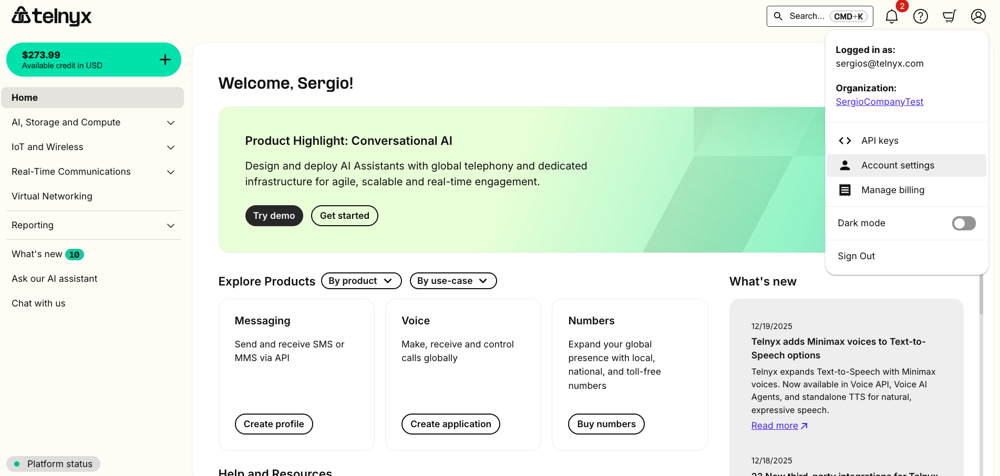
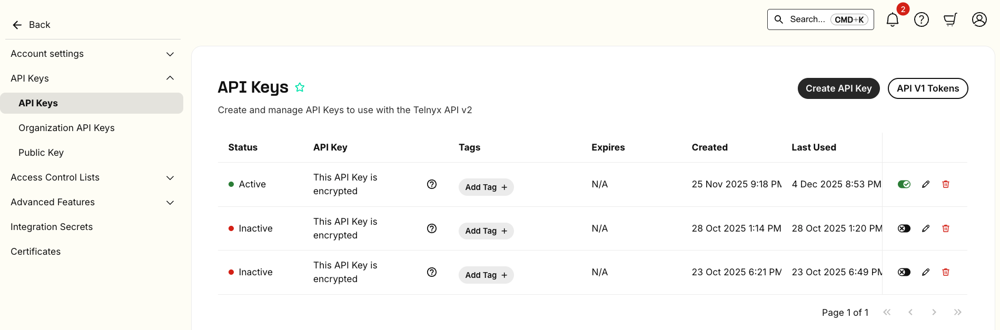
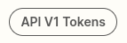

# Telnyx SIP Connection Configuration Guide

*Part 5 of 5 — see also: [Part 1](telnyx-sip-connection-configuration-guide--part-1.md), [Part 2](telnyx-sip-connection-configuration-guide--part-2.md), [Part 3](telnyx-sip-connection-configuration-guide--part-3.md), [Part 4](telnyx-sip-connection-configuration-guide--part-4.md)*

This page consolidates Telnyx guidance on configuring SIP connections, including IP and credentials-based authentication, failover and retry behavior, multi-device registration, tech prefixes, X-Telnyx-Token authentication, P-Charge-Info headers, and PBX-specific setup examples for FreePBX, FreeSWITCH, and FusionPBX.

## API Keys and Tokens

To use Telnyx v2 API endpoints, you need an API key. For v1 API endpoints, you need an API Token. Telnyx uses API Keys or Tokens to authenticate API requests from customers.

### API v2 Key

1. Log in to [portal.telnyx.com](https://portal.telnyx.com/).
2. Click the Account icon in the top-right corner and select **Account Settings**.
3. Click [API Keys](https://portal.telnyx.com/#/api-keys).
4. Click **Create API Key** in the top-right corner.

   
5. Copy the provided API v2 Key.

   

   

   > **NOTE:** The API Key is only visible at the time of creation. Store it securely in your application's environment variables.

If you lose the key, return to this section to view it or create a new one. You can set an expiration date, temporarily disable any API Key by toggling the option, and associate up to 10 tags per API Key.

### API v1 Token

1. Log in to [portal.telnyx.com](https://portal.telnyx.com/).
2. Click **Account Settings** in the left-hand side dropdown.
3. Click [API Keys](https://portal.telnyx.com/#/api-keys).
4. Click the **[API V1 Tokens](https://portal.telnyx.com/#/app/api-tokens)** button in the top-right corner.

   
5. Click **Create API Token**.

   
6. Give the token a name.
7. Click **Copy Token** in the right-hand section.

   

   > **NOTE:** The API Token is only visible at the time of creation. Store it securely in your application's environment variables.

In your API request, include two headers:

- **x-api-user:** your account email
- **x-api-token:** your account token

See the [developer docs](https://developers.telnyx.com/api) for more details on API v1 Tokens and API v2 Keys.

