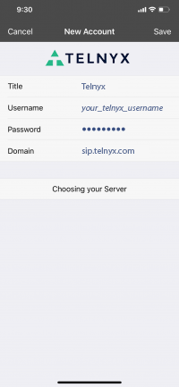
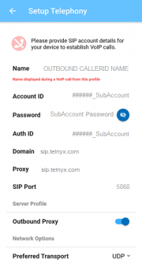
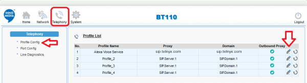
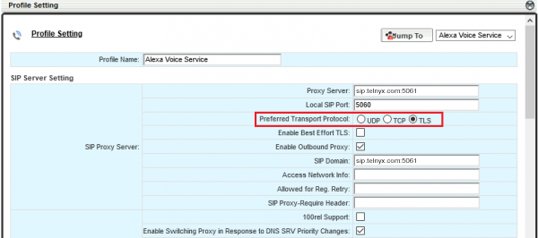
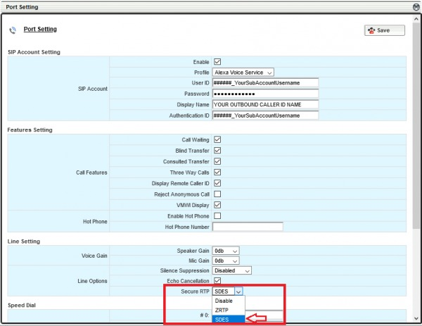

# Telnyx SIP Endpoint Configuration Guide

*Part 1 of 4 — see also: [Part 2](telnyx-sip-endpoint-configuration-guide--part-2.md), [Part 3](telnyx-sip-endpoint-configuration-guide--part-3.md), [Part 4](telnyx-sip-endpoint-configuration-guide--part-4.md)*

This page consolidates Telnyx setup instructions for a range of SIP endpoints — softphones, conference phones, and desk IP phones — covering Acrobits, BuddyTalk, FortiFone, Gigaset, and Vtech devices. Each section walks through prerequisites, obtaining the device IP address, registering the device with the Telnyx SIP service at sip.telnyx.com, and configuring transport, audio, and caller ID settings.

## Overview

Telnyx supports a wide range of SIP endpoints for voice calling. This guide consolidates configuration instructions for softphones, conference phones, and desk IP phones from vendors including Acrobits, BuddyTalk (Innomedia), Fortinet FortiFone, Gigaset, and Vtech. Across all devices, the core configuration pattern is the same: point the device at the Telnyx SIP domain `sip.telnyx.com`, supply your Telnyx SIP credentials, and choose a transport (UDP/TCP on port 5060, or TLS on port 5061) consistent with whether you have enabled encryption on your Telnyx account.

### Common prerequisites

Before configuring any endpoint, ensure that:

- Your [Telnyx Mission Control Portal](https://support.telnyx.com/en/articles/1176636-get-started-with-a-mission-control-account) account is set up correctly.
- You have provisioned a DID and a SIP connection (credentials-based) in the portal.
- You have created an outbound voice profile and assigned the number to the SIP connection.
- (Recommended) You have [enabled TLS to encrypt your traffic](https://support.telnyx.com/en/articles/1130711-does-telnyx-encrypt-communication).
- Your firewall allows SIP signaling on port 5060 (and 5061 for TLS) and the appropriate RTP media ports.

### Caller ID naming conventions

When configuring a display name / caller ID name on any endpoint, follow these conventions:

- Use **capital letters** so the name displays clearly on receiving devices.
- Do **not** use special characters — they will not be displayed. Spaces are allowed.
- Some Canadian providers truncate caller ID names to **15 characters**; keep your name short.

### Telnyx SIP connection details (common to all endpoints)

| Field | Value |
| --- | --- |
| Domain / SIP server | `sip.telnyx.com` |
| Outbound proxy | `sip.telnyx.com` |
| Registration server | `sip.telnyx.com` |
| Username | Your Telnyx SIP account username |
| Password | Your Telnyx SIP account password |
| UDP/TCP port | `5060` |
| TLS port | `5061` |
| Registration refresh | `300` seconds (some devices use `600`) |
| STUN server (optional) | `stun.telnyx.com:3478` |

### Supported audio codecs

Telnyx supports the following audio codecs. Configure them in priority order on devices that allow codec selection:

- `ulaw` (g711u)
- `alaw` (g711a)
- `g722`
- `g729`

---

## Acrobits Softphone / Groundwire

[Acrobits](https://acrobits.net/) provides mobile softphone apps (Acrobits Softphone and Acrobits Groundwire) for iOS and Android that support voice, video, file sharing, and more. Acrobits also offers a Cloud Softphone platform and SDK for building customized UCaaS solutions.

> **Important:** Acrobits softphone apps can only be used for voice calling. SIP/Simple, which is required to enable SMS/MMS on Acrobits, is currently not supported by Telnyx.

### Connect Acrobits to Telnyx

1. Run the Acrobits app (Softphone or Groundwire).
2. Tap the **settings gear** at the top-right and select **SIP Accounts**.
3. Tap **New SIP Account**.
4. If Telnyx is not in the provider list, contact Telnyx support and add the account manually — server details are entered in the next step regardless.
5. Enter the server information:
   - **Title:** `Telnyx` (recommended)
   - **Username:** Your Telnyx account username
   - **Password:** Your Telnyx account password
   - **Domain:** `sip.telnyx.com`

   
6. Tap **Save**.

### Optional: Set a display name for outbound caller ID

In the Acrobits app's advanced settings, configure a caller ID display name following the naming conventions above.

### Additional Acrobits resources

- [Acrobits official site](https://acrobits.net/)
- [Acrobits pricing and demo options](https://acrobits.net/cloud-softphone/pricing/)
- [What can I do with Acrobits?](https://acrobits.net/features/)
- [Build your own low-code app with Cloud Softphone](https://acrobits.net/cloud-softphone/)
- [Acrobits SDK](https://acrobits.net/acrobits-sdk/)

---

## BuddyTalk BT110 / BT120

[BuddyTalk](https://www.innomedia.com/buddytalk-product-family/), powered by Amazon Alexa Voice Service (AVS) and Alexa Communication (ACM), is an intelligent speakerphone/smart speaker that supports VoIP calling. The BT110 and BT120 are equipped with advanced audio processing and deliver high-quality voice calling with strong security.

### Prerequisites

- Telnyx Mission Control Portal configured.
- A DID provisioned from Telnyx.
- (Recommended) TLS enabled for encryption.
- An Amazon account with Communications enabled.
- The Alexa app installed.
- The BuddyTalk Setup App (Android 4.4.4+ or iOS 12+).
- Firewall open for SIP on port 5060.
- Access to the [BuddyTalk web console](https://www.innomedia.com/buddytalk-product-family/).

### Set up your BuddyTalk profile

1. Open the BuddyTalk Setup App and complete the first two setup steps.
2. On the third step (**Setup Telephony**), provide:
   - **Name:** Outbound Caller ID name (follow the naming conventions above).
   - **Account ID:** Your Telnyx SIP account ID.
   - **Auth ID:** Your Telnyx SIP account ID.
   - **Password:** Your Telnyx SIP account password.
   - **Domain:** `sip.telnyx.com`.
   - **Outbound proxy (optional):** Toggle to enable.
   - **Proxy (optional):** `sip.telnyx.com`.
   - **Local SIP Port:** `5060`.
   - **Preferred Transport:** `UDP` (default). Choose `TLS` if you have enabled call encryption on your Telnyx portal.

   
3. After registration completes, the phone icon in the upper-left turns green and the device LED changes from red to green to off.

### Optional: Encrypt traffic by enabling TLS

1. Log into the [BuddyTalk Web Console](https://www.innomedia.com/buddytalk-product-family/).
2. Click **Telephony** in the top navigation.
3. In the left-hand menu, click **Profile Config** and edit the profile you just created (pencil icon).

   
4. In the **SIP Proxy Server** section, set **Preferred Transport Protocol** to `TLS`.

   
5. In the left-hand menu, click **Port Config** and edit the profile.
6. In **Line Setting > Line Options**, set **Secure RTP** to `SDES`.

   

### Alexa voice commands

Once configured, you can use commands such as:

- *"Alexa call (some number)"*
- *"Alexa, call (name)"*
- *"Alexa, answer call."*
- *"Alexa, hang up."*

You can also use any other [Alexa skills and commands](https://www.amazon.com/alexa-skills/b?ie=UTF8&node=13727921011).

### Additional BuddyTalk resources

- [BT110 / BT120 / BT200 user documentation](https://www.innomedia.com/buddytalk-product-family/)
- [BuddyTalk setup page](https://www.innomedia.com/buddytalk-product-family/)

---
