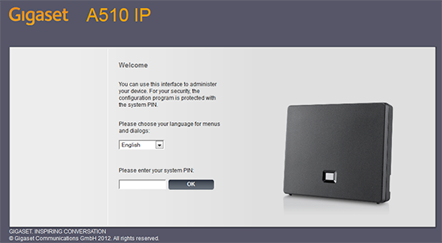
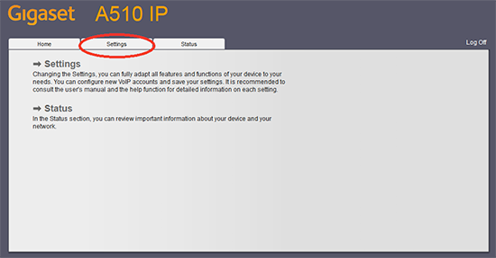
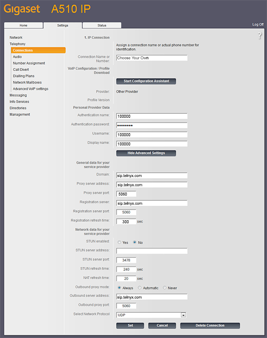
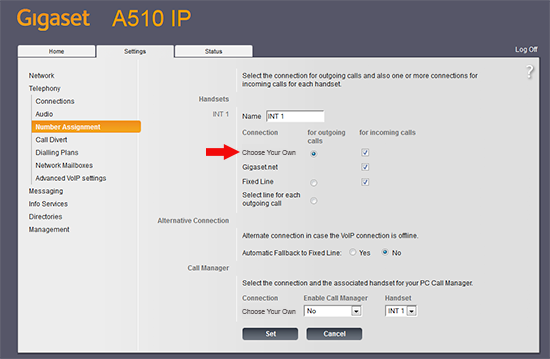
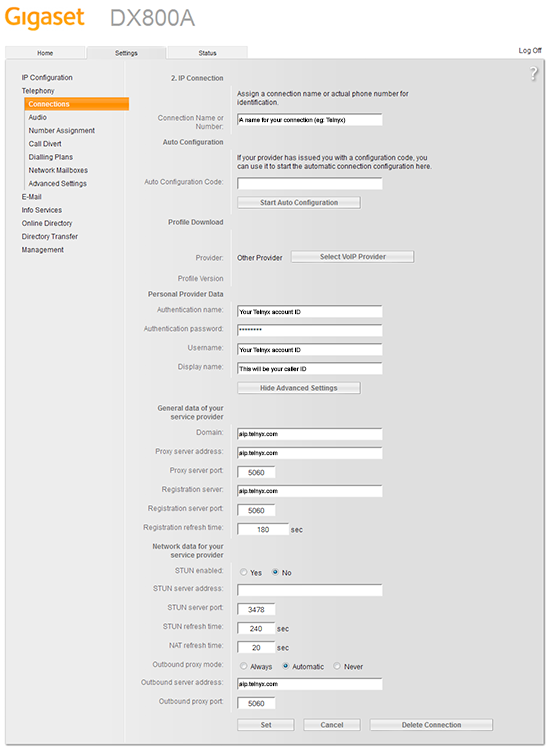
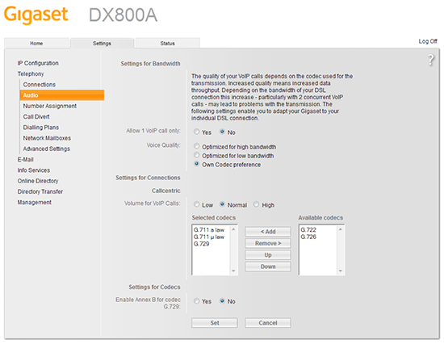

# Telnyx SIP Endpoint Configuration Guide

*Part 3 of 4 — see also: [Part 1](telnyx-sip-endpoint-configuration-guide--part-1.md), [Part 2](telnyx-sip-endpoint-configuration-guide--part-2.md), [Part 4](telnyx-sip-endpoint-configuration-guide--part-4.md)*

This page consolidates Telnyx setup instructions for a range of SIP endpoints — softphones, conference phones, and desk IP phones — covering Acrobits, BuddyTalk, FortiFone, Gigaset, and Vtech devices. Each section walks through prerequisites, obtaining the device IP address, registering the device with the Telnyx SIP service at sip.telnyx.com, and configuring transport, audio, and caller ID settings.

## Gigaset A690 / AS690

The [Gigaset A690 IP](https://gse.gigaset.com/fileadmin/gigaset/images/CustomerCare/Manuals/A6xx/A690IP-AS690IP/A31008-M2813-R601-1a-TE19_en_IM-East-INT.pdf) supports up to 3 parallel calls (2 VoIP + 1 landline), up to 6 handsets, and up to 6 SIP accounts from different providers. It features HDSP voice, an illuminated black-and-white 2" graphic display, a 150-entry phonebook, and the "Contacts Push" app for transferring smartphone contacts.

### Ensure the phone is running the latest firmware

1. On the handset, press **Menu**.
2. Navigate to **Settings** and press **OK**.
3. Navigate to **System** and press **OK**.
4. Navigate to **Base Update** and press **OK**.
5. Enter the system PIN (default `0000`).
6. The unit checks for new firmware. If available, press **OK** to update the base.
7. After the base update completes, press **Menu**, navigate to **Settings**, and press **OK**.
8. Navigate to **Firmware Update** and press **OK**.
9. Navigate to **Update** and press **OK**. The handset update can take up to 30 minutes.

### Optional: Enable automatic updates

1. Press **Menu**, navigate to **Settings**, press **OK**.
2. Navigate to **Firmware Update**, press **OK**.
3. Navigate to **Automatic Check**, press **OK** to enable.
4. If a new firmware is available, press **OK** to update.

### Get the device's IP address and log into the web portal

1. Briefly press the paging button on the base station to display the IP address.

   
2. From a computer on the same network, open a browser and navigate to `http://<device-ip>`.
3. Enter the system PIN (default `0000`).

   
4. Click **OK**.

### Configure the device from the Gigaset web portal

If you have not yet set up the phone with Telnyx, run the quickstart wizard:

1. Click the **Home** tab, select **Quick Start Wizard**, and click **Next**.
2. Select your country and click **Next**.
3. Select your provider. If Telnyx is not listed, click **Other Provider** and enter Telnyx's information manually using the IP account you provisioned.
4. Click the **Settings** tab.

   

### Configure Gigaset Telephony Settings

1. Expand **Telephony** in the left-hand navigation, click **Connections**, then click **Edit** next to the line to configure.

   
2. Enter:
   - **Connection Name or Number:** A descriptive name
   - **Authentication Name:** Your Telnyx SIP account username
   - **Authentication password:** Your Telnyx SIP account password
   - **Username:** Your Telnyx SIP account username
   - **Display name:** Your Telnyx SIP account username
   - **Domain:** `sip.telnyx.com`
   - **Proxy server address:** `sip.telnyx.com`
   - **Proxy server port:** `5060` for UDP, `5061` for TLS
   - **Registration server:** `sip.telnyx.com`
   - **Registration server port:** `5060` for UDP, `5061` for TLS
   - **Registration refresh time:** `300`
   - **STUN enabled:** `No`
   - **STUN server address:** (leave empty)
   - **Outbound proxy mode:** `Always`
   - **Outbound server address:** `sip.telnyx.com`
   - **Outbound proxy port:** `5060` for UDP/TCP, `5061` for TLS
   - **Select Network Protocol:** `UDP` by default; choose `TLS` if you have enabled TLS/SRTP

   
3. In **Telephony > Number Assignment > Handsets**, find the line you just created and check both:
   - **for outgoing calls**
   - **for incoming calls**

   

### Additional Gigaset A690 resources

- [User documentation](https://gse.gigaset.com/fileadmin/gigaset/images/CustomerCare/Manuals/A6xx/A690IP-AS690IP/A31008-M2813-R601-1a-TE19_en_IM-East-INT.pdf)
- [Gigaset service portal](https://service.gigaset.com/en/support/home)

---

## Gigaset DX800a (legacy)

The [Gigaset DX800a](https://www.gigaset.com/hq_en/) is a legacy hybrid multiline desktop phone for small/home offices. It supports up to 4 parallel calls, up to 6 handsets, up to 1,000 vCard entries, Outlook contact sync, and three integrated answering machines with up to 55 minutes of combined recording time. It can be configured as IP + ISDN or IP + fixed line.

### Prerequisites

- Telnyx Mission Control Portal configured.
- A DID purchased and assigned to a SIP connection.
- A credentials-based SIP connection created in the portal.
- An outbound voice profile created.
- (Recommended) TLS enabled for encryption.
- The device connected to Ethernet and its IP address known (see page 6 of the [user manual](https://gse.gigaset.com/fileadmin/legacy-assets/Gigaset%20DX800A%20all%20in%20one_Web_en_GBR.pdf)).

### Configure the Telnyx SIP trunk

1. On the welcome screen, enter the system PIN. The default is `0000`.

   
2. Click the **Settings** tab, then click **Telephony** in the side menu.
3. Click **Edit** next to the connection to configure.

   
4. Click **Show Advanced Settings** and configure:
   - **Connection name or number:** A descriptive name
   - **Authentication Name:** SIP connection username
   - **Authentication Password:** SIP connection password
   - **Username:** SIP connection username
   - **Display Name:** Your caller ID (follow the naming conventions above)
   - **Domain:** `sip.telnyx.com`
   - **Proxy Server Address:** `sip.telnyx.com` (international: see [signaling addresses](https://sip.telnyx.com/#signaling-addresses))
   - **Proxy Server Port:** `5060` for TCP/UDP, `5061` for TLS
   - **Registration Address:** `sip.telnyx.com` (international: see [signaling addresses](https://sip.telnyx.com/#signaling-addresses))
   - **Registration Refresh Time:** `600`
   - **STUN enabled:** `Yes` or `No`
   - **STUN Server:** `stun.telnyx.com:3478` (only if STUN is enabled)
   - **Outbound proxy mode:** `Always`
   - **Outbound Server Address:** `sip.telnyx.com` (international: see [signaling addresses](https://sip.telnyx.com/#signaling-addresses))
   - **Outbound Server Port:** `5060` for TCP/UDP, `5061` for TLS

   
5. Click **Set** to save.

### Configure audio settings

1. Click the **Settings** tab, then click **Audio** in the side menu.
2. Click **Show Advanced Settings** and add the codecs you want to use:
   - `ulaw` (g711u)
   - `alaw` (g711a)
   - `g722`
   - `g729`

   

### Configure call routing

1. Click the **Settings** tab, then click **Number Assignment** in the side menu.
2. Select the **for outgoing calls** radio button for the Telnyx account.
3. Select the **for incoming calls** radio button for the Telnyx account.
4. Click **Set** to save.

   

### Create a dial plan

1. Click the **Settings** tab, then click **Dialing Plans** in the side menu.
2. Configure:
   - **Phone number:** `911` (or your local emergency dial code)
   - **Use area code:** Unchecked
   - **Connection:** The Telnyx connection you set up
   - **Active:** Checked
3. Click **Set** to save.

You can check the connection status from **Settings > Telephony > Connections**.

### Additional Gigaset DX800a resources

- [Gigaset DX800a user manual](https://gse.gigaset.com/fileadmin/legacy-assets/Gigaset%20DX800A%20all%20in%20one_Web_en_GBR.pdf)

---
