# Telnyx SIP, Fax, and PBX Configuration

*Part 3 of 5 — see also: [Part 1](telnyx-sip-fax-and-pbx-configuration--part-1.md), [Part 2](telnyx-sip-fax-and-pbx-configuration--part-2.md), [Part 4](telnyx-sip-fax-and-pbx-configuration--part-4.md), [Part 5](telnyx-sip-fax-and-pbx-configuration--part-5.md)*

This page consolidates Telnyx support documentation covering fax service setup and error handling (T.38 and G.711), Programmable Fax API webhook and CDR error codes, FreeSWITCH and FusionPBX trunk configuration, SIP Trunking FIPS support, and the meaning of SIP 603+ carrier rejections.

## FusionPBX Credentials Trunk

[FusionPBX](https://www.fusionpbx.com/) is a highly available single- or multi-tenant PBX, carrier-grade switch, call center server, fax server, VoIP server, voicemail server, conference server, and voice application server built on FreeSWITCH. This article describes configuring FusionPBX 4.4 to make and receive calls through Telnyx.

### Prerequisites

- Configure the Telnyx Mission Control Portal, including creating a credentials-based connection assigned to a DID and outbound profile.
- Recommended: enable TLS to encrypt traffic.
- Download and install FusionPBX.
- Recommended: use Debian as the host operating system (Debian 9.9 was used during testing).

### Install a Virtual Machine (Optional but Recommended)

If running FusionPBX on a VM, install [VirtualBox](https://www.virtualbox.org/) and create a Debian VM:

1. Download the [Debian network installer](https://www.debian.org/) disk image and run it.
2. In VirtualBox, click the **New** icon to start the New Virtual Machine Wizard.
3. On the **Name and operating system** screen, set:
   - **Name**: any name
   - **Operating System**: Linux
   - **Version**: Debian (64-bit)

   
4. Click **Continue**.
5. On the **Memory size** screen, accept the default base memory.

   
6. Click **Continue**.
7. On the **Hard disk** screen, select **Create a virtual hard disk now**.

   
8. Click **Create**.
9. Accept the default VDI format and click **Continue**.
10. On the **Storage on physical hard disk** screen, choose **Dynamically allocated**.

    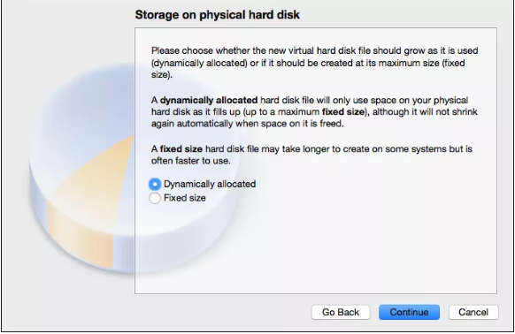
11. On the **File location and size** screen, accept the defaults unless specific values are required.

    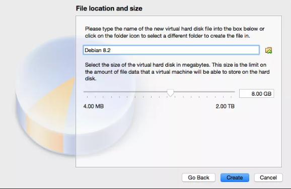
12. Click **Create**.

    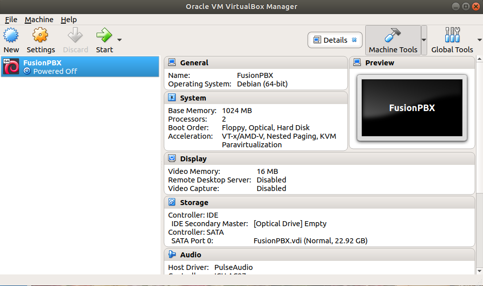
13. Open the VM **Settings**, select **Storage**, and choose the Debian ISO under **Controller: IDE**.

    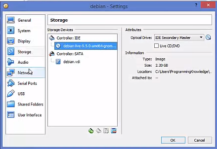
14. Start the VM and complete the Debian installation.

### Install FusionPBX

1. Follow the [FusionPBX quick install guide](https://docs.fusionpbx.com/en/latest/getting_started/quick_install.html).
2. As root, run:
   ```
   # upgrade the packages
   apt-get update && apt-get upgrade -y

   # install packages
   apt-get install -y git lsb-release

   # get the install script
   cd /usr/src && git clone https://github.com/fusionpbx/fusionpbx-install.sh.git

   # change the working directory
   cd /usr/src/fusionpbx-install.sh/debian
   ```
3. At the end of the install script, open the server's IP address in a browser to finish the install in the FusionPBX GUI.

   
4. Choose a language and click **Next**.

   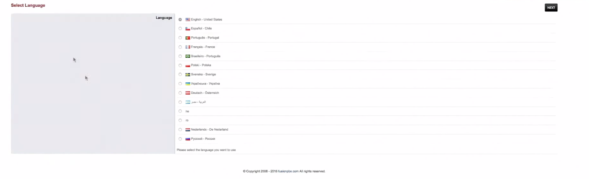
5. Event socket settings are auto-detected; click **Next**.

   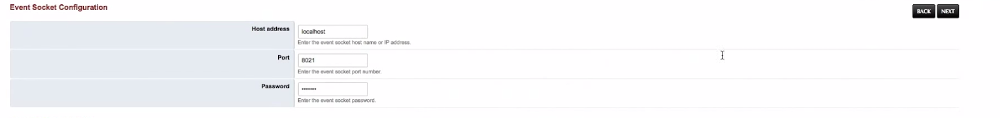
6. Enter a username and password for FusionPBX login.

   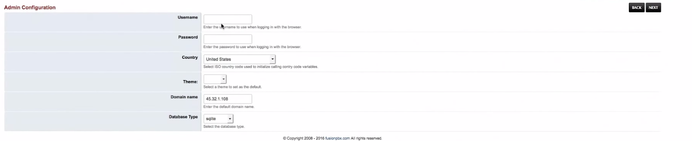
7. Fill in the database username and password shown in the terminal above the server IP. Bold fields are required.

   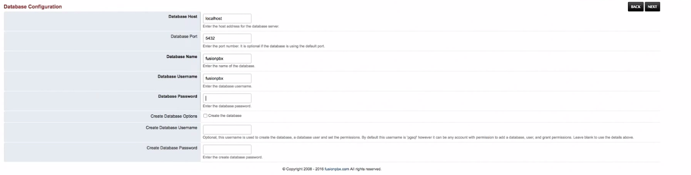
8. Click **Next** and sign in with the credentials from step 6.

   

### Configure a FusionPBX Trunk

1. Go to **Advanced → Upgrade**, tick **App Defaults**, and click **Execute**.

   
2. Go to **Accounts → Gateway** and provide:
   - **Gateway**: Telnyx
   - **Username**: the username from the Telnyx credentials-based connection
   - **Password**: the password from the Telnyx credentials-based connection
   - **From User**: the username from the Telnyx credentials-based connection
   - **From Domain**: `sip.telnyx.com`
   - **Proxy**: `sip.telnyx.com`

   
3. Click **Save**. FusionPBX is now registered with Telnyx.

   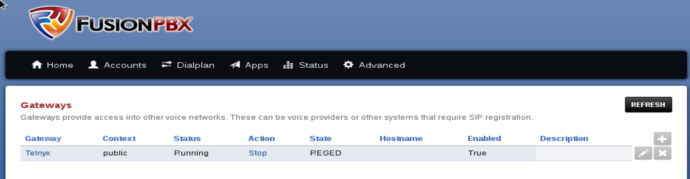

### Create Extensions

1. Go to **Accounts → Extensions** and click **Add**.

   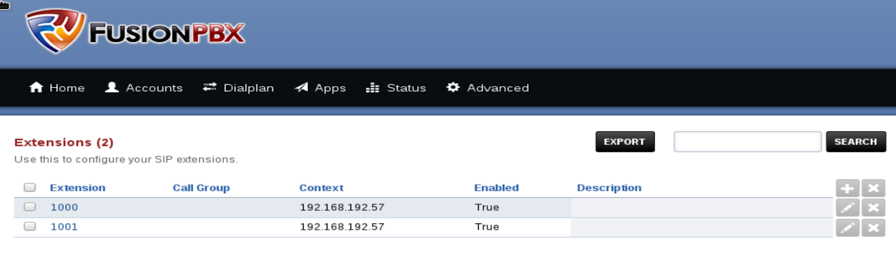
2. Optionally change the auto-generated password. To set an outbound caller ID, use the **Outbound Caller ID Number** field. Caller ID naming conventions:
   - Use capital letters for the caller ID name.
   - Do not use special characters.
   - Some Canadian providers display no more than 15 characters.
   - Spaces are allowed.
   - Follow Telnyx's caller ID number policy.

   
3. Click **Save**.
4. Go to **Dialplan → Destinations** and click **Add**.

   
5. Enter a purchased number prefixed with `+1` as the **Destination**, and select an extension for **Actions**.

   
6. Click **Save**.

### Configure Inbound Routing

1. Go to **Dialplan → Inbound routes**. Inbound routes for the destinations created above are added automatically.

   
2. Click an inbound route to view its dialplan. Ensure the number format is set to E.164 on the connection in Mission Control.

   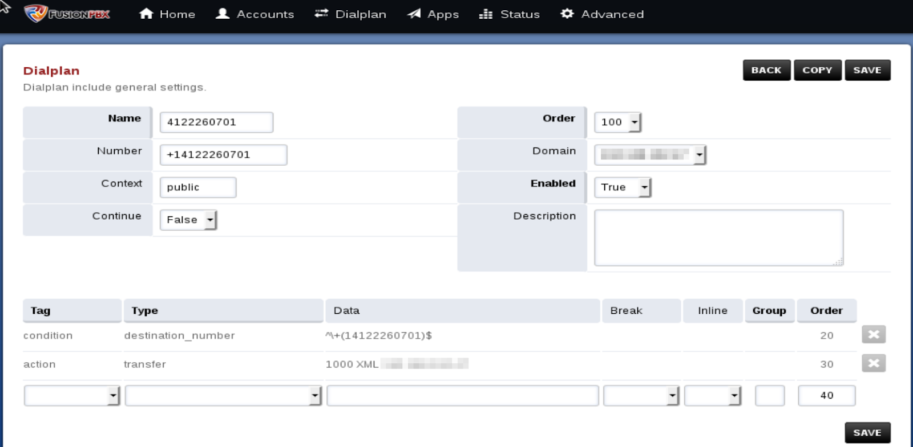

### Configure Outbound Routing

1. Go to **Dialplan → Outbound routes** and click **Add**.

   
2. Set:
   - **Gateway**: Telnyx
   - **Dialplan Expression**: the region to configure (e.g., North America)

   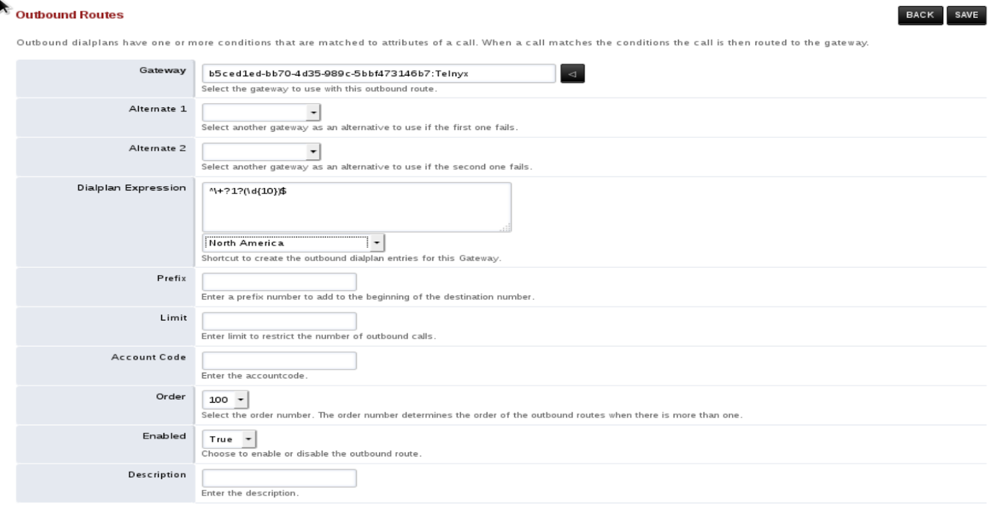
3. Click **Save**.

### Register Extensions with a Device

1. Go to **Status → Registrations** and register the extensions with a softphone such as [Zoiper](https://support.telnyx.com/en/articles/6133517-zoiper-communicator) or X-Lite.

   

Registered devices can call each other internally (e.g., 1000 or 1001) and make/receive external calls through the configured inbound and outbound routes.
