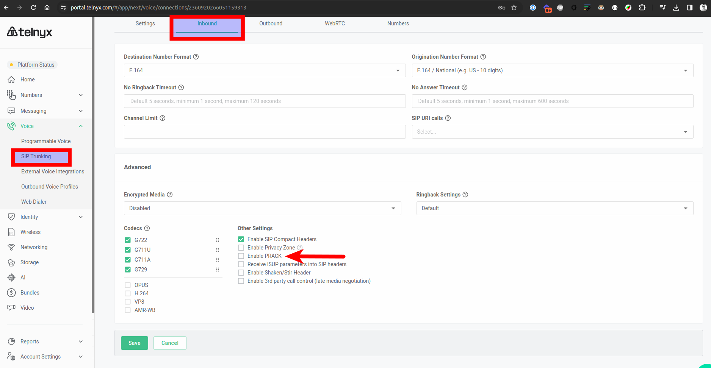

# Telnyx SIP Protocols, Methods, and Response Codes

*Part 4 of 5 — see also: [Part 1](telnyx-sip-protocols-methods-and-response-codes--part-1.md), [Part 2](telnyx-sip-protocols-methods-and-response-codes--part-2.md), [Part 3](telnyx-sip-protocols-methods-and-response-codes--part-3.md), [Part 5](telnyx-sip-protocols-methods-and-response-codes--part-5.md)*

This page consolidates Telnyx's SIP protocol documentation, covering supported transport protocols (UDP, TCP, TLS), the full set of SIP request methods and response classes defined in RFC 3261, Telnyx-specific custom response codes (D1X–D9X, PE, P0X, R1X, RG1, TV1, TM1), ISDN cause codes, the PRACK extension (RFC 3262), and step-by-step configuration of an Audiocodes 400HD IP phone with Telnyx Mission Control.

## ISDN Cause Codes and Hangup Reasons

ISDN cause codes are used to describe reasons for hang up. They are PSTN-based codes which are included in the "Reason" header of SIP responses. When the ISDN network or remote user disconnects a call for any reason, the cause might be reported by any ISDN-aware application. They don't necessarily indicate an error as cause codes are shown at the end of normally terminated calls as well. They are simply guidelines and are implementation-dependent.

An example is: `Reason: Q.850;cause=21;text="CALL_REJECTED"`, where the ISDN cause code is 21 and the hangup reason is call rejected. This generally maps to a SIP 403 response.

See the [SignalWire FreeSWITCH Hangup Cause Code Table](https://developer.signalwire.com/freeswitch/FreeSWITCH-Explained/Troubleshooting-Debugging/Hangup-Cause-Code-Table_3964945/) for a detailed breakdown of each cause code, their relevant hangup reason, and associated SIP response mapping.

## Special Notes on SIP Response Code 488

For 488 Not Acceptable responses with the reason header "incompatible destination", Telnyx does not explicitly highlight the reasons for them. This error code generally relates to a misconfiguration in your SIP INVITE's SDP, 183 with SDP, 200 OK with SDP, ACK with SDP for late negotiation, or a misconfiguration with a setting on your Telnyx account.

Example scenarios in which you may receive this response code:

1. You send a private IP address in your SDP (for example: `c=10.10.10.10`).
2. You send a re-invite for T.38 on inbound calls but do not have the T.38 fax gateway setting enabled on your DID's expert settings.
3. You send a re-invite for T.38 on your outbound calls but do not have the T.38 fax setting set to "Customer" or have it set to "Disabled" on your SIP Connections outbound settings.
4. You send a SIP INVITE with an IPV6 media IP address, something Telnyx does not currently support. Ensure media IP addresses are IPV4.
5. You send a SIP INVITE, on your outbound calls, with a codec Telnyx does not currently support. For a list of supported codecs, see [sip.telnyx.com/#codecs](https://sip.telnyx.com/#codecs).
6. You send a 200 OK, on your inbound calls, with a codec Telnyx does not currently support. In this scenario, Telnyx will send a BYE with a hangup cause of INCOMPATIBLE_DESTINATION and an ISDN cause code of 88.
7. You send a SIP INVITE, on your outbound calls, with encryption media attributes in the SDP but have not specified the encryption type on your SIP Connections outbound settings such as SRTP.
8. You send a SIP INVITE, on your outbound calls, without encryption media attributes in the SDP but have specified the encryption type on your SIP Connections outbound settings such as SRTP. In this scenario, Telnyx will send a BYE with a hangup cause of INCOMPATIBLE_DESTINATION and an ISDN cause code of 88.
9. You send a 183 or 200 OK, on your inbound calls, with encryption media attributes in the SDP but have not specified the encryption type on your SIP Connection inbound settings such as SRTP. In this scenario, Telnyx will send a BYE with a hangup cause of INCOMPATIBLE_DESTINATION and an ISDN cause code of 88.
10. You send a 183 or 200 OK, on your inbound calls, without encryption media attributes in the SDP but have specified the encryption type on your SIP Connection inbound settings such as SRTP. In this scenario, Telnyx will send a BYE with a hangup cause of INCOMPATIBLE_DESTINATION and an ISDN cause code of 88.

## SIP PRACK Protocol

PRACK (Provisional Response Acknowledgement) is defined in [RFC 3262](https://www.rfc-editor.org/rfc/rfc3262), "Reliability of Provisional Responses in the Session Initiation Protocol (SIP)", published by the IETF in June 2002. PRACK is a SIP extension that allows for the reliable delivery of provisional responses (1xx) in a SIP call. By default, provisional responses in a transaction are not acknowledged. PRACK is used to ensure that provisional responses (generally excluding 100 Trying) are received by the client and to handle any lost or delayed responses, especially when communicating with the PSTN. PRACK works by sending a PRACK request, which is a SIP request similar to an INVITE or ACK, to acknowledge receipt of a provisional response.

### Telnyx PRACK Support

Telnyx supports PRACK for inbound and outbound calls through its network.

When a SIP INVITE message is sent by a client with the "Supported" header containing the value "100rel", it indicates that the sender supports PRACK. In this case, Telnyx will send provisional responses with RSEQ header values and expects the customer's client to respond with a PRACK. However, if the customer's client sends "100rel" as a value in the "Supported" header but doesn't actually support or send PRACK, Telnyx will eventually time the call out with a 504 gateway timeout response and the reason header will contain "prack timeout" as the reason for the call ending.

Customers can also enable PRACK on their [SIP Connection](https://support.telnyx.com/en/articles/4404448-sip-connection-inbound-outbound-settings) inbound settings, specifically under "Advanced".

This means that for any inbound calls the customer receives, Telnyx will send a SIP INVITE with "100rel" as a value in the "Supported" header. If the customer's device supports PRACK, Telnyx expects to receive provisional responses containing RSEQ header and values, which Telnyx will then PRACK.

In summary, PRACK is a SIP extension used to ensure the reliable delivery of provisional responses in a SIP call. Telnyx supports PRACK and expects customers' devices to support it as well. If a customer's device does not support PRACK, outbound calls will time out with a 504 gateway timeout response. Customers can also enable PRACK on their SIP Connection within their Mission Control portal account for inbound calls.
