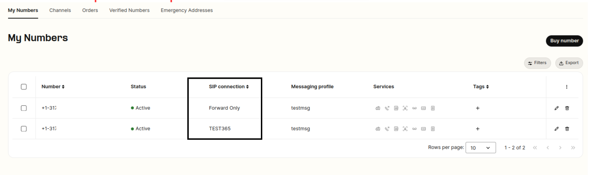
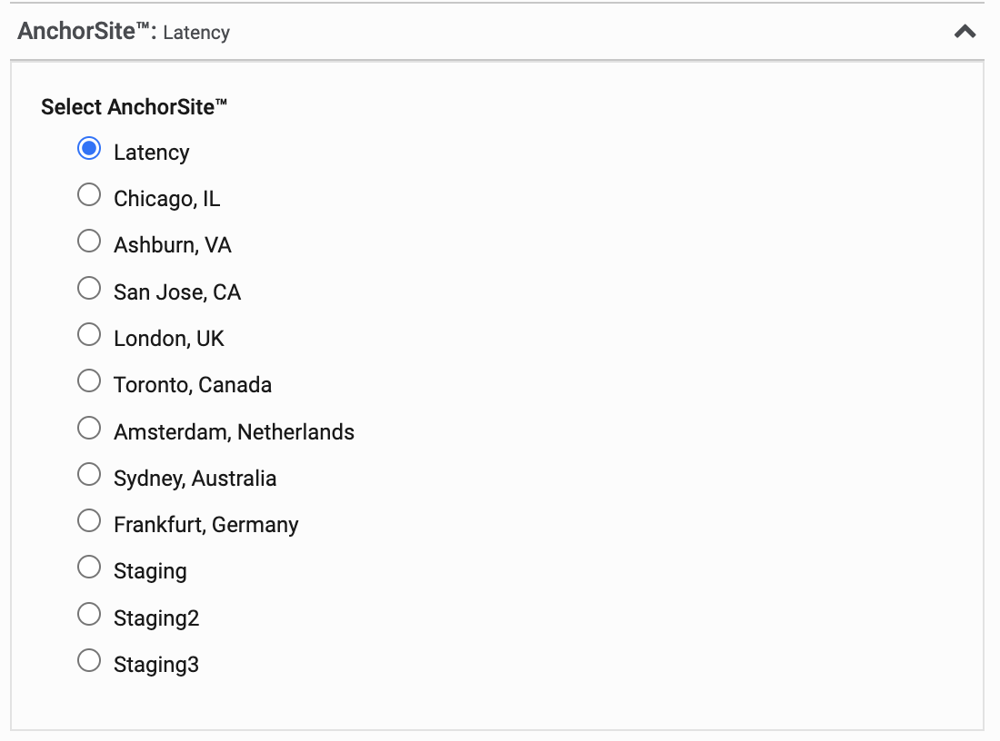

# Telnyx SIP Trunking Configuration

*Part 1 of 3 — see also: [Part 2](telnyx-sip-trunking-configuration--part-2.md), [Part 3](telnyx-sip-trunking-configuration--part-3.md)*

Telnyx SIP Trunking lets you use Telnyx as your inbound and outbound voice carrier with a compatible softphone, PBX, or contact center platform. This page consolidates the core configuration workflow (account setup, number purchase, SIP connection, authentication method, AnchorSite, and Outbound Voice Profile), explains the ~1–3 second configuration propagation window, and provides step-by-step integration guides for Avaya IP Office and Vicidial (both IP-based and credentials-based), along with pointers to the broader library of vendor configuration guides.

## Overview

Telnyx SIP Trunking lets you use Telnyx as your inbound and outbound voice carrier with a compatible softphone, PBX, or contact center platform. This page consolidates the core configuration workflow, the available authentication methods, propagation considerations, and the most common vendor-specific integrations (Avaya, Vicidial, and others) supported by Telnyx.

## Prerequisites

Before configuring a SIP trunk, ensure the following are in place:

- A Telnyx Mission Control Portal account. See [Get Started with a Mission Control Account](get-started-with-a-mission-control-account.md).
- A provisioned DID. See [Requesting Numbers](https://support.telnyx.com/en/articles/3562148-requesting-numbers).
- A compatible softphone, PBX, or contact center system installed and ready to register.
- For call centers, Telnyx is an ideal fit — there are at least [32,000 call centers in the United States](https://www.ibisworld.com/industry-statistics/number-of-businesses/telemarketing-call-centers-united-states/) and Telnyx actively supports that customer profile.

## General SIP Trunk Configuration Workflow

The end-to-end process for standing up a Telnyx SIP trunk is the same regardless of the system you pair it with.

### Step 1: Create an account and add funds

Sign up at [telnyx.com/sign-up](https://telnyx.com/sign-up) or log in at [portal.telnyx.com](https://portal.telnyx.com/#/login/sign-in). Add funds via the green "+" icon at the top of the Mission Control portal — as little as $3 may be enough to begin testing, depending on the cost of the number you intend to purchase.

### Step 2: Purchase a phone number

Navigate to the [search section](https://portal.telnyx.com/#/voice/my-numbers/buy) and use the input fields or filters to narrow your search. See [Search and Buy Numbers](https://support.telnyx.com/en/articles/4380325-search-and-buy-numbers) for a detailed walkthrough.

### Step 3: Choose your system

Select the softphone, PBX, or compatible system (such as a CRM) you will use to make and receive calls. Telnyx has strong pairings with Zoiper, Linphone, MicroSIP, x-Lite, Twinkle, Blink, and Microsoft Teams (Operator Connect or Direct Routing). For teams with more complex requirements, a PBX such as FreePBX is recommended. Telnyx does not provide the softphone or PBX itself — you take your Telnyx authentication details and plug them into the system of your choice. Browse the [Configuration Guides](https://support.telnyx.com/en/collections/133118-configuration-guides) collection for inspiration.

### Step 4: Configure your SIP Connection

Create a SIP Connection under [Voice → SIP Trunking](https://portal.telnyx.com/#/voice/connections) by selecting the green "Create SIP Connection" button. Alternatively, in [My Numbers](https://portal.telnyx.com/#/voice/my-numbers) you can select or create a new SIP connection and assign it to your number simultaneously.

*In <https://portal.telnyx.com/#/voice/connections> click "Add SIP Connection".*

*In <https://portal.telnyx.com/#/voice/my-numbers> you can click the pencil icon in the SIP Connection column to select or add a new SIP Connection.*

SIP Connections configure inbound traffic and authentication. See [SIP Connection: Settings](https://support.telnyx.com/en/articles/4351104-sip-connection-settings) and [SIP Connection: Inbound & Outbound Settings](https://support.telnyx.com/en/articles/4404448-sip-connection-inbound-outbound-settings) for deeper detail.

#### Choose your authentication method

Depending on the softphone or PBX you chose, select one of the following authentication types:

1. **Credentials (Username & Password)** — Inbound and Outbound
2. **IP address** — Inbound and Outbound
3. **FQDN (Inbound) + Credentials (Outbound)**
4. **FQDN (Inbound) + IP address (Outbound)**

When you create a SIP connection with the **Credentials** authentication type, Telnyx generates a random username and password that you can change. We recommend using a random password generator for additional security. To find or update your SIP credentials at any time:

1. Log in to the [Telnyx Portal](https://portal.telnyx.com).
2. Navigate to [Voice → SIP Trunking](https://portal.telnyx.com/#/voice/connections).
3. Find the SIP connection and click the **pencil (edit) icon**.
4. Open the **Authentication and routing** tab.
5. Your username and password are displayed here — you can view, copy, or update them at any time.

#### Choose your AnchorSite

AnchorSite lets you minimize latency by anchoring calls to a specific part of the Telnyx private network. Choose a specific city, or select **Latency** to let Telnyx route each call via the lowest-latency location automatically.

*Select the "AnchorSite" city that best fits your needs based on the geography of your calls, or select "Latency" for Telnyx to route calls for the lowest latency automatically.*

### Step 5: Configure your Outbound Voice Profile

Your Outbound Voice Profile (OVP) enables outbound calling.

1. Go to <https://portal.telnyx.com/#/outbound-profiles> and select the green **Add New Profile** button. Give the profile a name.

*In the Mission Control Portal go to Voice > Outbound Voice Profile and select the green "Add New Profile" button in the upper right.*

2. Select all the relevant OVP settings you'd like to use.

*All of the OVP settings you can configure through the portal.*

3. Add a SIP connection to your OVP and save.

*Add a SIP connection to your OVP to enable two-way calls.*

4. Optionally but recommended, set a daily spend limit to protect against compromise, and save.

Use these settings to specify allowed destinations, max daily spends, and max destination rates to keep costs under control.

### Step 6: Plug your Telnyx authentication into your system

Take the authentication method you selected in Step 4 and plug it into the compatible system of your choice. The [Configuration Guides](https://support.telnyx.com/en/collections/133118-configuration-guides) collection contains many examples.

### Step 7: Start calling

Once your system is registered, you can begin making and receiving calls. Follow best practices around do-not-call lists and treat others as you would want to be treated. Repeated nuisance calls are grounds for removal from the Telnyx platform.

## Configuration Propagation Delays

When you make changes in the Mission Control Portal or via the Telnyx API, updates must propagate across Telnyx's globally distributed infrastructure before they become fully effective. Observed propagation timing:

- **Minimum:** ~1 second
- **Average:** ~1.5 seconds
- **Maximum:** ~3 seconds

This window applies to **all** configuration updates, including:

- Creating or modifying **On-Demand SIP Credentials**
- Updating call control settings
- Modifying connection configurations
- Editing messaging profiles or number settings

Design your workflows with this in mind. For example, if you create new SIP credentials and attempt to use them immediately, authentication may fail until propagation completes. Adding a small delay before first use — or pre-creating credentials ahead of time — avoids potential issues.
