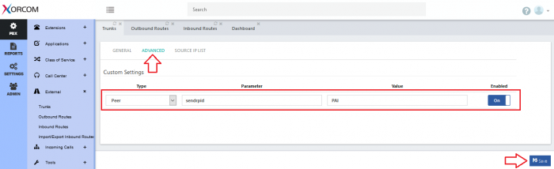
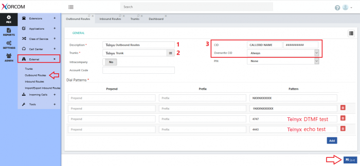
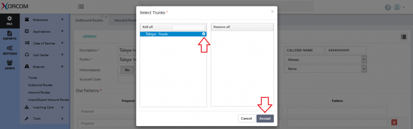

# Telnyx SIP Trunking Configurations

*Part 1 of 3 — see also: [Part 2](telnyx-sip-trunking-configurations--part-2.md), [Part 3](telnyx-sip-trunking-configurations--part-3.md)*

This page consolidates Telnyx SIP trunking configuration guidance, covering the general setup workflow in Mission Control (account creation, number purchase, SIP connection, authentication, AnchorSite selection, and Outbound Voice Profile) along with vendor-specific integration guides for Xorcom CompletePBX, PBXes, Wildix, and Genesys Cloud BYOC. It also serves as an index to the broader Telnyx SIP trunking knowledge base, including configuration guides, specifications, outbound call essentials, and inbound/outbound voice resources.

## Overview

Telnyx SIP Trunking lets you use Telnyx as your inbound and outbound voice carrier with a compatible softphone, PBX, ATA, or contact-center platform of your choice. Telnyx provides the underlying connectivity; you supply the endpoint system and plug your Telnyx authentication credentials into it. The platform supports multiple authentication methods (Credentials, IP, FQDN, or a mix), global AnchorSite selection for low latency, and granular Outbound Voice Profile controls for spend and destination management.

Before configuring any trunk, ensure your Telnyx Mission Control Portal account is set up, you have completed L2 verification (where required), and you have provisioned at least one DID. See [How to Configure a SIP Trunk](how-to-configure-a-sip-trunk.md) for the canonical end-to-end walkthrough.

## General SIP Trunk Setup Workflow

The following steps apply to most softphone and PBX integrations with Telnyx.

### Create or sign in to your account

Sign up at [telnyx.com/sign-up](https://telnyx.com/sign-up) or log in to the [Mission Control Portal](https://portal.telnyx.com/#/login/sign-in).

### Add funds

Add funds by clicking the green "+" icon at the top of the Mission Control portal. A small starting balance (for example, $3) is often enough to test.

### Purchase a phone number

Search and purchase a number from the [Buy Numbers](https://portal.telnyx.com/#/voice/my-numbers/buy) page. See [Search and Buy Numbers](https://support.telnyx.com/en/articles/4380325-search-and-buy-numbers) for details.

### Choose your system

Select a softphone, PBX, or compatible system. Telnyx has strong pairings with Zoiper, Linphone, MicroSIP, x-Lite, Twinkle, Blink, and Microsoft Teams (Operator Connect or Direct Routing). For teams with more complex requirements, a PBX such as FreePBX is recommended. Telnyx does not provide the softphone or PBX itself; you take your Telnyx credentials and plug them into the system of your choice. If your software is not yet documented, you can request a pairing at [community@telnyx.com](mailto:community@telnyx.com).

### Configure your SIP Connection

In Mission Control, go to [Voice → SIP Trunking](https://portal.telnyx.com/#/voice/connections) and click **Create SIP Connection**. Alternatively, assign or create a SIP Connection from the [My Numbers](https://portal.telnyx.com/#/voice/my-numbers) page. SIP Connections define how inbound traffic is authenticated and routed to your endpoint.

Choose one of the following authentication methods based on your system's requirements:

- Credentials (Username & Password) — inbound and outbound
- IP address — inbound and outbound
- FQDN (inbound) + Credentials (outbound)
- FQDN (inbound) + IP address (outbound)

See [SIP Connection Settings](https://support.telnyx.com/en/articles/4351104-sip-connection-settings) and [SIP Connection: Inbound & Outbound Settings](https://support.telnyx.com/en/articles/4404448-sip-connection-inbound-outbound-settings) for deeper configuration detail.

### Choose your AnchorSite

AnchorSite selection minimizes latency by keeping your media on the Telnyx private network. Pick a specific city, or select **Latency** to let Telnyx route each call through the lowest-latency region automatically.

### Configure your Outbound Voice Profile

Go to [Outbound Voice Profiles](https://portal.telnyx.com/#/outbound-profiles) and click **Add New Profile**. Give the profile a name, attach your SIP Connection, and configure allowed destinations, daily spend limits, and maximum destination rates. Attaching a SIP Connection to the OVP is required to enable two-way calling. See [More About Outbound Voice Profiles](https://support.telnyx.com/en/articles/4320411-more-about-outbound-voice-profiles) for details.

### Plug credentials into your system and start calling

Enter the Telnyx authentication method you selected into your softphone or PBX. Once saved, you can place and receive calls through Telnyx.

## Xorcom CompletePBX

Xorcom designs and manufactures integrated business telephony systems, including IP PBX, Hotel Phone Systems, Virtual PBX, and Multi-tenant PBX. CompletePBX is their flagship PBX platform. See the [CompletePBX 4.6 reference guide](https://files.xorcom.com/techdocs/pm0618-completepbx-reference-guide.pdf) for full technical documentation (version 5.x is current but documentation is being updated).

### Prerequisites

- Download and install [CompletePBX](https://www.xorcom.com/pbx-download/).
- Ensure your Telnyx Mission Control Portal is configured.

### Create a SIP trunk

From the left navigation bar, click **PBX → External → Trunks** and configure the following.

In the **Technology** section:

- **Technology**: SIP
- **Description**: A descriptive name for the trunk
- **Trunk CID**: Optional. If set, the CallerID Name must be in CAPITAL LETTERS, contain no special characters (spaces allowed), and be no longer than 15 characters. The Outbound CallerID Name only works when calling a Canadian number; for the US, update the CNAM record via Telnyx support. To force this CID, set **Overwrite CID** to *Always*.

In the **Device for Outgoing Calls (Peer)** section:

- **Outbound Username**: Your Telnyx username
- **Host**: `sip.telnyx.com` (or `.ca`, `.au`, `.eu` depending on country)
- **Port**: 5060
- **Remote Username**: Your Telnyx account username
- **Remote Secret**: Your Telnyx account password
- **From User**: Your Telnyx account username
- **From Domain**: `sip.telnyx.com`
- **Insecure**: *Port, Invite*
- **Allow Inbound Calls**: *Yes*
- **Qualify**: *Yes*

In the **Register String** section, set **Use Default** to *Yes* so the string is generated automatically.

On the **Advanced** tab, add:

- **Type**: *Peer*
- **Parameter**: *sendrpid*
- **Value**: *PAI*
- **Enabled**: *On*

### Configure an outbound route

From the left navigation, click **PBX → External → Outbound Routes**.

In the **General** section:

- **Description**: A descriptive name such as "TLS Calling Rule"
- **Trunks**: Select the Telnyx trunk created above
- **CID**: Optional company name (same 15-character, capitals-only rules as above)
- **Overwrite CID**: *Always* if you want this route's CID to take effect (the trunk's Overwrite CID must be set to *Never*)

In the **Dial Patterns** section:

- **Prefix**: Optional, e.g. `9` to require extensions to dial 9 first. The prefix is not sent to Telnyx.
- **Pattern**: One or more patterns, e.g. `NXXNXXXXXX/1NXXNXXXXXX` for North American numbers (N = 0–9, X = 2–9).

### Configure an inbound route

From the left navigation, click **PBX → External → Inbound Routes**.

In the **General** section:

- **Routing Method**: *Default*
- **Description**: A descriptive name for the route
- **DID Pattern**: Your DID number, with no dots, parentheses, or other formatting
- **Inbound Destination**: Where the call should be routed when first answered

Multiple DIDs can share a route, but each DID can only belong to one route.

