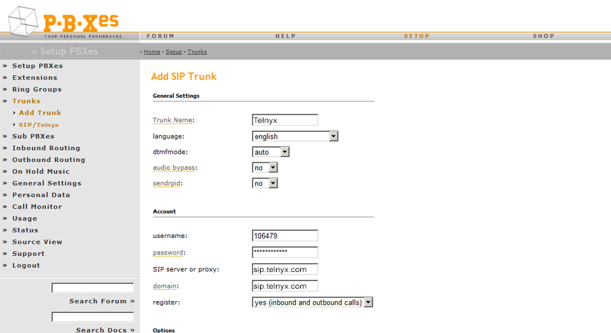
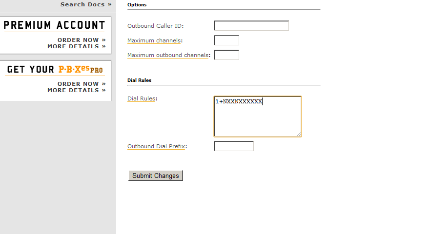
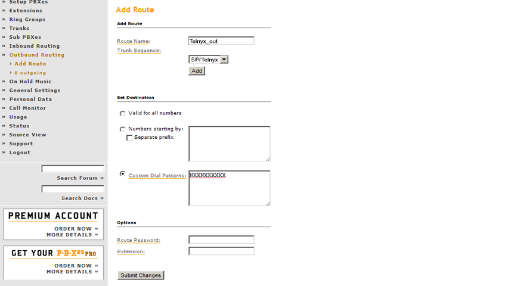
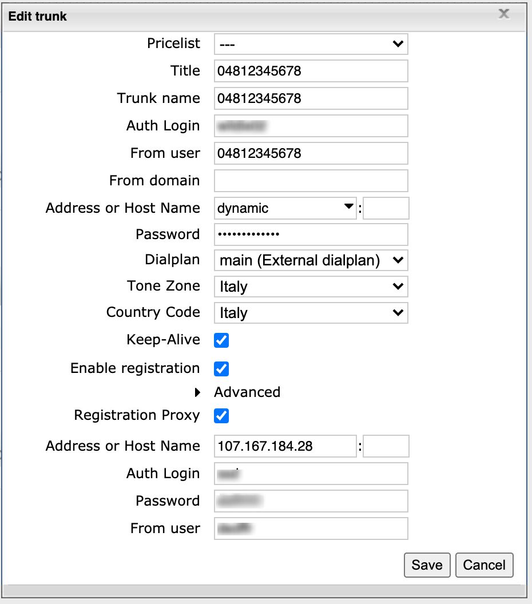
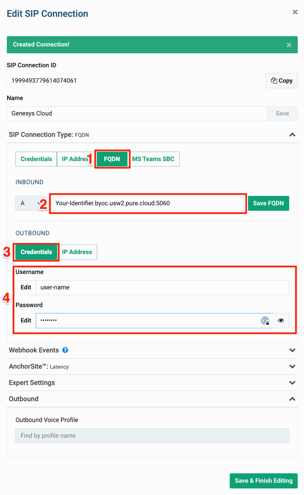

# Telnyx SIP Trunking Configurations

*Part 2 of 3 — see also: [Part 1](telnyx-sip-trunking-configurations--part-1.md), [Part 3](telnyx-sip-trunking-configurations--part-3.md)*

This page consolidates Telnyx SIP trunking configuration guidance, covering the general setup workflow in Mission Control (account creation, number purchase, SIP connection, authentication, AnchorSite selection, and Outbound Voice Profile) along with vendor-specific integration guides for Xorcom CompletePBX, PBXes, Wildix, and Genesys Cloud BYOC. It also serves as an index to the broader Telnyx SIP trunking knowledge base, including configuration guides, specifications, outbound call essentials, and inbound/outbound voice resources.

## PBXes

[PBXes](https://www1.pbxes.com/iptel_virtuelle-telefonanlage.html) is a German PBX provider offering hosted PBX service with installation, updates, and backups handled for you. The PBXes website is in German; right-click and select **Translate to English** to read it in English.

### Prerequisites

- Telnyx Mission Control Portal configured
- A Telnyx DID provisioned
- A [free PBXes account](https://www1.pbxes.com/config.php) (upgradeable to a [Premium plan](https://www1.pbxes.com/shop.php) later)

### Add a SIP trunk

1. Log into the pbxes.com web portal.
2. Expand **Trunks** in the left menu and click **Add Trunk**.
3. Click **Add SIP Trunk**.

In **General Settings**:

- **Trunk Name**: Any descriptive name
- **Language**: Your language
- **DTMF mode**: *Auto* or a specific configuration
- **audio-bypass**: Your choice
- **sendrpid**: *No* (controls whether a Remote-Party-ID SIP header is sent; defaults to No)

In the **Account** section:

- **username**: Your Telnyx SIP account username
- **password**: Your Telnyx SIP account password
- **SIP server or proxy**: `sip.telnyx.com`
- **domain**: `sip.telnyx.com`
- **register**: *Yes (inbound and outbound calls)*

### Configure inbound routing

1. Expand **Inbound Routing** and click **Add Route**.
2. In **Options**, optionally set an Outbound Caller ID. Follow the same naming rules used elsewhere: CAPITAL LETTERS, no special characters (spaces allowed), max 15 characters.
3. In **Dial Rules**, use the basic pattern `1+NXXNXXXXXX`.

### Configure outbound routing

1. Expand **Outbound Routing** and click **Add Route**.
2. In **Add Route**:
   - **Route Name**: e.g. `Telnyx_out`
   - **Trunk Sequence**: Select `SIP/Telnyx`
3. In **Set Destination**:
   - **Custom Dial Patterns**: `NXXNXXXXXX`

## Wildix

[Wildix](https://www.wildix.com/) is a browser-based WebRTC VoIP PBX with presence, audio/video calling, IM, conferencing, online chat, fax, SMS, and desktop sharing — all without installing client software.

### Prerequisites

- Telnyx Mission Control Portal configured
- A Telnyx DID provisioned

### Configure basic SIP trunk settings

1. Log into Wildix and go to **WMS → Trunks → Trunks**.
2. Click the **+** button under the SIP table to open a new trunk window.
3. In the **Basic Settings** tab:
   - **Title**: e.g. `Telnyx SIP trunk`
   - **Trunk name**: A descriptive name
   - **Auth login**: Your Telnyx SIP username
   - **From user**: Your Telnyx SIP username
   - **From domain**: Forced from-domain header used in register and invite messages
   - **Address or host name**: `sip.telnyx.com`
   - **Password**: Your Telnyx SIP password
   - **Dialplan**: Typically `main`
   - **Tone Zone**: Your country/region
   - **Country Code**: Country where the trunk is used (for number normalization)
   - **Keep-Alive**: Enable periodic keep-alive messages
   - **Enable Registration**: Enable outgoing registration (for PBX-to-PBX SIP interconnections, enable on the client PBX and disable on the server)

If **Enable Registration** is checked, also configure:

- **Address or Host Name**: `sip.telnyx.com`
- **Auth Login**: Your Telnyx SIP username
- **Password**: Your Telnyx SIP password
- **From user**: Your Telnyx SIP username

### Configure advanced SIP trunk settings

Expand the **Advanced** section and set:

- **Audio codecs**: Telnyx-supported codecs — `ulaw (g711u)`, `alaw (g711a)`, `g722`, `g729`
- **Video codecs**: `H264` if using video
- **T38**: *Yes* (with special parameters for T.38 support and maxdatagram)
- **Session timer**: Enabled, e.g. min 90 / max 600
- **Registration expiry (sec)**: `180`
- **UDP/TCP/TLS**: `UDP`
- **DTMF mode**: `RFC2833`

## BYOC: Telnyx & Genesys Cloud

This section covers Bring-Your-Own-Carrier (BYOC) SIP trunking between Telnyx and Genesys Cloud.

### Prerequisites

- A Telnyx account with L2 verification completed
- A Telnyx DID purchased for voice
- BYOC enabled in your Genesys Cloud organization
- Genesys Cloud admin rights to set up Trunks
- The DID routed correctly (for example, to an Architect flow)

### Create a SIP connection in Mission Control

1. In Mission Control, go to **Voice → SIP Trunking** and click **Add SIP Connection**.
2. Name the connection for easy identification.
3. Choose **FQDN** as the connection type and provide the SIP URI of your Genesys Cloud organization. The domain should match the region of your Genesys Cloud deployment. Click **have FQDN** to update the FQDN setting.
4. In the **Outbound** section, choose **Credentials** and provide a username and password for digest authentication.
5. Click **Save & Finish Editing**.

### Create an Outbound Voice Profile

1. Go to **Voice → Outbound Voice Profiles** and click **Add New Profile**.
2. Name the profile and click **Create**.
3. Select the countries or regions allowed for outbound calls and click **Save**.
4. Return to your SIP Connection, open the **Outbound** tab, and select the new OVP from the dropdown.
5. On the **Inbound** tab, adjust DNIS and ANI number formats to match your Genesys Cloud configuration and save.

### Assign the number

In Mission Control, go to **Numbers → My Numbers** and assign your configured SIP Connection to the purchased number. The same SIP connection can be assigned to multiple numbers.

### Configure the SIP trunk in Genesys Cloud

1. In Genesys Cloud Admin, go to **Trunks** and create a new SIP trunk.
2. Choose **BYOC Carrier** as the trunk type and **Generic BYOC Carrier** as the subtype.
3. Provide a name and an Inbound SIP Termination Identifier that matches the FQDN configured in the Telnyx SIP Connection.
4. In **SIP Servers and Proxies**, enter the Telnyx SIP interface URL for your region (e.g. `sip.telnyx.com`, `sip.telnyx.eu`).
5. Enable **Digest Authentication** and set the **Realm** to the same URL used for the SIP proxy.
6. Enter the **User Name** and **Password** configured in the Telnyx SIP Connection.
7. Set the **Caller ID** to the number purchased on Telnyx.
8. In **SIP Access Control**, add the IP addresses of your chosen Telnyx SIP endpoints (listed on `sip.telnyx.com`).
9. Under **External Trunk Configuration → Outbound**, add a custom SIP header `X-Telnyx-Username` with the same value as the digest authentication username.

### Troubleshooting

Use the Mission Control debugging tools to inspect SIP call flows:

1. Go to **Reporting → Debugging**.
2. Select **SIP Call Flow Tool**.
3. Specify search criteria and click **Search CDRs**.
4. Open a call with the **Call Data Debugging** button to review the SIP call flow, session info, and PCAP exports.

