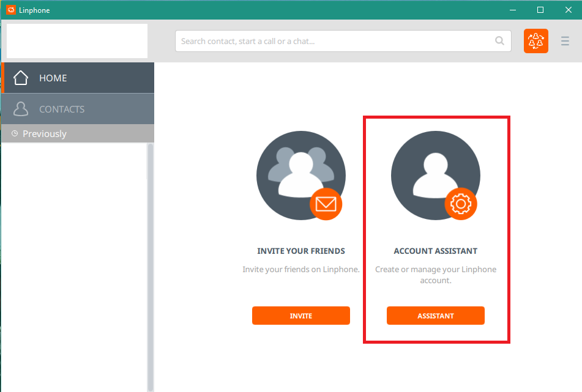
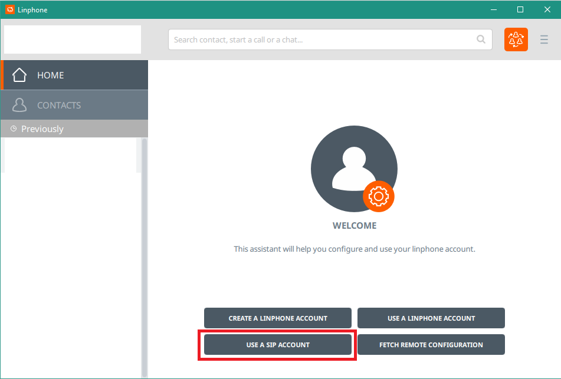
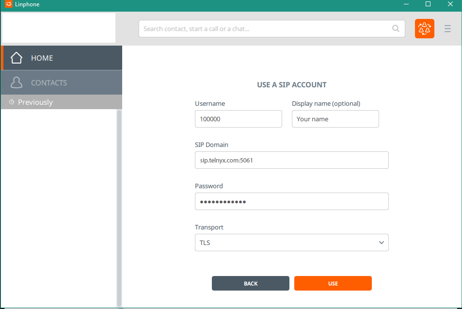
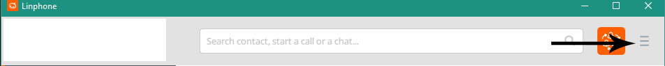
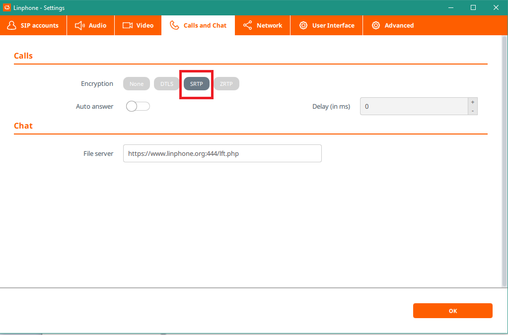
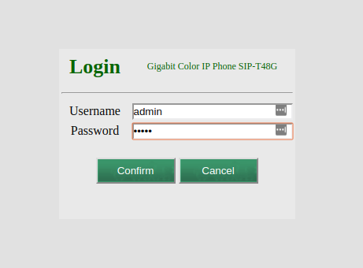
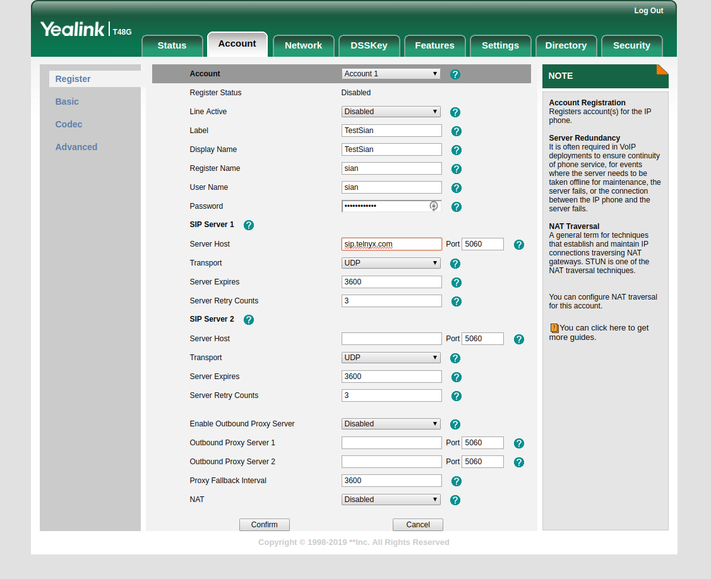

# Telnyx Softphone and Device Setup Guides

*Part 1 of 4 — see also: [Part 2](telnyx-softphone-and-device-setup-guides--part-2.md), [Part 3](telnyx-softphone-and-device-setup-guides--part-3.md), [Part 4](telnyx-softphone-and-device-setup-guides--part-4.md)*

Consolidated Telnyx setup guides for popular SIP softphones and IP phones (Linphone, Yealink T Series, Zoiper 3/5/Communicator, Acrobits Softphone/Groundwire, MicroSIP) plus an ElevateAI proof-of-concept integration. Each section covers prerequisites, account creation, SIP connection details (using sip.telnyx.com), optional TLS/SRTP encryption, and caller ID configuration.

## Overview

This page consolidates Telnyx setup guides for several popular SIP softphones and IP phones, plus a proof-of-concept integration with ElevateAI. Each section walks through prerequisites, account creation, SIP connection details, optional encryption, and caller ID configuration. The Telnyx SIP domain used across all clients is `sip.telnyx.com`.

## Common Prerequisites

Before configuring any softphone or IP phone with Telnyx, you should:

- Have a configured Telnyx Mission Control Portal account (see the [getting started guide](https://support.telnyx.com/en/articles/1176636-get-started-with-a-mission-control-account)).
- Create a credentials-based connection in the portal and assign it to a DID and outbound voice profile so you can make and receive calls.
- Have your SIP credentials (username and password) ready.
- For encrypted setups, enable TLS on the Telnyx connection (see [Does Telnyx encrypt communication?](https://support.telnyx.com/en/articles/1130711-does-telnyx-encrypt-communication)).

## Linphone

[Linphone](https://www.linphone.org) is an open source VoIP softphone SIP client that supports audio and video calls and instant messaging. See the [Linphone technical documentation](https://wiki.linphone.org/xwiki/wiki/public/view/Linphone/) and [Linphone support](https://www.linphone.org/contact) for vendor details.

### Basic configuration

1. Run Linphone and follow the wizard, then click **ACCOUNT ASSISTANT**.

   
2. Click **USE A SIP ACCOUNT**.

   
3. Fill in the SIP account form:
   - **Username:** Your auth username for the SIP connection in the Telnyx portal.
   - **Display Name:** Used as the FROM field on most Linphone versions, so this must be your caller ID. See the [Caller ID Number Policy](caller-id-number-policy.md) and [Verified Numbers](verified-numbers.md) articles.
   - **SIP Domain:** `sip.telnyx.com`
   - **Password:** The auth password for the SIP connection.
   - **Transport:** UDP or TCP.

   
4. Click **USE**.

> To make outbound calls, Telnyx requires either a valid caller ID from your device or a caller ID override enabled on your SIP connection. See the [Caller ID Number Policy](caller-id-number-policy.md).

### Configuring with encryption

1. Follow the basic configuration steps with these changes:
   - **SIP Domain:** `sip.telnyx.com:5061`
   - **Transport:** TLS

   
2. Open the top-right menu and select **Preferences**.

   
3. On the **Call and Chat** tab, enable **SRTP**.

   

### Caller ID

Telnyx enforces a strict caller ID policy. The number you send must either belong to your Telnyx account or be a [verified number](verified-numbers.md). If you receive a 403 error about an invalid caller ID, the softphone may not be passing the caller ID in the required headers. As a workaround, configure a caller ID override in the outbound section of your SIP connection settings (see the [Caller ID Number Policy](caller-id-number-policy.md)).

## Yealink T Series IP Phones

[Yealink](https://www.yealink.com/en) provides video and voice communication solutions. This section covers configuring T series SIP-compatible hardphones with Telnyx. Additional resources: [Yealink Knowledge Base](https://support.yealink.com/en/portal/knowledge), [Yealink equipment maintenance](https://ams.yealink.com/search/index), [Yealink license application](https://license.yealink.com/), and [Yealink support](https://support.yealink.com/en/portal/home).

### Pre-requisites

- Configure the [Telnyx Mission Control Portal](https://support.telnyx.com/en/articles/1176636-get-started-with-a-mission-control-account).
- [Purchase a DID](https://portal.telnyx.com/#/app/numbers/search-numbers).
- [Set up your Telnyx SIP connection](https://portal.telnyx.com/#/app/connections).
- [Provision your number](https://portal.telnyx.com/#/app/numbers/my-numbers) (assign it to a SIP connection).
- [Create an outbound voice profile](https://portal.telnyx.com/#/app/outbound).
- Create a [credentials-based connection](https://portal.telnyx.com/#/app/connections).
- Recommended: [Enable TLS to encrypt your traffic](https://support.telnyx.com/en/articles/1130711-does-telnyx-encrypt-communication).
- Connect the Yealink phone to an ethernet port.

### Provisioning via the phone keypad

1. Press **Menu** on the handset.
2. Navigate to **Advanced** and enter the default password `admin`.
3. Navigate to **Accounts** and select an empty line.
4. Fill in:
   - **Activation:** Enabled
   - **Label:** Display name (e.g. *John Doe*)
   - **Register Name:** Your Telnyx account username
   - **User name:** Your Telnyx account username

### Provisioning via the web interface

1. Find the phone's IP address: press **Home/Menu**, then **Status**, and note the IPv4 address. Enter it in a browser.
2. Log in with default credentials (`admin` / `admin`).

   
3. Click **Account**, then **Account 1**, and provide:
   - **Activation:** Enabled
   - **Label:** Display name (e.g. *John Doe*)
   - **Register Name:** Username from your credentials-based Telnyx connection
   - **User name:** Username from your credentials-based Telnyx connection
   - **Password:** Password from your credentials-based connection
   - **Display Name:** Shown as the caller ID on outbound calls

   

Caller ID naming conventions:

- Use **capital letters** for clearer display on some devices.
- Do **not** use special characters.
- Some Canadian providers display no more than 15 characters.
- Spaces are allowed.
- See the [Caller ID Number Policy](caller-id-number-policy.md).
