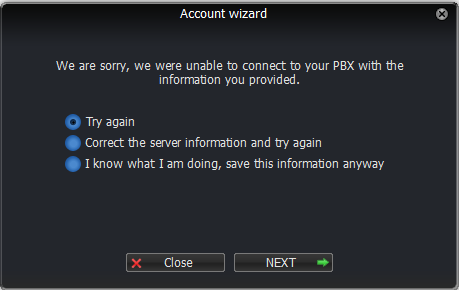

# Telnyx Softphone and Device Setup Guides

*Part 3 of 4 — see also: [Part 1](telnyx-softphone-and-device-setup-guides--part-1.md), [Part 2](telnyx-softphone-and-device-setup-guides--part-2.md), [Part 4](telnyx-softphone-and-device-setup-guides--part-4.md)*

Consolidated Telnyx setup guides for popular SIP softphones and IP phones (Linphone, Yealink T Series, Zoiper 3/5/Communicator, Acrobits Softphone/Groundwire, MicroSIP) plus an ElevateAI proof-of-concept integration. Each section covers prerequisites, account creation, SIP connection details (using sip.telnyx.com), optional TLS/SRTP encryption, and caller ID configuration.

## Zoiper 3 (Linux)

The Linux setup mirrors the Mac flow with a few differences.

### Pre-requisites

- Configure the [Telnyx Mission Control Panel](https://support.telnyx.com/en/articles/1176636-get-started-with-a-mission-control-account).
- Create a [credentials-based connection](https://portal.telnyx.com/#/app/connections) and assign it to a DID and outbound profile.

### Creating a VoIP account

> Visit [https://oem.zoiper.com](https://oem.zoiper.com/) for preconfigured/pre-provisioned Zoiper builds.

1. Download, install, and run Zoiper.
2. If you have a business license:
   - Log in with the email used to purchase the license and the password Zoiper emailed you.

     
   - **Activating online:** click **Activate online**.
   - **Activating offline:** click **Activate offline**. The certificate file is generated in `~/.Zoiper`. Email it to [register4@shop.zoiper.com](mailto:register5@shop.zoiper.com) and save the returned certificate in the same folder.
3. Open **Settings** and select **Create a new account**.

   
4. Select **SIP** and click **Next**.

   
5. Enter your Telnyx credentials. **Domain/outbound proxy:** `sip.telnyx.com`. Click **Next**.

   
6. Provide a name for the account and click **Next**.

   
7. Zoiper connects to the Telnyx server.

   

### Troubleshooting

Same checks as the Mac version. If everything is correct, select **I know what I am doing, save this information anyway** and click **NEXT**.

## Acrobits Softphone / Groundwire

[Acrobits](https://acrobits.net/) lets you build a customized UCaaS solution. The [Acrobits Groundwire or Acrobits Softphone](https://acrobits.net/sip-client-ios-android/) apps run on iOS and Android.

> Acrobits softphone apps can only be used for voice calling. SIP/Simple, which is required for SMS/MMS on Acrobits, is not currently supported by Telnyx.

Additional resources: [Acrobits official site](https://acrobits.net/), [Acrobits pricing and demo options](https://acrobits.net/cloud-softphone/pricing/), [What can I do with Acrobits?](https://acrobits.net/features/), [Build your own low-code app with cloud softphone](https://acrobits.net/cloud-softphone/), and the [Acrobits SDK](https://acrobits.net/acrobits-sdk/).

### Pre-requisites

- Configure the [Telnyx Portal](https://support.telnyx.com/en/articles/1176636-get-started-with-a-mission-control-account).
- Meet the [hardware requirements](https://acrobits.net/cloud-softphone/pricing/) for Acrobits.
- [Add key and repository to Debian](https://acrobits.net/cloud-softphone/pricing/), [configure SIPIS](https://acrobits.net/cloud-softphone/pricing/), [set up HTTPS registration](https://acrobits.net/cloud-softphone/pricing/), and [configure your firewall](https://acrobits.net/cloud-softphone/pricing/).
- Review any other [SIPIS settings](https://doc.acrobits.net/sipis/index.html) you may need.

### Connecting Acrobits to Telnyx

1. Run the Acrobits app (Softphone or Groundwire).
2. Tap the settings gear at the top-right and select **SIP Accounts**.
3. Tap **New SIP Account**.
4. Select Telnyx from the provider list. If Telnyx is not listed, contact Telnyx support and add the provider manually.
5. Enter the server information:
   - **Title:** A name for the connection (e.g. *Telnyx*).
   - **Username:** Your Telnyx account username.
   - **Password:** Your Telnyx account password.
   - **Domain:** `sip.telnyx.com`

   
6. Click **Save**.

### Optional: Display name for outbound caller ID

In the advanced settings, set a caller ID display name. Considerations:

- Use **capital letters** for clearer display on some devices.
- Do **not** use special characters.
- Some Canadian providers display no more than 15 characters.
- Spaces are allowed.

## MicroSIP

[MicroSIP](https://www.microsip.org) is an open source portable SIP softphone based on the PJSIP stack.

> MicroSIP is only available for Windows.

Highlights include a small footprint (>2.5MB) and low RAM usage (>5MB), H.264/H.263+/VP8 video, SIMPLE messaging and presence, DTMF support, TLS/SRTP for control and media, portability (no dependencies, settings stored in an ini file), multi-language and RTL support, and accessibility features such as NVDA screen reader compatibility.

Additional resources: [Download MicroSIP](https://www.microsip.org/downloads/current), [MicroSIP custom build](https://www.microsip.org/custom), [MicroSIP source code](https://www.microsip.org/source), [MicroSIP FAQ](https://www.microsip.org/faq), [MicroSIP troubleshooting](https://www.microsip.org/issues), [MicroSIP help documentation](https://www.microsip.org/help), [feature/change requests](https://www.microsip.org/wishes), [supported languages](https://www.microsip.org/translation), and [contact MicroSIP](https://www.microsip.org/contact).

### Pre-requisites

- Configure the [Telnyx Portal](https://support.telnyx.com/en/articles/1176636-get-started-with-a-mission-control-account).
- Have your SIP credentials (main account or sub-account).
- Have [DIDs available](https://support.telnyx.com/en/articles/4380325-search-and-buy-numbers) to assign.
- Run Windows and [download MicroSIP](https://www.microsip.org/downloads/current).

### Adding Telnyx as your SIP provider

1. Run MicroSIP and click the arrow at the top-right of the home screen.
2. Click **Edit Account**.
3. Provide:
   - **Account Name:** Your choice.
   - **SIP Server:** `sip.telnyx.com`
   - **SIP Proxy:** `sip.telnyx.com`
   - **Username:** Your main Telnyx account or sub-account.
   - **Domain:** `sip.telnyx.com`
   - **Login:** Your main Telnyx account or sub-account username.
   - **Password:** Your main Telnyx account or sub-account password.
   - **Display Name:** Becomes your caller ID. Use capital letters, no special characters (spaces allowed), and keep under 15 characters for some Canadian providers.
   - **Media Encryption:** *Disabled* for UDP/TCP, or *Mandatory SRTP (RTP/SAVP)* for TLS.
   - **Transport:** *Auto (UDP/TCP)* or *TLS*.

   

### Optional: Encrypting calls

> If you plan to encrypt calls, ensure media encryption and transport are configured correctly in the previous section.

1. Open **MicroSIP > Settings**.
2. Set:
   - **Source Port:** `5061`
   - **RTP Ports:** `10001 - 20000`

   
3. Click **Save**.

### Audio settings

1. Open **MicroSIP > Settings**.
2. Enable Telnyx-supported codecs: `ulaw (g711u)`, `alaw (g711a)`, `g722`, `g729`. See [codecs and VoIP sound quality](https://telnyx.com/resources/codecs-affect-voip-sound-quality).
3. Check the **EC** box to enable echo cancellation.

   
