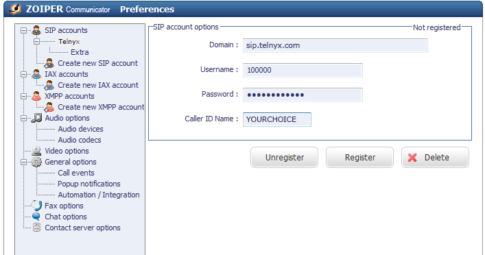
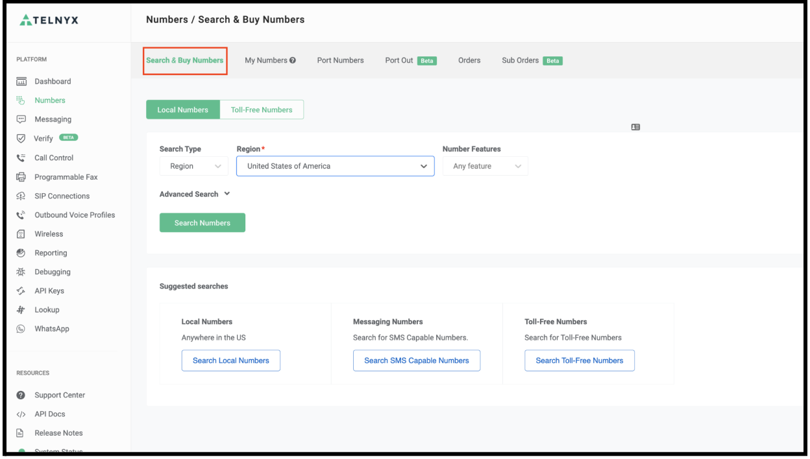
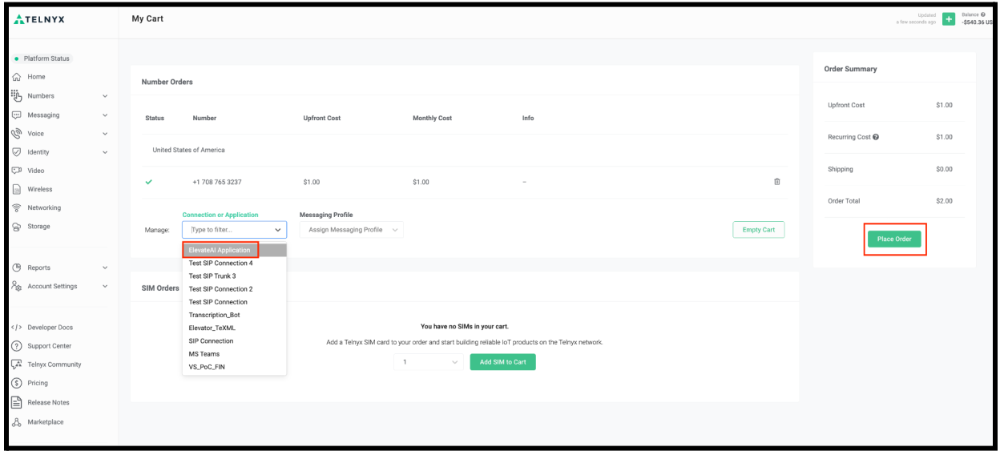
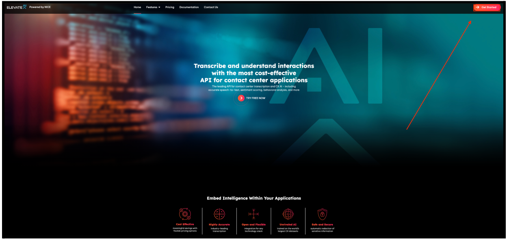
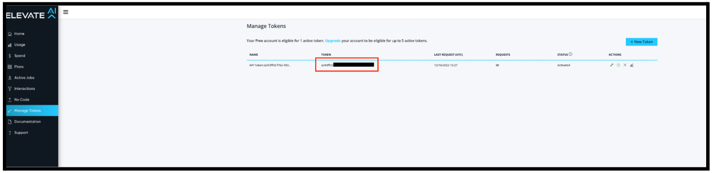

# Telnyx Softphone and Device Setup Guides

*Part 4 of 4 — see also: [Part 1](telnyx-softphone-and-device-setup-guides--part-1.md), [Part 2](telnyx-softphone-and-device-setup-guides--part-2.md), [Part 3](telnyx-softphone-and-device-setup-guides--part-3.md)*

Consolidated Telnyx setup guides for popular SIP softphones and IP phones (Linphone, Yealink T Series, Zoiper 3/5/Communicator, Acrobits Softphone/Groundwire, MicroSIP) plus an ElevateAI proof-of-concept integration. Each section covers prerequisites, account creation, SIP connection details (using sip.telnyx.com), optional TLS/SRTP encryption, and caller ID configuration.

## Zoiper Communicator

[Zoiper Communicator](https://digitalvoice.ca/softphone_zoiper_dl.php) is a free IAX & SIP softphone combining voice, video, fax, instant messaging, and presence. The Zoiper Service enables free Zoiper-to-Zoiper communication.

> You can decline the Zoiper Service on initial startup by choosing "I don't want to use this service" or simply not logging in. Zoiper does not currently advertise or offer Zoiper Communicator, but it remains available via the link above.

Additional resources: [Zoiper help](https://www.zoiper.com/en/support/questions).

### Pre-requisites

- Configure the [Telnyx Portal](https://support.telnyx.com/en/articles/1176636-get-started-with-a-mission-control-account).
- Have your SIP credentials (main account or sub-account).
- Have [DIDs available](https://support.telnyx.com/en/articles/4380325-search-and-buy-numbers) to assign.
- Run Windows and [download Zoiper Communicator](https://digitalvoice.ca/softphone_zoiper_dl.php).

### Adding Telnyx as your SIP provider

1. Start Zoiper Communicator and select **Settings**.
2. Select **Create New Account**.

   
3. Enter a name for the account and click **OK**.

   
4. On the **SIP Account Options** page, provide:
   - **Domain:** `sip.telnyx.com`
   - **Username:** Your main Telnyx account or sub-account username.
   - **Password:** Your main Telnyx account or sub-account password.
   - **Caller ID Name:** Your preferred name. Use capital letters, no special characters (spaces allowed), and keep under 15 characters for some Canadian providers.

   
5. Click **OK** to complete setup.

   

## ElevateAI Proof-of-Concept Setup

This guide demonstrates a sample application using Telnyx-Python transcription and recording with ElevateAI.

### Step 1: Create a Call Control Application in the Telnyx Portal

1. Log in to the Telnyx account.
2. Click **Voice** in the left menu, then **Programmable Voice**.
3. Click **Add new App** at the top right.

   
4. Enter the application name and webhook URL, then click **Save**.

   

### Step 2: Purchase a Telnyx Phone Number

1. Click **Numbers** in the left menu.

   
2. Open the **Search & Buy Numbers** tab, choose the search type and region/area code, and click **Search Numbers**.

   
3. Select a number, click **Add to Cart**, then click the **Cart** button.

   
4. Under **Connections or Applications**, select the ElevateAI call control application created in Step 1 and click **Place Order**.

   

### Step 3: Sign up for ElevateAI and get your API key

1. Go to [ElevateAI's website](https://www.elevateai.com/) and click **Get Started**.

   
2. Click **Sign Up** to register.

   
3. Fill out the registration form and click **Sign Up**.

   
4. After verifying the account, log in and click **Manage Keys**.

   
5. Copy the API token for later use.

   

### Step 4: Clone the PoC project

Clone the project from GitHub: <https://github.com/team-telnyx/demo-python-telnyx/tree/master/flask-elevateai-transcription-call-control> and follow the steps in the repository.

## Related Articles

- [Configuring an AVAYA IP trunk with Telnyx](configuring-an-avaya-ip-trunk-with-telnyx.md)
- [Configuring a Vicidial IP trunk with Telnyx](configuring-a-vicidial-ip-trunk-with-telnyx.md)
- [Configuring Grandstream GXP16XX with Telnyx](configuring-grandstream-gxp16xx-with-telnyx.md)
- [Configuring Bria Solo (a.k.a X-Lite)](configuring-bria-solo-a-k-a-x-lite.md)
- [Polycom: Setup with Telnyx](polycom-setup-with-telnyx.md)
- [Flyingvoice: Telnyx Setup](flyingvoice-telnyx-setup.md)
- [Grandstream HT802: Telnyx Setup](grandstream-ht802-telnyx-setup.md)
- [BuddyTalk BT110/BT120](buddytalk-bt110-bt120.md)
- [Grandstream Wave Lite (iPhone)](grandstream-wave-lite-iphone.md)
- [Grandstream Wave Lite (Android)](grandstream-wave-lite-android.md)
- [Algo 8xxx: Telnyx Endpoints](algo-8xxx-telnyx-endpoints.md)
- [Gigaset A510: Telnyx Setup](gigaset-a510-telnyx-setup.md)
- [Snom C520: Telnyx Setup](snom-c520-telnyx-setup.md)
- [Vtech VCS754: Telnyx Setup](vtech-vcs754-telnyx-setup.md)
- [Fanvil A32i: Telnyx Setup](fanvil-a32i-telnyx-setup.md)
- [SIP URI Calling](sip-uri-calling.md)
- [MS Teams: Call2Teams & Telnyx](ms-teams-call2teams-telnyx.md)
- [E911 Setup Guide](e911-setup-guide.md)
- [Bicom: PBXware Setup](bicom-pbxware-setup.md)
- [Configuring Telnyx with Microsoft Teams Direct Routing](configuring-telnyx-with-microsoft-teams-direct-routing.md)
- [Real-Time Transcription](real-time-transcription.md)
