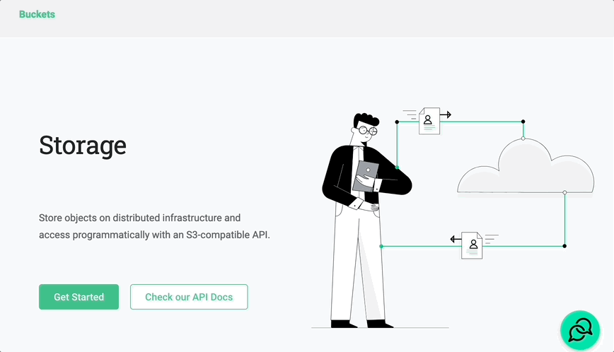
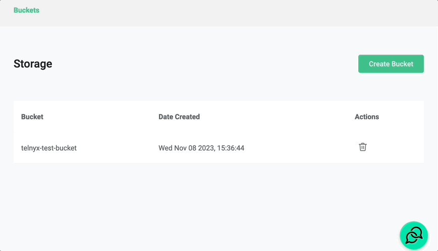
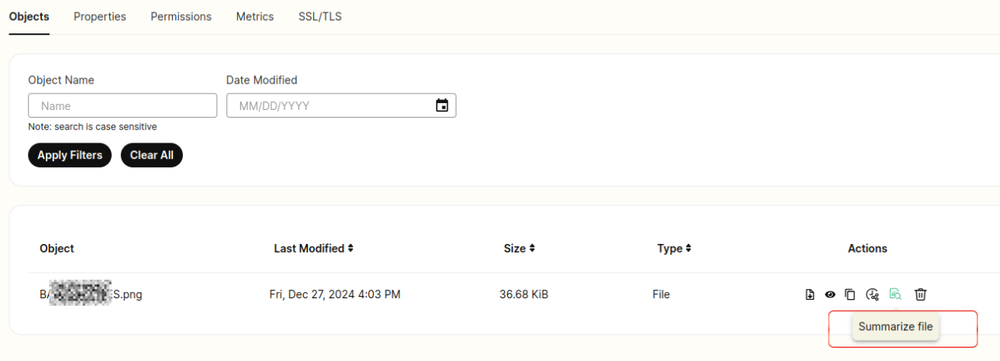
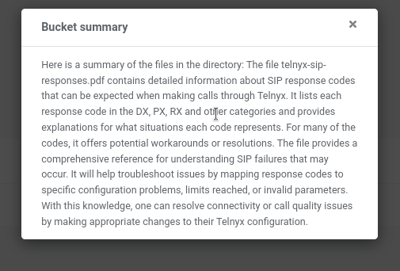
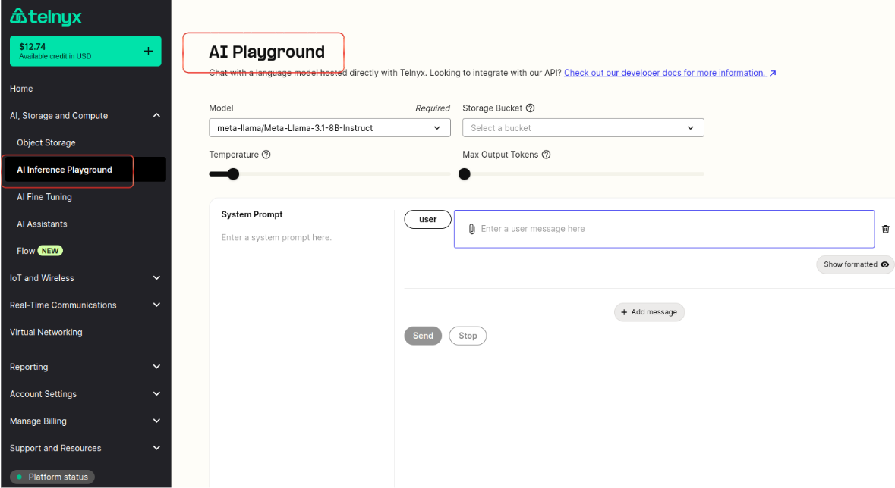

# Telnyx Storage

*Part 1 of 3 — see also: [Part 2](telnyx-storage--part-2.md), [Part 3](telnyx-storage--part-3.md)*

Telnyx Storage is a high-performance, S3-compatible cloud storage service offering 11 nines of durability, zero egress fees, and seamless integration with a wide range of third-party tools. This page explains how to create and manage storage buckets, use the built-in AI features for summarization and inference, and configure popular S3 clients and backup utilities to work with Telnyx Storage.

## Overview

Telnyx Storage is a high-performance cloud storage service designed for storing and managing large volumes of unstructured data. It offers speedy data retrieval and 11 nines of reliability, and exposes an S3-compatible API so that existing S3-centric applications can be pointed at Telnyx endpoints for easy migration.

Key differentiators compared to platforms such as Google Cloud Storage include:

- **No egress fees** — data retrieval is free regardless of operation class.
- **Lower cost** — roughly 70% less expensive than Google Cloud Storage for both Class A and Class B operations.
- **Distributed edge architecture** — built on distributed storage technology for reliable, efficient storage at the edge.
- **S3 compatibility** — point any S3 client or application at a Telnyx endpoint to migrate workloads quickly.
- **MSP-friendly** — managed service providers and resellers can use Telnyx Storage to scale disaster recovery and backup/restore services across their client base.

## Storage buckets

A storage bucket is the fundamental unit of storage in Telnyx Storage. Buckets can be created through the Telnyx portal or via an API call, and there is no additional charge for creating additional buckets.

Key facts about buckets:

- **Creation** — create a bucket from the [Storage](https://portal.telnyx.com/#/app/storage/buckets) section of the Telnyx portal or with an API command.
- **Limit** — up to 100 buckets per account at no additional cost. Contact sales for higher limits.
- **S3-compatible API** — point any S3-compatible application at a Telnyx endpoint.
- **Use cases** — store multi-modal raw data for embeddings, fine-tuning datasets, backups, archives, and more, with zero egress fees.

### Create a bucket

1. Sign in to your Telnyx account and open the [Storage](https://portal.telnyx.com/#/app/storage/buckets) section in the left navigation bar. First-time users can click **Get Started**.
2. Enter a unique bucket name. Names must be 3–65 characters long and may contain only lowercase letters, numbers, dots (`.`), and hyphens (`-`).
3. Click **Create**.

If the name is already in use, the portal returns:

> The requested bucket name is not available. The bucket namespace is shared by all users of the system. Specify a different name and try again.

### Upload objects

Once a bucket is created, click into it to access settings or upload objects. Use the **Upload Object** or **Upload Folder** button in the middle of the page the first time, and the **Upload Object** button in the top right for subsequent uploads. Files can be dragged and dropped or selected via **Browse Files**. Optional key/value tags can be applied to objects before upload.

Supported file types include but are not limited to:

- Text files (`.txt`, `.csv`, `.json`, `.xml`, etc.)
- Image files (`.jpg`, `.png`, `.gif`, etc.)
- Video files (`.mp4`, `.mov`, `.avi`, etc.)
- Audio files (`.mp3`, `.wav`, `.aac`, etc.)
- Document files (`.pdf`, `.docx`, `.xlsx`, etc.)
- Archive files (`.zip`, `.tar`, `.rar`, etc.)

There are no restrictions on file types, but you are responsible for ensuring you have the rights and permissions to store and distribute any data uploaded.

### Delete a bucket

Click the trash icon in the **Actions** column to delete a bucket. A bucket can only be deleted when it is empty — all objects must be removed first.

## AI features and inference

Telnyx Storage includes built-in AI capabilities that operate directly on objects in your buckets.

### Summarize a file

Click the **Summarize File** button on an object to generate a summary of its contents.

Supported file types for AI features:

- `pdf`
- `html`
- `txt` and other unstructured text files
- `json`
- `csv`
- Audio/video: `mp3`, `mp4`, `mpeg`, `mpga`, `m4a`, `wav`, `webm` (max 20 MB)

When the summary is ready, a popup window displays the result.

### Embed objects

Click the **Embed** button to embed an object's content so it can be used in the AI Playground (inference). Only supported file types can be embedded.

### AI Playground

After embedding files, open the [AI Playground](https://portal.telnyx.com/#/app/aiPlayground) tab next to the bucket tab to run inference.

Select a language model, optionally provide an OpenAI API key when using an OpenAI model, choose a bucket, and supply a system prompt and one or more user messages. Adjust **Temperature** (higher = more random, lower = more focused) and **Max Tokens** (maximum tokens generated for the chat completion), then click **Send** to trigger the completion request.

Supported language models include:

- `openai/gpt-3.5-turbo-0613`
- `openai/gpt-3.5-turbo-0125`
- `openai/gpt-4-turbo-preview`
- `openai/gpt-4-1106-preview`
- `openai/gpt-4-32k-0314`
- `openai/gpt-3.5-turbo-1106`
- `openai/gpt-4`
- `openai/gpt-4-0314`
- `openai/gpt-4-32k`
- `openai/gpt-3.5-turbo`
- `openai/gpt-3.5-turbo-16k`
- `openai/gpt-3.5-turbo-16k-0613`
- `openai/gpt-3.5-turbo-0301`
- `openai/gpt-4-0125-preview`
- `openai/gpt-4-32k-0613`
- `openai/gpt-4-0613`
- `NousResearch/Nous-Hermes-2-Mixtral-8x7B-DPO`
- `TheBloke/zephyr-7B-beta-GPTQ`
- `meta-llama/Llama-2-13b-chat-hf`
- `mistralai/Mistral-7B-Instruct-v0.1`

### Why embed and infer on bucket objects

Embedding and inferring on objects in your buckets unlocks several use cases:

- **Content-based recommendation** — generate embeddings for catalog items and recommend similar items based on user interactions.
- **Semantic search** — find documents that are semantically related to a query, even when exact keywords are absent.
- **Image or video recognition** — represent visual content as embeddings for classification, object detection, or similarity search.
- **Data clustering and organization** — group similar items together in large, varied buckets.
- **Anomaly detection** — capture the essence of log or transaction entries and detect outliers.
- **Reduced latency** — process data in place without moving it to a separate processing location.

Telnyx itself uses this approach to power its AI support assistant, which combines embeddings of telnyx.com, the support center, and developer documentation. See the [Mission Control Portal AI Chat Support](https://support.telnyx.com/en/articles/8020222-mission-control-portal-ai-chat-support) article for details.

## Organisation access

At present, storage buckets created by an organisation owner can only be accessed by that owner. Buckets created by sub-members of an organisation are likewise only accessible to that sub-member. Cross-user access within an organisation is planned for a future release.

## Common configuration values

Most S3-compatible clients require the same handful of values to connect to Telnyx Storage. The values below are referenced throughout the per-tool guides that follow.

| Field | Value |
| --- | --- |
| Access Key | Your [Telnyx API Key](https://portal.telnyx.com/#/app/api-keys) |
| Secret Key | Any value without spaces, quotes, or special characters — Telnyx Storage does not use the secret key, but most clients require one |
| Endpoint / REST Endpoint / Server | One of the available [API Endpoints](https://developers.telnyx.com/docs/cloud-storage/api-endpoints) |
| Region / Location Constraint | The matching region from the [API Endpoints](https://developers.telnyx.com/docs/cloud-storage/api-endpoints) page (for example, `us-central-1` for `https://us-central-1.telnyxstorage.com`) |
| Bucket | The name of an existing bucket in the [Storage](https://portal.telnyx.com/#/app/storage/buckets) section of the Telnyx portal |
