# Telnyx Storage

*Part 2 of 3 — see also: [Part 1](telnyx-storage--part-1.md), [Part 3](telnyx-storage--part-3.md)*

Telnyx Storage is a high-performance, S3-compatible cloud storage service offering 11 nines of reliability, zero egress fees, and roughly 70% lower cost than Google Cloud Storage. This guide covers bucket creation and management, built-in AI features (summarization, embedding, and inference via the AI Playground), and step-by-step instructions for connecting a wide range of third-party S3-compatible tools — including rclone, MSP360 Cloudberry Explorer, S3 Browser, Syncovery, GoodSync, CloudMounter, DragonDisk, ExpanDrive, ODrive, WebDrive, NetDrive3, and AirExplorer — using your Telnyx API key and an available API endpoint.

## Third-Party Tool Integrations

The following guides walk through connecting specific S3-compatible tools to Telnyx Storage.

### MSP360 Cloudberry Explorer

[MSP360 Cloudberry Explorer](https://www.msp360.com/explorer/) is a user-friendly file manager for transferring and organizing data across many cloud storage providers.

1. Download and install MSP360 Cloudberry Explorer from the [official site](https://www.msp360.com/explorer/).
2. Open the application and select **New Connection**.

   
3. When prompted for the connection type, select **S3 compatible**.

   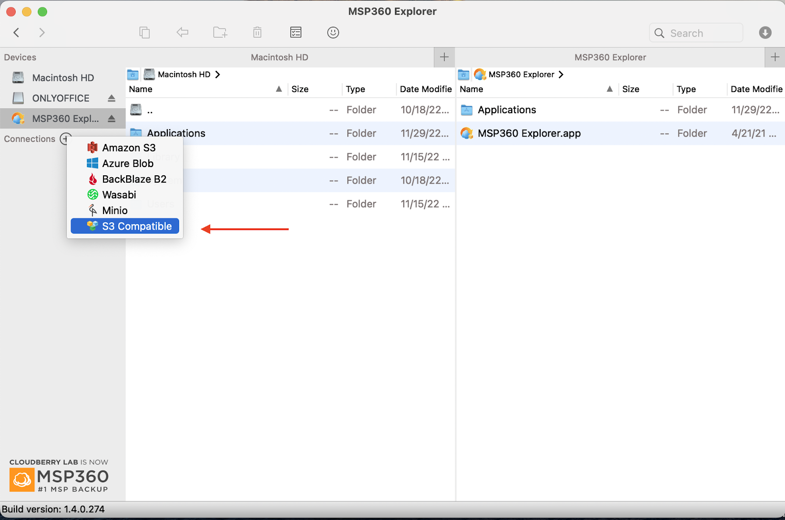
4. In the connection settings window, enter the following and click **OK**:
   - **Display Name**: A nickname for the connection.
   - **Access Key**: Your Telnyx API Key.
   - **Secret Key**: Any value without spaces, quoting, or special characters.
   - **Endpoint**: One of the available API Endpoints.
   - **Signature Version**: `AWS4`.

   
5. The new connection appears in the navigation bar; clicking it lists your buckets.

   

For more, see the [MSP360 guides for Windows](https://help.msp360.com/explorer) and [MSP360 guides for Mac](https://help.msp360.com/explorer-for-macos).

### rclone

[rclone](https://rclone.org/) is a command-line tool for syncing files and directories to and from many cloud storage providers and local file systems.

1. Download and install rclone from the [official install page](https://rclone.org/install/).
2. Open a terminal and run `rclone config` to create a new configuration.
3. Answer the prompts as follows:
   - `n` — create a new remote.
   - **Name**: any name you like.
   - **Storage**: option `4` (Amazon S3 Compliant Storage Providers including AWS, Alibaba, Ceph, …).
   - **provider**: option `34` (Any other S3 compatible provider).
   - **env_auth**: option `1` (Enter AWS credentials in the next step).

   
   - **access_key_id**: your Telnyx API Key.
   - **secret_access_key**: any value without spaces, quoting, or special characters.
   - **region**: option `1` (Will use v4 signatures and an empty region).
   - **endpoint**: one of the available API Endpoints.
   - **location_constraint**: leave empty, or enter one of the available regions.
   - **acl**: option `1` (Owner gets full control. No one else has access rights — default).
   - **Edit advanced config?**: `n`.
   - **Keep this remote?**: `y`.
4. Type `q` to quit the config.

For more, see the [rclone S3 documentation](https://rclone.org/s3/).

### S3 Browser

[S3 Browser](https://s3browser.com/) is a graphical user interface for managing files on Amazon S3 and other S3-compatible services.

1. Download and install S3 Browser from the [official site](https://s3browser.com/).
2. On first launch, the **Add New Account** window appears. Otherwise, click **Accounts** → **Add New Account**.

   
3. Enter the following and click **Add New Account**:
   - **Display Name**: A nickname for the connection.
   - **Account Type**: `S3 Compatible Storage`.
   - **REST Endpoint**: One of the available API Endpoints.
   - **Access Key ID**: Your Telnyx API Key.
   - **Secret Access Key**: Any value without spaces, quoting, or special characters.

   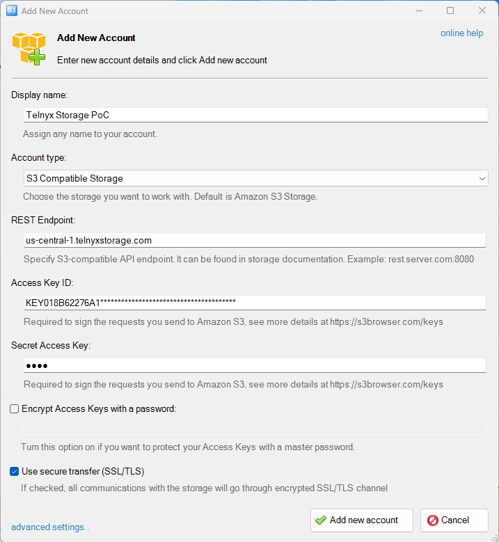
4. Existing buckets appear in the application window.

   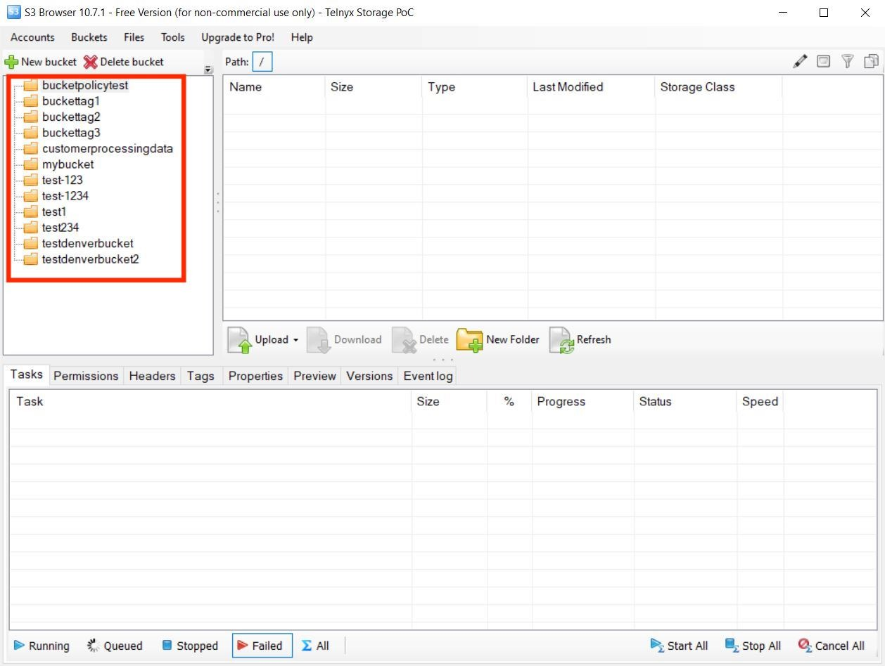

For more, see the [S3 Browser user guides](https://s3browser.com/help.aspx).

### Syncovery

[Syncovery](https://www.syncovery.com/) is a file synchronization and backup tool with a wide range of features.

1. Download and install Syncovery from the [official site](https://www.syncovery.com/).
2. Launch Syncovery.

   
3. Click the green **+** button to create a new profile.

   
4. In the profile configuration window, click **Internet**.

   
5. In the Internet Protocol Settings window, enter the following and click **OK**:
   - **Protocol**: `S3`.
   - **Access ID**: Your Telnyx API Key.
   - **Secret key**: Any value without spaces, quoting, or special characters.
   - **Provider**: `custom`.
   - **Bucket**: One of the available API Endpoints.
   - **Folder**: The local folder to back up.

   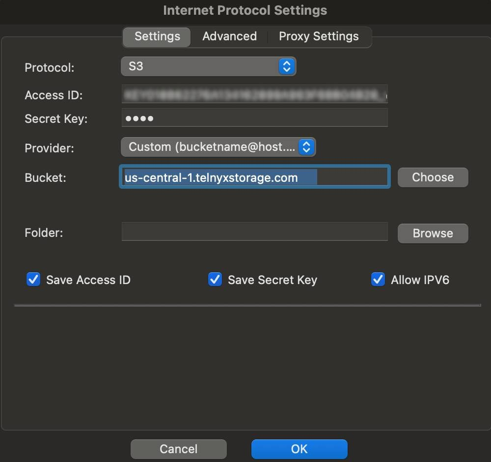
6. Choose the destination path — local storage (**Browse…**), **Internet**, or a **Device**.

   
7. Click **OK** to save the profile.

   

For more, see the [Syncovery documentation](https://www.syncovery.com/category/documentation/).

### GoodSync

[GoodSync](https://www.goodsync.com/) is a simple and secure file backup and synchronization tool.

1. Download and install GoodSync from the [official site](https://www.goodsync.com/download).
2. Sign up and create a GoodSync account.
3. Click **New Job**.

   
4. Enter a job name, set the job type to **Synchronize**, and click **OK**.

   
5. Click the folder icon to choose a folder.

   
6. Select **Amazon S3** from the list.

   
7. Add the S3 bucket details:
   - **Server address**: One of the available API Endpoints.
   - **AWS Access Key**: Your Telnyx API Key.
   - **AWS Secret Access Key**: Any value without spaces, quoting, or special characters.
   - Click **Test** and **Save**.

   
8. After saving, the bucket appears in the Amazon S3 folder dropdown.

   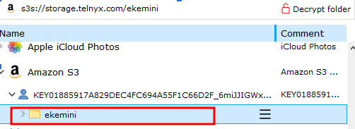

For more, see the [GoodSync documentation](https://www.goodsync.com/goodsync-storage).

### CloudMounter

[CloudMounter](https://cloudmounter.net/) mounts cloud storage services as local drives on your computer.

1. Download CloudMounter for [Mac or Windows](https://cloudmounter.net/).
2. Install and launch the application.

   
3. Select **Amazon S3** as the storage type.

   
4. Fill in the connection details:
   - **Name**: Your name.
   - **Access Key**: Your Telnyx API Key.
   - **Secret Key**: Any value without spaces, quoting, or special characters.
   - **Server Endpoint**: One of the available API Endpoints.
   - **Bucket**: A bucket name from your [Telnyx Storage buckets](https://portal.telnyx.com/#/app/storage/buckets).

   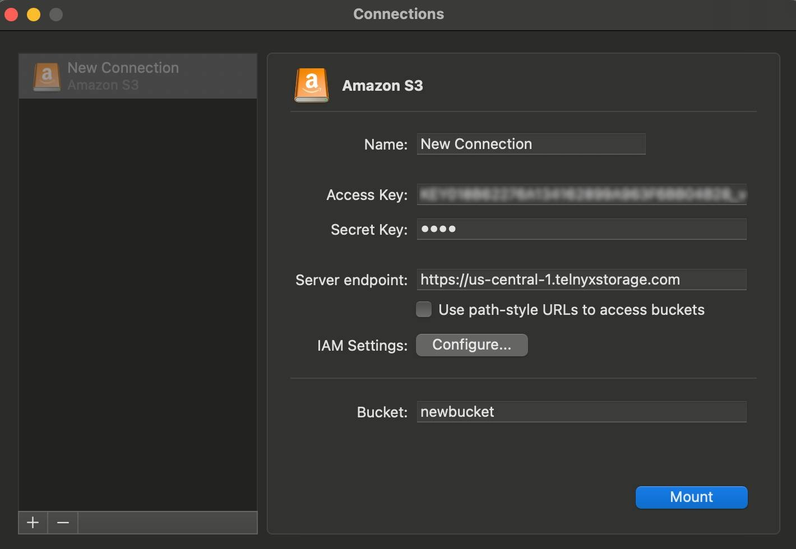
5. Click **Mount** to connect.

For more, see the [CloudMounter blog](https://cloudmounter.net/blog/).

### DragonDisk

[DragonDisk](http://www.s3-client.com/) is a file manager for Amazon S3 and other S3-compatible cloud storage services.

1. Download and install DragonDisk from the [official site](http://www.s3-client.com/download-s3-compatible-cloud-client.html).
2. Open the DragonDisk application.
3. Click **File** → **Accounts**.

   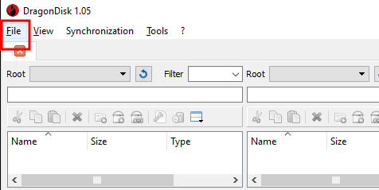
4. In the **Accounts** window, click **New**.

   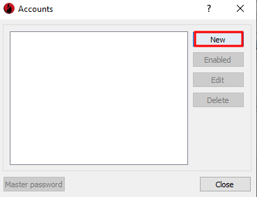
5. Select **Other S3 compatible service** from the **Provider** dropdown, then fill in:
   - **Service Endpoint**: `https://storage.telnyx.com`.
   - **Account name**: A nickname.
   - **Comment**: A note to identify the account.
   - **Access Key**: Your Telnyx API Key.
   - **Secret Key**: Any value without spaces, quoting, or special characters.

   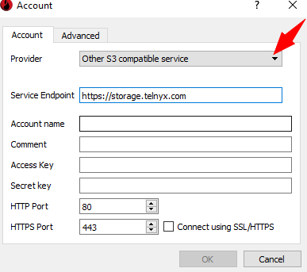
6. Click **OK** to save.

For more, see the [DragonDisk FAQ](http://www.s3-client.com/faq.html).

### ExpanDrive

[ExpanDrive](https://www.expandrive.com/) mounts cloud storage as a local drive on your computer.

1. Download and install ExpanDrive from the [official site](https://www.expandrive.com/desktop/).
2. Launch ExpanDrive and click **ExpanDrive** → **New Connection**.

   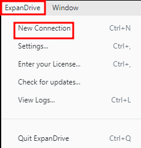
3. Select **Amazon S3** from the list of storage options.

   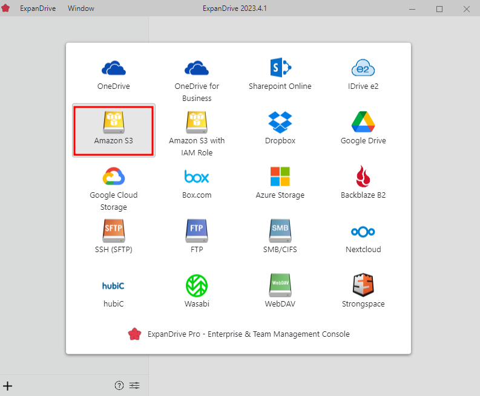
4. Fill in the storage options:
   - **Server**: One of the available API Endpoints.
   - **Access Key**: Your Telnyx API Key.
   - **Secret Key**: Any value without spaces, quoting, or special characters.
   - **Custom Region**: The region matching the chosen endpoint (for example, `us-central-1` for `https://us-central-1.telnyxstorage.com`).
   - **Nickname**: A name of your choice.
   - **Bucket**: A bucket name, or leave blank.
   - **Drive Letter**: A local drive letter.

   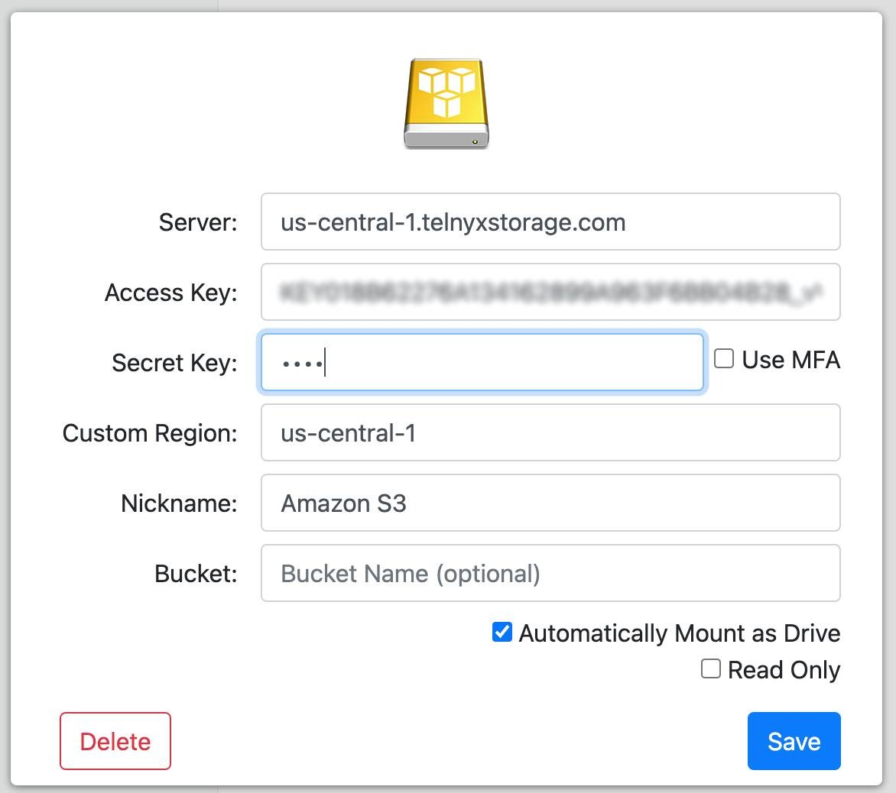
5. Click **Save** to authenticate and create the connection. Once authenticated, Telnyx Storage files appear as a mounted drive.

   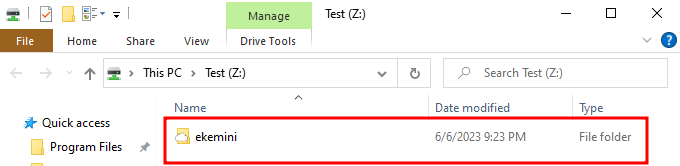

For more, see the [ExpanDrive blog](https://www.expandrive.com/).

### ODrive

[ODrive](https://www.odrive.com/) syncs and accesses files across multiple devices and cloud storage services.

1. Download and install ODrive from the [official install guide](https://docs.odrive.com/docs/odrive-usage-guide#install-desktop-sync).
2. Launch the application and click **Link Storage**.

   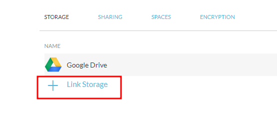
3. In the **Link Storage** window, select **Amazon S3/S3 Compatible**.

   
4. Fill in the fields:
   - **Name**: A nickname for the connection.
   - **Host**: One of the available API Endpoints.
   - **Bucket Name**: A bucket from your [Telnyx Storage](https://portal.telnyx.com/#/app/storage/buckets).
   - **Access Key ID**: Your Telnyx API Key.
   - **Secret Key ID**: Any value without spaces, quoting, or special characters.
   - **Default Storage Class**: `Standard`.
   - **Directory Structure**: `Simple` or `Delimited`.

   
5. After authorizing, you are redirected back to ODrive with Telnyx Storage linked.

   

For more, see the [ODrive documentation](https://docs.odrive.com/docs).

### WebDrive

[WebDrive](https://southrivertech.com/) is a file transfer client that supports many protocols and remote servers.

1. Download and install WebDrive from the [official site](https://southrivertech.com/webdrive/).
2. Launch WebDrive and click the **+** button to create a new connection.

   
3. Select **Amazon S3** as the connection type.

   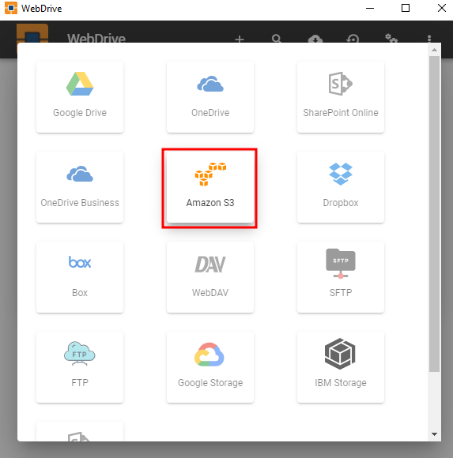
4. In the connection settings window, enter:
   - **Connection Name**: A nickname.
   - **Access Key**: Your Telnyx API Key.
   - **Secret Key**: Any value without spaces, quoting, or special characters.
   - **Bucket**: A bucket name, or leave blank.
   - **Drive Letter**: A local drive letter.
   - **Advanced Settings**: One of the available API Endpoints as the custom server URL.

   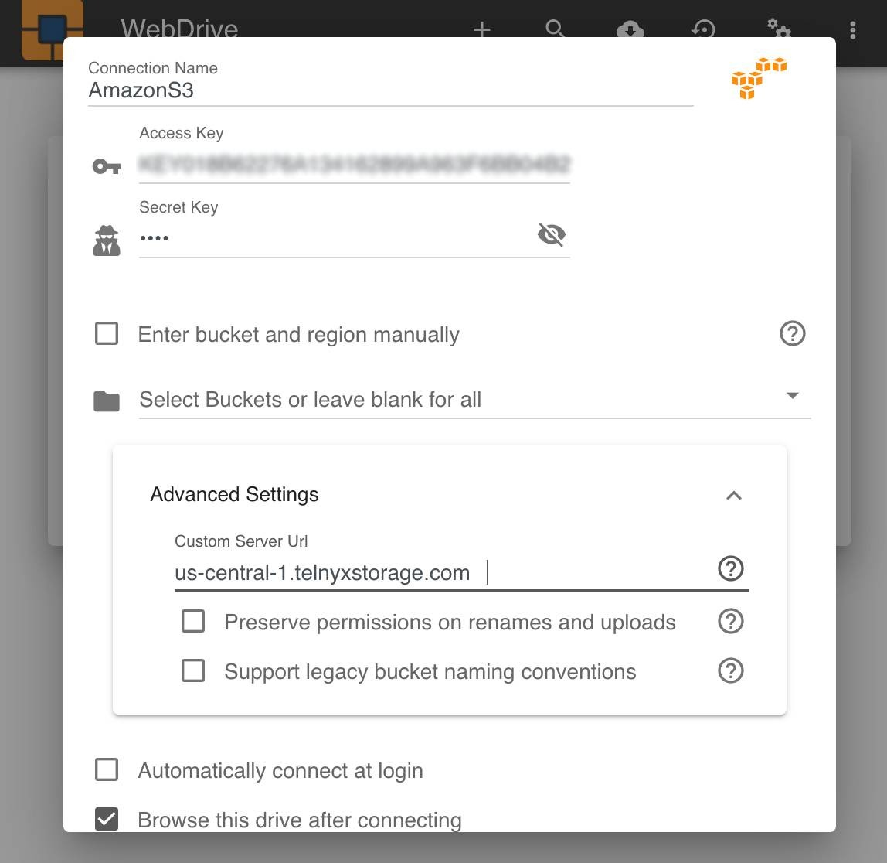
5. Click **Save**.

   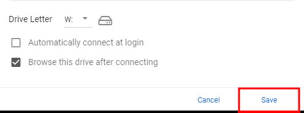
6. Select the new connection and click the **box** object button to connect.

   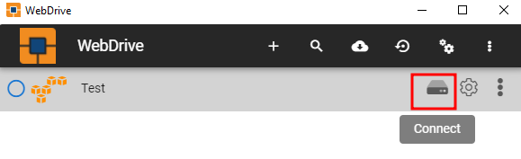

For more, see the [WebDrive blog](https://southrivertech.com/blog/).

### NetDrive3

[NetDrive3](https://netdrive.net/) maps remote storage as a virtual drive on your computer.

1. Download and install NetDrive3 from the [official site](https://netdrive.net/).
2. Launch NetDrive3 and click the **+** button to create a new connection.

   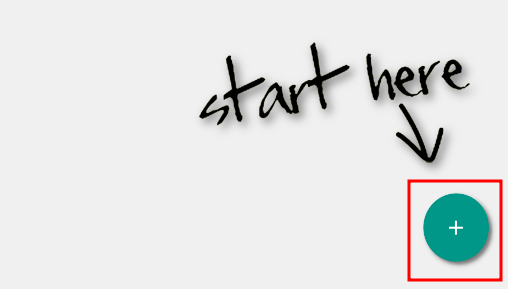
3. In the **Add a Personal Drive** window, select **S3** as the storage type and click **Connect**.

   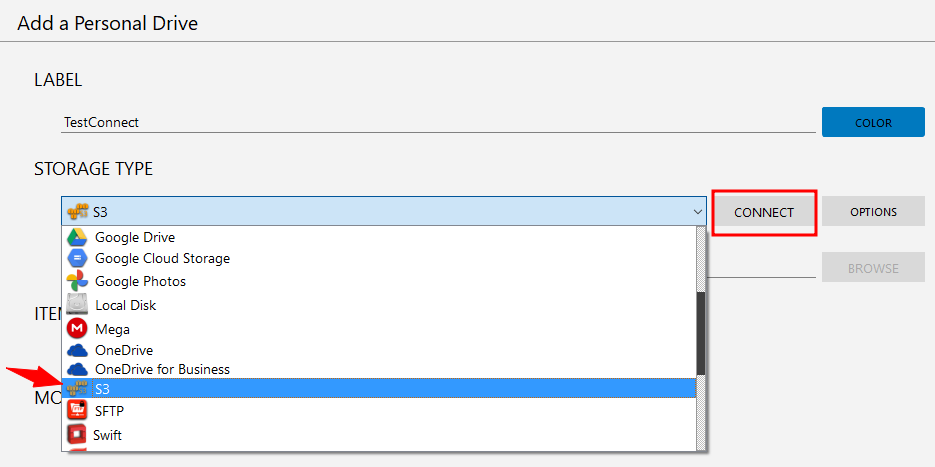
4. Fill in the fields:
   - **Server Address**: One of the available API Endpoints.
   - **Access ID**: Your Telnyx API Key.
   - **Secret Key**: Any value without spaces or special characters.
   - **Bucket name**: A bucket from your [Telnyx Storage](https://portal.telnyx.com/#/app/storage/buckets).
5. After entering the details, **S3** appears as a storage type with a remote path based on the bucket name. Click **OK** to continue.

   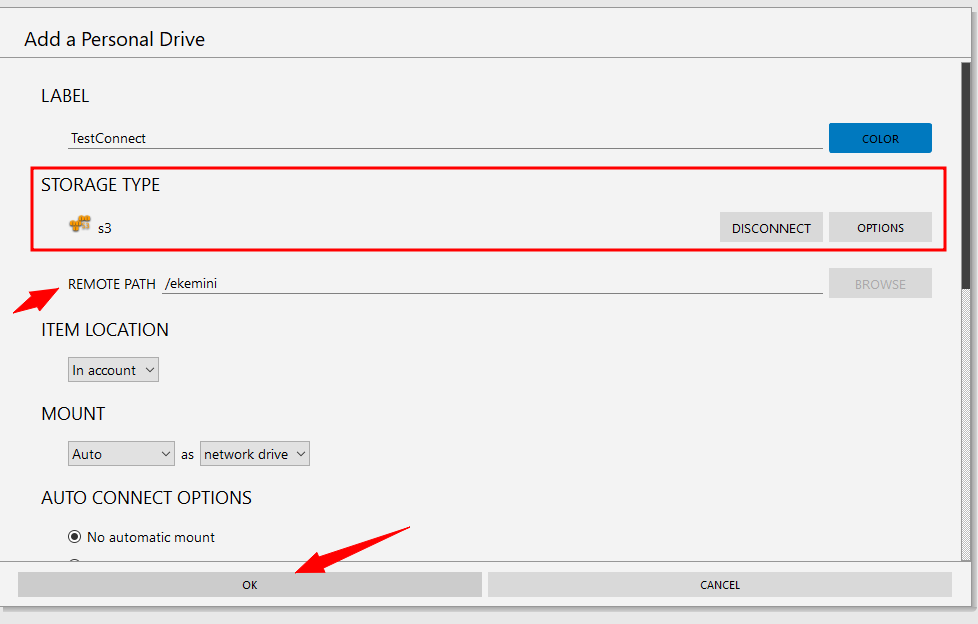
6. Click **Connect** to link NetDrive3 with Telnyx Storage.

   
7. Once connected, Telnyx Storage appears as a virtual drive.

   

For more, see the [NetDrive3 documentation](https://netdrive.net/support/).

### AirExplorer

[AirExplorer](https://www.airexplorer.net/en/) is a file management tool that works across multiple cloud storage providers.

1. Download and install AirExplorer from the [official site](https://www.airexplorer.net/en/).
2. Launch AirExplorer and select **S3** from the list of cloud storage options.

   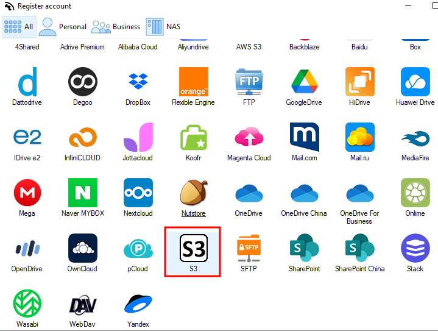
3. In the configuration window, enter:
   - **REST endpoint**: One of the available API Endpoints.
   - **Access Key ID**: Your Telnyx API Key.
   - **Secret Access Key**: Any value without spaces, quoting, or special characters.
   - **Bucket**: A bucket name from your [Telnyx Storage](https://portal.telnyx.com/#/app/storage/buckets).
4. Click **OK** to verify the connection and save the configuration.

   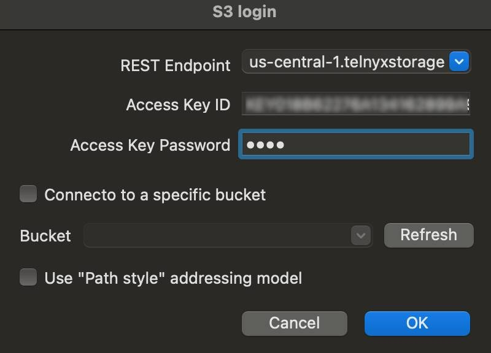

For more, see the [AirExplorer blog](https://www.airexplorer.net/en/blog/).
