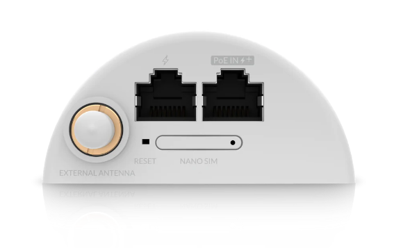
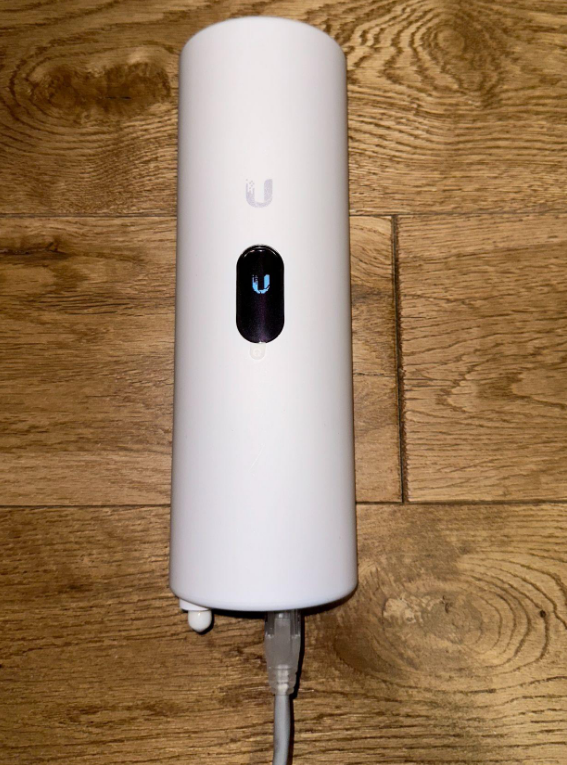
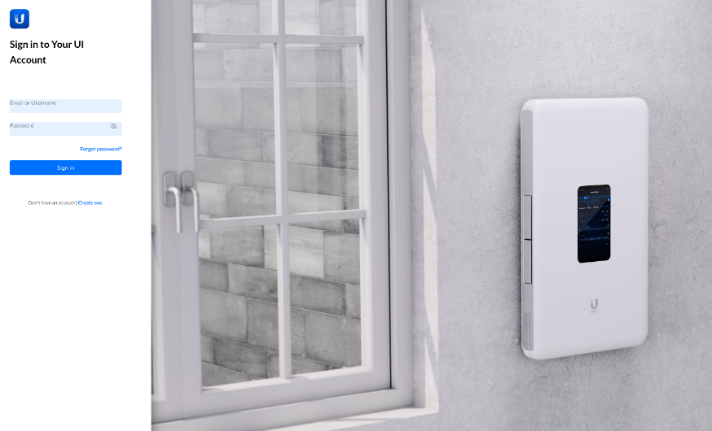
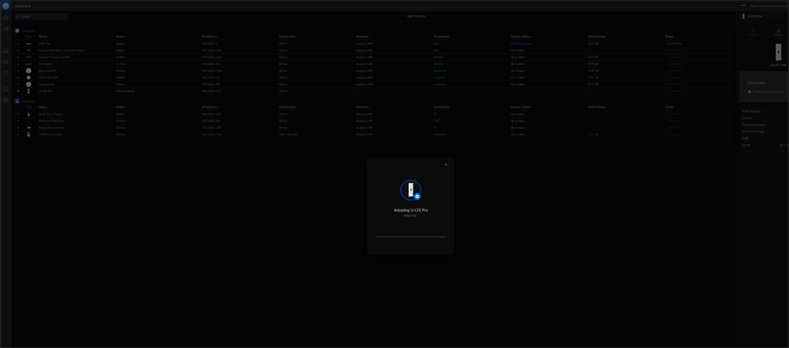
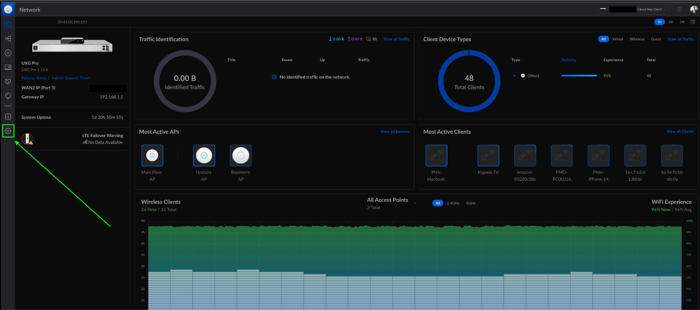
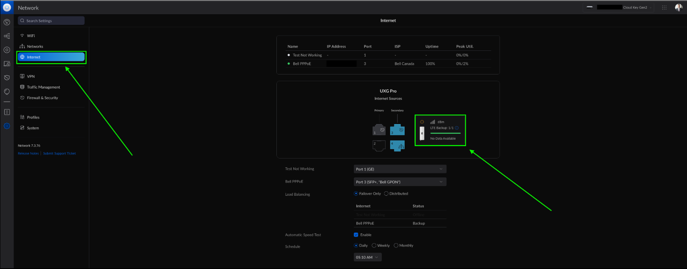
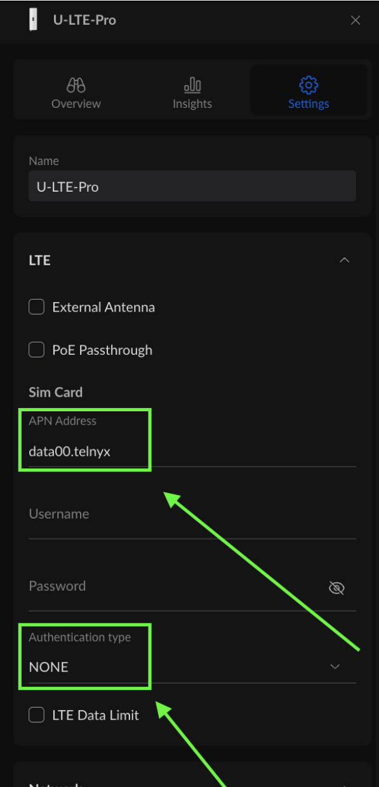
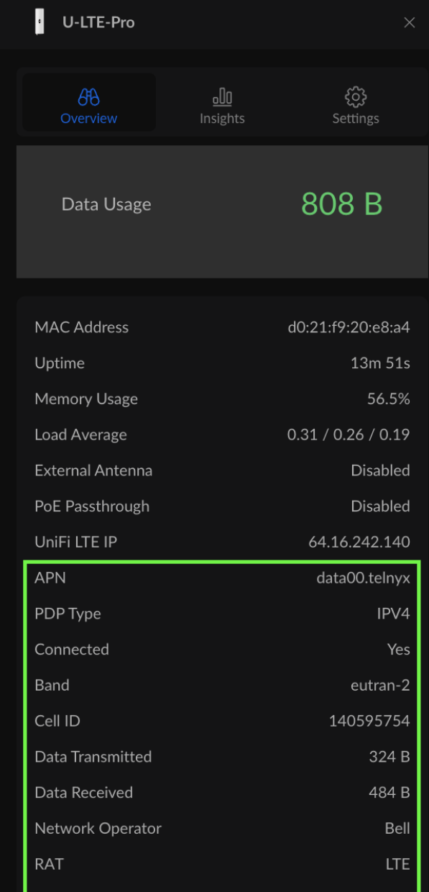

# Telnyx Ubiquiti Integration, 10DLC, Organizations & US Tax & Fee Reference

*Part 1 of 5 — see also: [Part 2](telnyx-ubiquiti-integration-10dlc-organizations-us-tax-fee-reference--part-2.md), [Part 3](telnyx-ubiquiti-integration-10dlc-organizations-us-tax-fee-reference--part-3.md), [Part 4](telnyx-ubiquiti-integration-10dlc-organizations-us-tax-fee-reference--part-4.md), [Part 5](telnyx-ubiquiti-integration-10dlc-organizations-us-tax-fee-reference--part-5.md)*

This page consolidates Telnyx support guidance covering Ubiquiti UniFi LTE Pro cellular backup setup with a Telnyx SIM, UniFi Talk PBX trunk configuration using both credentials and IP authentication, 10DLC brand verification requirements, user organization and permission management, and US sales tax, USF, and TRS fee policies.

## Ubiquiti UniFi LTE Pro Setup with Telnyx SIM

The Ubiquiti UniFi LTE Pro provides reliable backup cellular internet connectivity to ensure your UniFi WAN network remains operational. The Pro model supports 4G LTE and WCDMA bands and is compatible with the EU, US, and CA regions. It includes a Nano SIM card slot, which allows for the insertion of a Telnyx SIM card.


### Setup Instructions

**Step 1: Insert the Telnyx SIM Card**

- Locate the Nano SIM card slot on your UniFi LTE Pro device.
- Insert the Nano SIM (smallest size from the Telnyx SIM card kit) into the slot.



**Step 2: Power On the Device**

- Connect the UniFi LTE Pro to a PoE (802.3af) enabled Ubiquiti network switch to power it on.



**Step 3: Access the UniFi Console**

1. Open your preferred web browser.
2. Navigate to <https://unifi.ui.com>.
3. Log in to your UniFi console.



**Step 4: Adopt the Device**

- Locate the UniFi LTE Pro in your device list on the console.
- Click on the **Adopt** button to add the device to your network.



**Step 5: Configure LTE Backup Settings**

1. After the device is successfully adopted, navigate to the **Settings** page.

   
2. Select the **Internet** tab and click on the **LTE Backup** option.

   
3. A configuration window will appear on the right-hand side. Click **Settings** to proceed.


**Step 6: Enter Telnyx APN Settings**

1. Input the Telnyx APN settings as follows:
   - **APN**: `data00.telnyx`
   - **Authentication Type**: Select **NONE**.
2. Click **Apply** to save the settings.



**Step 7: Verify Connection Status**

- Go to the **Overview** tab.
- Confirm that the **Status** is listed as **Ready** and that **Connected** is set to **Yes**.



### Important Notes

**First-Time Network Attachment**

- Telnyx SIM cards support multiple network types and operators. During the first connection attempt, it may take up to 30 minutes for the device to attach to a network.
- Once connected, the network will be added to the list of priority operators for faster future connections.

**Device Restart or Re-provisioning**

- If the device is restarted or re-provisioned, it may enter SIM-Activation mode. To resolve this, execute the following command in the UniFi CLI:

  ```
  qmicli -p -d /dev/cdc-wdm0 --wds-set-autoconnect-settings=enabled
  ```
