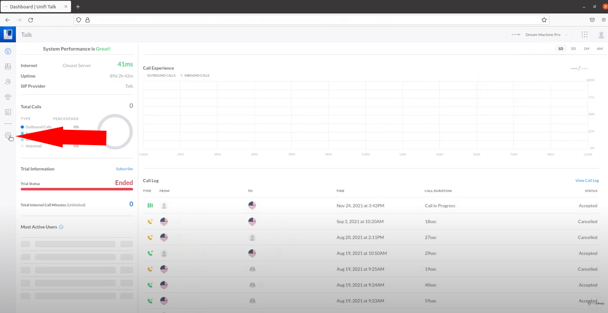
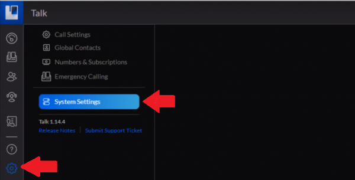
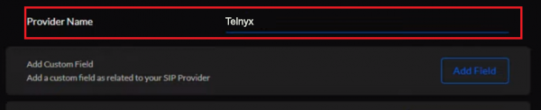
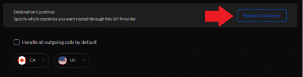
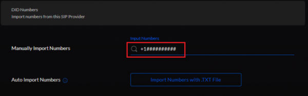
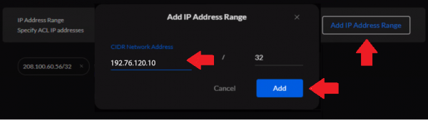
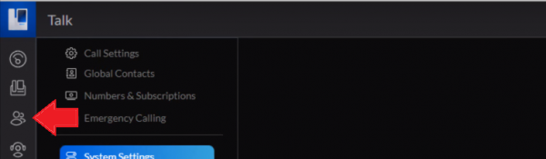
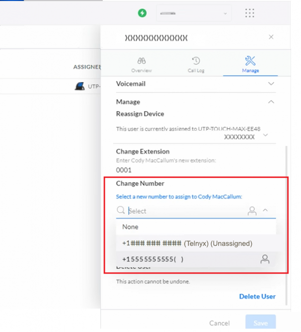

# Telnyx Ubiquiti Integration, 10DLC, Organizations & US Tax & Fee Reference

*Part 2 of 5 — see also: [Part 1](telnyx-ubiquiti-integration-10dlc-organizations-us-tax-fee-reference--part-1.md), [Part 3](telnyx-ubiquiti-integration-10dlc-organizations-us-tax-fee-reference--part-3.md), [Part 4](telnyx-ubiquiti-integration-10dlc-organizations-us-tax-fee-reference--part-4.md), [Part 5](telnyx-ubiquiti-integration-10dlc-organizations-us-tax-fee-reference--part-5.md)*

This page consolidates Telnyx support guidance covering Ubiquiti UniFi LTE Pro cellular backup setup with a Telnyx SIM, UniFi Talk PBX trunk configuration using both credentials and IP authentication, 10DLC brand verification requirements, user organization and permission management, and US sales tax, USF, and TRS fee policies.

## Ubiquiti UniFi Talk PBX with Telnyx Trunk

The [UniFi Talk PBX](https://help.ui.com/hc/en-us/articles/1500005593742), provided by [Ubiquiti](https://www.ui.com/), is a subscription-based VoIP phone solution that is the ideal plug-and-play setup for small to medium sized businesses.

> **Note:** Unifi Talk (referred to here as simply Talk) has specific hardware requirements. Only other Talk devices are compatible with the Talk application.

### Pre-requisites

- Your Telnyx Portal must be correctly [set up and configured for use](https://support.telnyx.com/en/articles/1176636-get-started-with-a-mission-control-account).
- Have your SIP Credentials (the username/password for your main SIP account or SIP sub-account).
- Have [DID(s) available](https://support.telnyx.com/en/articles/4380325-search-and-buy-numbers) to assign.
- You must have a [UniFi Console](https://ui.com/cloud-gateways) set up and configured: a [Dream Machine Pro](https://store.ui.com/us/en/products/udm-pro) or [Cloud Keygen 2 Plus](https://store.ui.com/us/en/products/uck-g2-plus) is required in order for the Talk application to work.
  - If you want to store call recordings, you will also need a hard disk drive, but this is not required for the Talk application to run correctly.
- PoE switches are required to power and connect your Talk device. UniFi offers their own [in-house option](https://ui.com/switching/#compare).
- A [Talk device](https://www.ui.com/new-integrations/managed-voip). Only Talk devices will work with the Talk application.
- Your Talk application must be [set up and up to date](https://help.ui.com/hc/en-us/articles/1500005593742) before you continue.
  - Ensure you can log into Talk UI.
- Make sure to have completed [all firmware updates](https://www.ui.com/download/) or other updates on your endpoint(s) (IP Phone).

### Add a Telnyx SIP Trunk to Talk

1. From your Unifi Talk dashboard, click on the settings icon in the right-hand navigation.

   
2. Under Unifi Talk settings click **System Settings**.

   
3. Find the **Third Party SIP Setup** section and click on **Add Third Party SIP Provider**.
4. Enter the provider name (e.g., *Telnyx*).

   
5. Click the **Add Fields** button. Add the following field names exactly as written:
   - *proxy*
   - *realm*
   - *username*
   - *password*
   - *register*
   - *sip_cid_type* (credentials auth only)
   - *context* (IP auth only)
   - *extension* (IP auth only)
   - *from-user* (IP auth only)
   - *from-domain* (IP auth only)
   - *retry_seconds*
   - *expire-seconds*
6. Click **Done** when finished.
7. Provide values for each field as described below.

#### Credentials Authentication Values

- **proxy**: *sip.telnyx.com*
- **realm**: *sip.telnyx.com*
- **username**: Your Telnyx account or sub-account username
- **password**: Your Telnyx account or sub-account password
- **register**: *true*
- **sip_cid_type**: *rpd*
- **retry_seconds**: *30*
- **expire-seconds**: *120*

#### IP Authentication Values

- **proxy**: *192.76.120.10* (For international, see [this document](https://sip.telnyx.com/#signaling-addresses).)
- **realm**: *sip.telnyx.com* (For international, see [this document](https://sip.telnyx.com/#signaling-addresses).)
- **context**: *public*
- **password**: You can type anything here. The Unifi setup wants a password value, even when doing IP authentication.
- **register**: *false*
- **username**: Your Telnyx username
- **extension**: Leave blank
- **from-user**: Your Telnyx username
- **from-domain**: *192.76.120.10* (For international, see [this document](https://sip.telnyx.com/#signaling-addresses).)
  - **Note:** If this doesn't work, you may need to instead give the static IP address of your Unifi Talk.
- **retry_seconds**: *30*
- **expire-seconds**: *120*

### Authorize International Outgoing Calls

If you want your users to be able to dial out to other countries, you'll need to authorize those.

1. From the **System Settings** config, click the **Select Countries** button. Make sure your Telnyx account allows for international calling, or this will not work.

   
2. Click **Save**.

### Configure Phone Numbers

1. From the **System Settings** config, open the **DID Numbers** section.
2. To manually import numbers, enter each of your Telnyx DIDs into the **Input Numbers** field in E164 format (e.g., +1XXXXXXXXXX).
   - You **MUST** provide the + at the beginning of your number string, otherwise you may get parsing errors.

   
3. To auto-import numbers from a text file, click the **Import Numbers with .TXT File** button.
   - There **MUST** be the + at the beginning of each number string, otherwise you may get parsing errors.
   - Make sure each number is on a separate line.

### Set the IP Address Range

1. From the **System Settings** config, click the **IP Address Range** option.
2. Click the **Add IP Address Range** button on the right.
   - **CIDR Network Address**: *192.76.120.10* (For international, see [this document](https://sip.telnyx.com/#signaling-addresses).) Leave */32* as it is.
3. Click the **Add** button.

   

### Assign a Phone Number to a User

1. Go to the left-hand navigation and click on the users icon.

   
2. Find the user you want to assign a number and click the **Edit** button at the far right of their row.

   
3. A user edit popup will appear. Click the **Manage** dropdown.

   
4. Find the **Change Number** section. Here you'll see all the DIDs you added previously. Any numbers that have not yet been assigned to a user will say "Unassigned" next to them.

   
