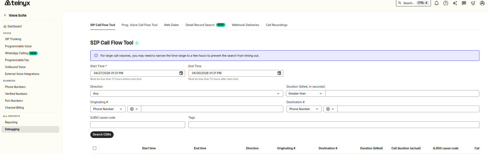
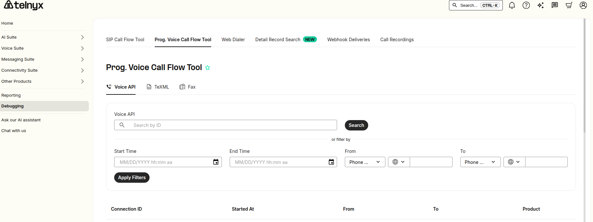
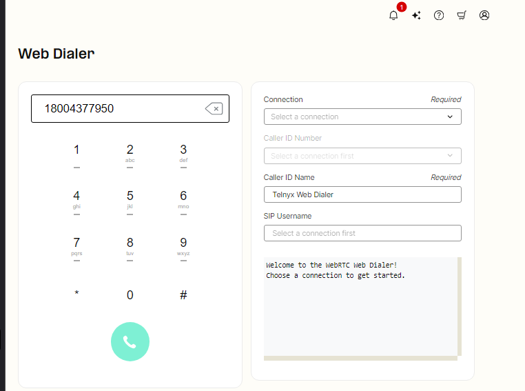
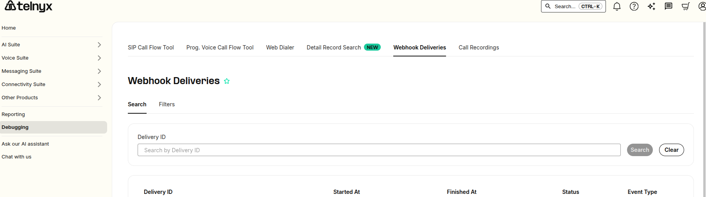
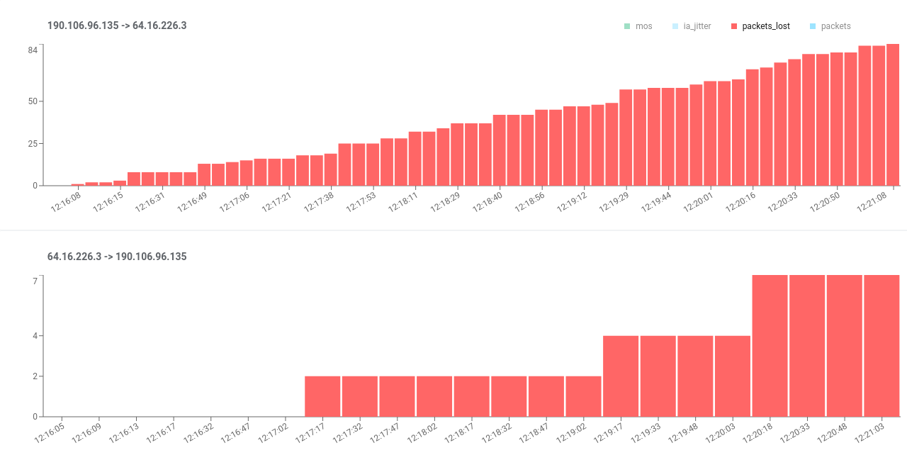
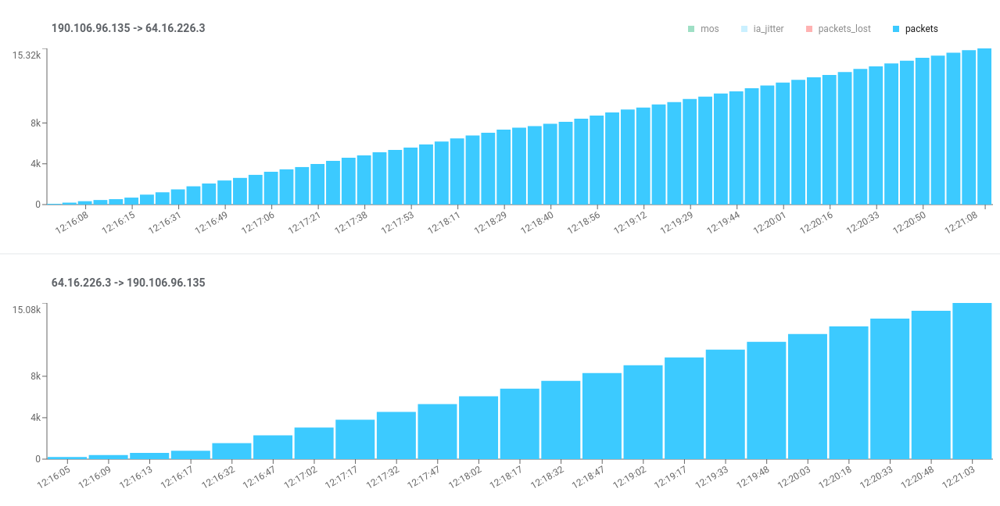

# Telnyx Voice API, TeXML, and Device Setup Guide

*Part 2 of 3 — see also: [Part 1](telnyx-voice-api-texml-and-device-setup-guide--part-1.md), [Part 3](telnyx-voice-api-texml-and-device-setup-guide--part-3.md)*

A consolidated reference covering Telnyx account basics, Voice API and TeXML application configuration, debugging tools, conference calling, and step-by-step setup instructions for several SIP desk and conference phones.

## Debugging Tools

The Debugging section of the Mission Control Portal contains tools for debugging SIP calls and call control flows. It includes six areas: SIP Call Flow Tool, Programmable Voice Call Flow Tool, Web Dialer, Detail Record Search, Webhook Deliveries, and Call Recordings.

### SIP Call Flow Tool

Specify a date range (up to 3 days back) and the calling and/or destination numbers. Additional filters include:

- **Billed duration:** Filter calls with a billed duration greater than, equal to, or less than the specified value.
- **Direction:** Filter inbound or outbound calls.
- **Tags:** Filter calls from/to numbers with a specific tag.
- **Result code:** Filter based on the SIP response code received.

An example call flow:

### Programmable Voice Call Flow Tool

Use this simpler tool to view Call Control, TeXML, or Fax API flows by supplying the Call Session ID of the call in question.

Clicking an example opens the Call Inspector, which illustrates the flow of the call. Each call event has a clickable drop-down that opens its associated webhook.

### Web Dialer

The Web Dialer lets you make test calls without setting up a softphone or PBX, which is useful for eliminating your PBX or softphone client as a source of issues. To use it, you need a Credentials Connection, a DID number assigned to that connection, and optionally a Caller ID name value. You can also receive inbound calls by dialing the DID number assigned to the SIP Connection.

If you encounter a `CALL_REJECTED` websocket response, check the specific call rejection within the message. A list of error responses and resolutions is available in the SIP response codes article.

### Webhook Deliveries

This tool shows a history of webhooks sent over your account. Search by webhook delivery ID, or filter by time, status, and webhook name (for example, `call.initiated`). To view webhook deliveries or logs for your voice application:

1. Log in to the Telnyx portal.
2. Select the **Debugging** tab.

Use this tool to:

- Locate and analyze specific webhooks using their webhook ID.
- Verify the delivery of a webhook.
- Verify the contents of a webhook.
- Analyze all webhooks sent in a certain timeframe or containing a certain text string (for example, `call.initiated`) to find anomalies.
- Analyze all webhooks with "failed" status.
- View logs alongside conversation transcripts and insights.

Tips for troubleshooting:

- Ensure your endpoint is correctly configured to receive webhook payloads.
- Use filtering options to quickly identify failed webhook deliveries.
- Inspect payload contents to verify the data sent matches expectations.
- Check for anomalies or errors in the logs that could indicate issues with your webhook setup.

### QoS (Quality of Service) Reports

RTCP Capture must be enabled on your SIP Connection settings. QoS Reports provide a visual representation of call quality on a timeline with two graphics, one for each RTP media stream. Access them through the SIP Call Flow Tool by searching for your call, clicking the blue "Call Data Debugging" button, and selecting the "QoS" tab. Reports are based on RTCP reports sent between SIP devices and Telnyx.

When a call is established, media flows over two RTP streams (one in each direction). Each side periodically sends RTCP reports containing transmission and reception statistics, including packets sent, packets lost, and interarrival jitter.

The QoS report displays four quality metrics on a timeline for each RTP stream:

- **MOS (Mean Opinion Score):** Based only on network metrics; other audio issues are not captured. Scale: 1 (Bad) to 4.5 (Excellent).

  

- **IA Jitter:** The value of Interarrival Jitter as measured by the reporter.

  

- **Packets Lost:** The accumulated number of RTP packets perceived as lost by the reporter.

  

- **Packets:** The accumulated number of RTP packets sent by the reporter.

  
