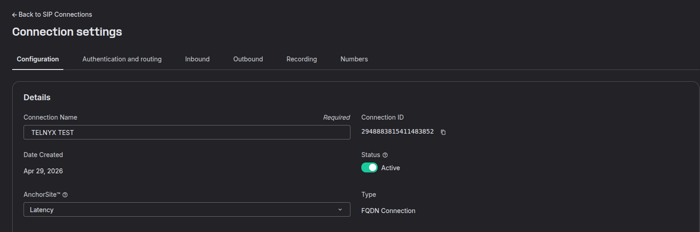
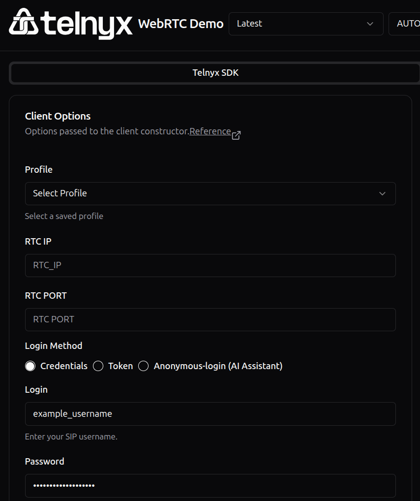
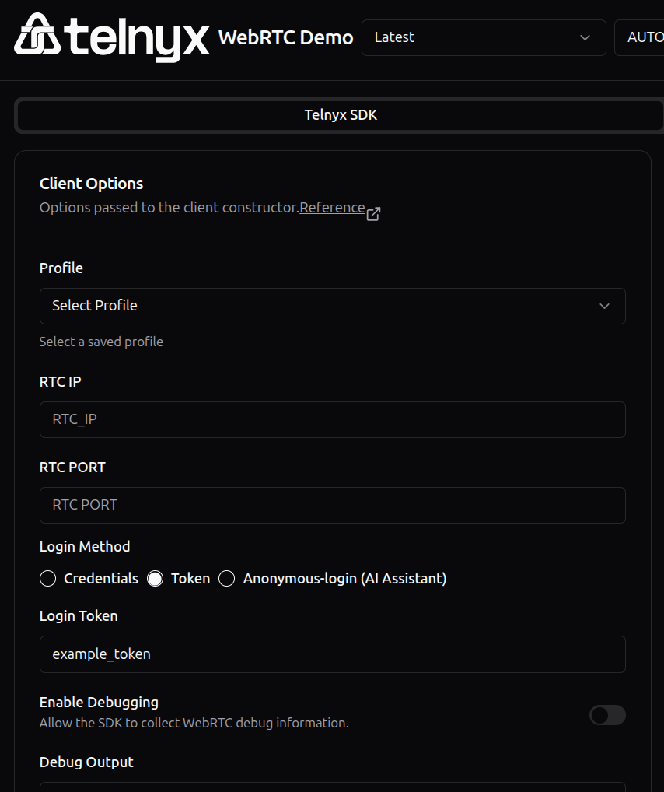

# Telnyx Voice Configuration: DTMF, TwiML Conferences, and Telephony Credentials

*Part 3 of 3 — see also: [Part 1](telnyx-voice-configuration-dtmf-twiml-conferences-and-telephony-credentials--part-1.md), [Part 2](telnyx-voice-configuration-dtmf-twiml-conferences-and-telephony-credentials--part-2.md)*

This page consolidates Telnyx guidance on configuring DTMF signalling for SIP trunks, building TwiML/TeXML conference calls using the Twilio SDK across multiple languages, and choosing between SIP Connection Credentials, On-Demand Credentials, and JSON Web Tokens for authenticating telephony traffic.

## Telephony credentials

Telnyx offers three different Telephony Credential types to authenticate your calls. Each is suited to a different scenario.

### SIP Connection Credentials

SIP Connection Credentials are configured in the Mission Control Portal and provide a one-stop authentication service for managing calls.

1. Click **Voice → SIP Trunking** in the Mission Control Portal and select **Create SIP Connection**.
2. Enter the name you want to give your SIP Connection and select **Credentials** as the authentication type.
3. Edit the username and password. A username and password are generated automatically, but you should consider changing them. It is **highly recommended** that you choose a **strong password**:
   - **Length:** at least 12–16 characters.
   - **Complexity:** mix of upper and lower case letters, numbers, and special characters (such as `!`, `@`, `#`, `$`).
   - **Avoid common words and patterns:** no "password", "123456", "abcd", "1234", or "qwerty".
   - **No personal information:** avoid birthdays, names of family members, pets, or favourite bands.
   - **Uniqueness:** each account should have a unique password.
   - **Use of passphrases:** consider a combination of unrelated words plus additional characters.
4. Click **Create** and you will now have access to use your new credentials SIP Connection.

**Why use SIP Connection Credentials?** The intuitive portal setup helps users separate their call traffic and allows for easy integration with soft-phone clients such as [Zoiper](https://support.telnyx.com/en/articles/5717957-zoiper-5-pro-telnyx-setup).

### On-Demand Credentials

On-Demand Credentials are created programmatically via the RESTful API.

1. **Gather your API key.** If you have not done so, generate a V2 key in the [Keys & Credentials section](https://portal.telnyx.com/#/app/api-keys) under **Account Settings**. Ensure **API Keys** is selected in the horizontal menu bar, click **Create API key**, then copy the API key and save it somewhere safe.
2. **Gather your Connection ID.** This can be found in your SIP Connection's settings.

   

   You can also return a list of your SIP Connections programmatically using the RESTful API — see the [developer docs](https://developers.telnyx.com/api/connections/list-connections).
3. **POST the API request:**

   ```
   curl -i -X POST \
     https://api.telnyx.com/v2/telephony_credentials \
     -H 'Authorization: Bearer <YOUR_TOKEN_HERE>' \
     -H 'Content-Type: application/json' \
     -d '{
       "connection_id": "1234567890",
       "name": "My-new-credential"
     }'
   ```

**Why use On-Demand Credentials?** They help you onboard new customers or team members under your SIP connection, allowing you to separate each user with their own security credentials. This solution is ideal for integrating WebRTC into your own platforms so that your back-end system can create outbound calls to each on-demand generated credential.

**Limitations:** Inbound calls directly to an on-demand generated credential are not currently supported. The purpose of on-demand generated credentials is purely for outbound calls. The typical use case is a call center service: a programmable voice application is associated with a number, and when a call is received, your call center service uses the call control API to dial each of the generated credentials to connect the caller with one of the available agents. These agents typically use a WebRTC client to log in with the on-demand credentials you generated for them, and the WebRTC client informs your call center backend that the agents are registered so the backend has a list of agents it can dial each time an inbound call is received to the main number.

### JSON Web Tokens (JWT)

JSON Web Tokens can be created programmatically using the RESTful API. These tokens are temporary and expire after 24 hours. You must first generate an On-Demand Credential before you can mint a JWT.

1. **Gather your Credential ID.** This is provided in the API response to your On-Demand Credential creation.
2. **POST the API request.** In Postman, set your **Authorization** header to the API v2 secret key preceded with `Bearer`, leave the body blank, and POST to `https://api.telnyx.com/v2/telephony_credentials/<credential_id>/token`, replacing `<credential_id>` with your generated Credential ID.

**Note:** The response body to your API request will be the JSON Web Token, which expires 24 hours after creation.

**Why use JWTs?** JWTs provide much the same functionality as On-Demand Credentials while also providing additional security thanks to their default expiry time. This allows you to provide temporary access to onboarding users or guests while still giving them access to WebRTC and VoIP with Telnyx.

## Authenticating and placing a test call

The [Telnyx WebRTC test application](https://webrtc.telnyx.com/) is built using the JavaScript WebRTC SDK to showcase the WebRTC platform and make it easier to test your setup.

If you are testing using your SIP Connection Credentials or On-Demand Credentials, set your Authentication to **Credential** and enter your credential information:



If you are testing using your JSON Web Token, set your Authentication to **Token** and enter your token under **Login Token**:



## Need help?

If you have any questions or run into issues with your DTMF configuration, the Telnyx support team is available 24/7.

- **Email:** [support@telnyx.com](mailto:support@telnyx.com)
- **Phone:** [+1 888 980 9750](tel:+18889809750)
