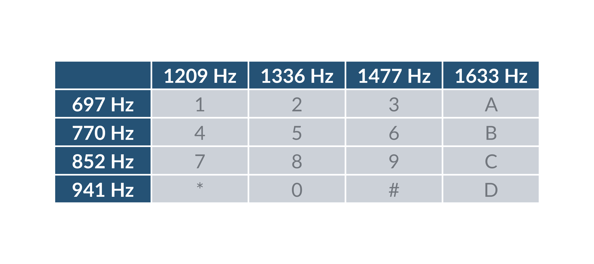
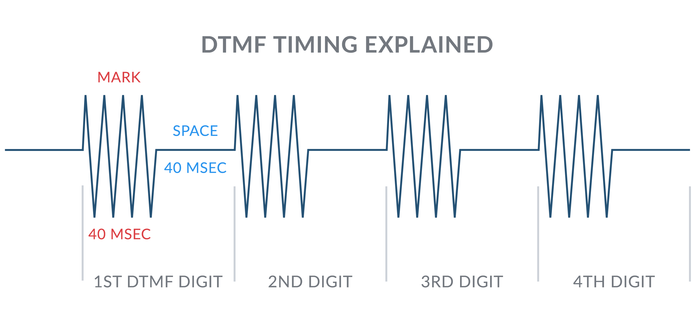
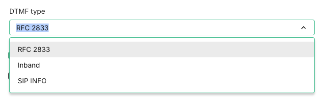

# Telnyx Voice: DTMF, TwiML Conferences, and TLS Certificates

*Part 1 of 4 — see also: [Part 2](telnyx-voice-dtmf-twiml-conferences-and-tls-certificates--part-2.md), [Part 3](telnyx-voice-dtmf-twiml-conferences-and-tls-certificates--part-3.md), [Part 4](telnyx-voice-dtmf-twiml-conferences-and-tls-certificates--part-4.md)*

This page covers three Telnyx support topics: configuring DTMF (Dual-Tone Multi-Frequency) signalling on SIP connections, building Twilio TwiML conference calls on Telnyx using the Voice API across multiple programming languages, and resolving TLS certificate errors when connecting to api.telnyx.com.

## What is DTMF?

**DTMF (Dual-Tone Multi-Frequency)** is the signalling standard used by telephone systems to transmit keypad inputs — the tones you hear when pressing digits on a phone. When you press a key, your device generates two simultaneous audio frequencies: one from a row and one from a column of the frequency matrix. The combination uniquely identifies each digit. For example, pressing **1** produces 697 Hz + 1209 Hz at the same time.

This system uses 8 audio frequencies in pairs to represent 16 signals: the digits 0–9, letters A–D, and the **#** and ***** symbols.

**Mark** refers to the duration of a DTMF tone, and **Space** refers to the silence between tones.

## DTMF over VoIP and SIP

In traditional telephony, DTMF tones travel as audio within the phone call itself. Over VoIP and SIP, there are three different methods for transmitting DTMF — each with its own advantages and compatibility requirements. Telnyx supports all three methods, and you can configure which one your SIP connection uses directly in the Telnyx Portal.

## The three DTMF types

### RFC 2833 (recommended default)

RFC 2833 — also known as RTP Named Telephony Events — transmits DTMF digits as special RTP packets, sent alongside the audio stream on a dedicated payload type (typically PT 101). The tones are separated from the voice audio entirely.

**Why use it:**

- Codec-agnostic — digits are not affected by audio compression
- Widely supported across modern SIP devices, IP-PBX systems, and IVRs
- Reliable and consistent in most network conditions

**Best for:** The majority of Telnyx SIP deployments. If you are unsure which to choose, start with RFC 2833.

### Inband

Inband DTMF transmits tones directly within the audio stream itself as actual audible frequencies — exactly how DTMF worked on analog phone lines. No special signalling is used; the tones are part of the voice audio.

**Why use it:**

- Works with legacy analog equipment and ATAs that do not support RFC 2833 or SIP INFO
- Useful when compatibility with older hardware is required

**Important limitation:** Inband DTMF is susceptible to distortion from audio compression. Codecs such as G.729 or Opus can degrade or destroy the tones, causing missed or misread digits. Inband is not recommended when compressed codecs are in use.

**Best for:** Legacy analog adapters (ATAs), older hardware, or where the far end only supports inband tones.

### SIP INFO

SIP INFO transmits DTMF digits as SIP signalling messages — completely out of the RTP audio stream. The digit is sent through the SIP dialog itself, separate from voice media.

**Why use it:**

- Immune to audio codec issues since digits never touch the RTP stream
- Useful when the far-end device or platform specifically requires SIP INFO

**Limitation:** Can have timing and synchronisation inconsistencies compared to RFC 2833, and is not supported by all SIP devices.

**Best for:** Scenarios where the destination device or hosted platform explicitly requires SIP INFO, or where RFC 2833 is not supported.

## Which DTMF type should I use?

| Situation | Recommended type |
| --- | --- |
| Default / unsure | RFC 2833 |
| Using G.711 (ulaw/alaw) codecs | RFC 2833 |
| Using compressed codecs (G.729, Opus) | RFC 2833 or SIP INFO |
| Legacy analog device or ATA | Inband |
| Far end requires SIP INFO specifically | SIP INFO |

**Tip:** RFC 2833 is the recommended default for most Telnyx SIP connections. Only change this setting if you are experiencing DTMF issues or if your device documentation specifies a different method.

## How to configure DTMF in the Telnyx Portal

You can change the DTMF type for any SIP connection in your Telnyx account by following these steps:

1. Log in to the [Telnyx Portal](https://portal.telnyx.com)
2. In the left navigation, go to **Real Time Communications** → **Voice** → **SIP Trunking**
3. Find the SIP connection you want to edit and click the **pencil (edit) icon**
4. Open the **Configuration** tab
5. Under **DTMF type**, select your preferred method: **RFC 2833**, **Inband**, or **SIP INFO**
6. Click **Save** to apply your changes
