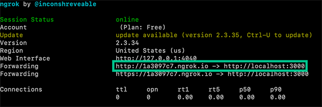

# Telnyx Voice: DTMF, TwiML Conferences, and TLS Certificates

*Part 2 of 4 — see also: [Part 1](telnyx-voice-dtmf-twiml-conferences-and-tls-certificates--part-1.md), [Part 3](telnyx-voice-dtmf-twiml-conferences-and-tls-certificates--part-3.md), [Part 4](telnyx-voice-dtmf-twiml-conferences-and-tls-certificates--part-4.md)*

This page covers three Telnyx support topics: configuring DTMF (Dual-Tone Multi-Frequency) signalling on SIP connections, building Twilio TwiML conference calls on Telnyx using the Voice API across multiple programming languages, and resolving TLS certificate errors when connecting to api.telnyx.com.

## Twilio TwiML Conference on Telnyx

Telnyx supports running Twilio TwiML code and the Twilio SDK against the Telnyx Voice API (formerly Call Control), letting you swap to Telnyx with your existing TwiML code. This is useful for building conference call applications across multiple languages.

### A simple conference

The simplest TwiML/TeXML document for a conference call is:

```xml
<?xml version="1.0" encoding="UTF-8"?>
<Response>
  <Dial>
    <Conference>My superior Telnyx conference</Conference>
  </Dial>
</Response>
```

### Buy and configure a phone number and TeXML application

In the [Telnyx Mission Control Portal](https://portal.telnyx.com/), search for and buy phone numbers in countries around the world. Numbers that have the Voice capability can make and receive voice phone calls from just about anywhere.

Once you purchase a number, configure it to send a request to your web application. This callback mechanism is called a [webhook](https://en.wikipedia.org/wiki/Webhook). Create a [TeXML Application](https://portal.telnyx.com/#/app/call-control/texml) and point it to your web application so that Telnyx can make an HTTP request when you receive a call. For the URL, enter your current TwiML application URL. If you don't have an application URL yet, you can create one using [ngrok](https://ngrok.com/).

### Set up your web application

Telnyx makes answering a phone call as easy as responding to an HTTP request. When a phone number you have bought through Telnyx receives an incoming call, Telnyx will send an HTTP request to your web application asking for instructions on how to handle the call. Your server will respond with an XML document containing TwiML that instructs Telnyx on what to do with the call. Those instructions can direct Telnyx to read out a message, play an MP3 file, make a recording, and much more.

To start answering phone calls, you must:

1. Buy and configure a Telnyx-powered phone number capable of making and receiving phone calls, link it to a [TeXML Application](https://portal.telnyx.com/#/app/call-control/texml), and point it at your web application
2. Write a web application to tell Telnyx how to handle the incoming call using TwiML
3. Make your web application accessible on the Internet so Telnyx can make an HTTP request when you receive a call


### Dynamic conference calls with moderators

The `<Conference>` TeXML noun can be used to create a conference that begins only when a moderator joins. Two advanced `<Conference>` features allow one participant, the "moderator", to better control the call:

- `startConferenceOnEnter` keeps all other callers on hold until the moderator joins
- `endConferenceOnExit` causes Telnyx to end the call for everyone as soon as the moderator leaves

The "From" argument on Telnyx's webhook request is used to identify whether the current caller should be the moderator or just a regular participant.

### Python example

```python
"""Demonstration of setting up a conference call in Flask with Telnyx."""
from flask import Flask, request
from twilio.twiml.voice_response import VoiceResponse, Dial

app = Flask(__name__)

# Update with your own phone number in E.164 format
CONFERENCE_MODERATOR = '+13129457420'

@app.route("/voice", methods=['GET', 'POST'])
def call():
    """Return TwiML for a moderated conference call."""
    response = VoiceResponse()
    with Dial() as dial:
        if request.values.get('From') == CONFERENCE_MODERATOR:
            dial.conference(
                'My superior Telnyx conference',
                start_conference_on_enter=True,
                end_conference_on_exit=True)
        else:
            dial.conference('My superior Telnyx conference', start_conference_on_enter=False)
    response.append(dial)
    return str(response)

if __name__ == "__main__":
    app.run(debug=True)
```

### PHP example

```php
<?php
require_once '/path/to/vendor/autoload.php';
use Twilio\TwiML;

$CONFERENCE_MODERATOR = '+13129457420';
$response = new TwiML;
$dial = $response->dial();

if ($_REQUEST['From'] == $CONFERENCE_MODERATOR) {
  $dial->conference('My superior Telnyx conference', array(
                'startConferenceOnEnter' => True,
                'endConferenceOnExit' => True
                ));
} else {
  $dial->conference('My superior Telnyx conference', array(
                'startConferenceOnEnter' => False
                ));
}

print $response;
```

### Node.js example

```javascript
import express from 'express';
import twilio from 'twilio';
import { urlencoded } from 'body-parser';

const CONFERENCE_MODERATOR = '+13129457420';
const app = express();
app.use(urlencoded({ extended: false }));

app.post('/voice', (request, response) => {
  const twiml = new twilio.TwimlResponse();
  twiml.dial(dialNode => {
    if (request.body.From == CONFERENCE_MODERATOR) {
      dialNode.conference('My superior Telnyx conference', {
        startConferenceOnEnter: true,
        endConferenceOnExit: true,
      });
    } else {
      dialNode.conference('My superior Telnyx conference', {
        startConferenceOnEnter: false,
      });
    }
  });
  response.type('text/xml');
  response.send(twiml.toString());
});

app.listen(3000);
```

### Java example

```java
import java.io.IOException;
import javax.servlet.ServletException;
import javax.servlet.annotation.WebServlet;
import javax.servlet.http.HttpServlet;
import javax.servlet.http.HttpServletRequest;
import javax.servlet.http.HttpServletResponse;
import com.twilio.twiml.voice.Conference;
import com.twilio.twiml.voice.Dial;
import com.twilio.twiml.TwiMLException;
import com.twilio.twiml.VoiceResponse;

@SuppressWarnings("serial")
@WebServlet("/voice")
public class IncomingCallServlet extends HttpServlet {
  public static final String CONFERENCE_MODERATOR = "+13129457420";

  protected void doPost(HttpServletRequest request, HttpServletResponse response)
      throws ServletException, IOException {
    String fromNumber = request.getParameter("From");
    Conference.Builder conferenceBuilder = new Conference.Builder("'My superior Telnyx Conference'");
    if (CONFERENCE_MODERATOR.equalsIgnoreCase(fromNumber)) {
      conferenceBuilder.startConferenceOnEnter(true);
      conferenceBuilder.endConferenceOnExit(true);
    } else {
      conferenceBuilder.endConferenceOnExit(false);
    }
    VoiceResponse twiml = new VoiceResponse.Builder()
        .dial(new Dial.Builder()
              .conference(conferenceBuilder.build())
              .build()
        ).build();
    response.setContentType("text/xml");
    try {
      response.getWriter().print(twiml.toXml());
    } catch (TwiMLException e) {
      e.printStackTrace();
    }
  }
}
```

### .NET example

```csharp
// In Package Manager, run:
// Install-Package Twilio.AspNet.Mvc -DependencyVersion HighestMinor

using System.Web.Mvc;
using Twilio.AspNet.Mvc;
using Twilio.TwiML;

public class VoiceController : TwilioController
{
    private const string Conference_Moderator = "+13129457420";

    [HttpPost]
    public ActionResult Index(string from)
    {
        var response = new VoiceResponse();
        var dial = new Dial();

        if (from == Conference_Moderator)
        {
            dial.Conference("My superior Telnyx conference",
                            startConferenceOnEnter: true,
                            endConferenceOnExit: true);
        }
        else
        {
            dial.Conference("My superior Telnyx conference",
                            startConferenceOnEnter: false);
        }

        response.Dial(dial);
        return TwiML(response);
    }
}
```

### Ruby example

```ruby
require 'rubygems'
require 'sinatra'
require 'twilio-ruby'

CONFERENCE_MODERATOR = '+13129457420'.freeze

post '/voice' do
  Twilio::TwiML::VoiceResponse.new do |r|
    r.dial do |d|
      if params['From'] == CONFERENCE_MODERATOR
        d.conference('My superior Telnyx conference',
                     startConferenceOnEnter: true,
                     endConferenceOnExit: true)
      else
        d.conference('My superior Telnyx conference', startConferenceOnEnter: false)
      end
    end
  end.to_s
end
```

### Exposing your local app with ngrok

For the webhooks in these code samples to work, Telnyx must be able to send your web application an HTTP request over the Internet. In production, you have a public URL, but during development, [ngrok](https://ngrok.com/) gives you a public URL for a local port on your development machine, which you can use to configure your Telnyx webhooks.

Once ngrok is installed, you can use it at the command line to create a tunnel to whatever port your web application is running on. For example, this will create a public URL for a web application listening on port 3000:

```
ngrok http 3000
```

After executing that command, ngrok will give your application a public URL that you can use in your webhook connection configuration in the [Telnyx Mission Control Portal](https://portal.telnyx.com/). Remember to append it with a path to a method that should handle new calls, for example: `http://<your ngrok subdomain>.ngrok.io/voice`.



Grab your ngrok public URL and head back to the connection number you configured earlier. Set it to use your new ngrok URL, appending the URL path to your actual TwiML logic (e.g. `http://<your ngrok subdomain>.ngrok.io/voice`).


