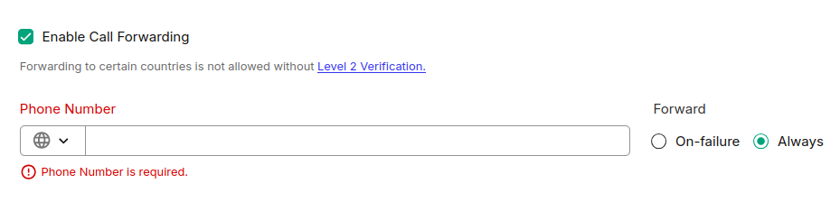
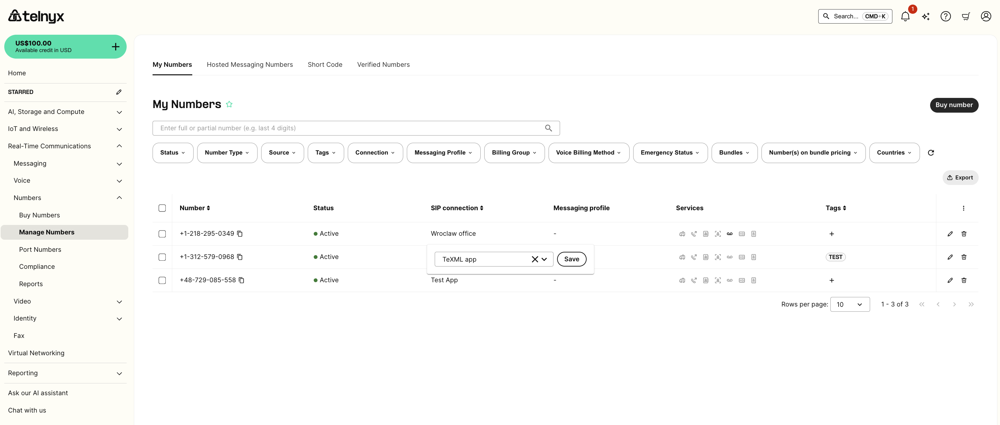

# Telnyx Voice Features and Configuration

*Part 1 of 6 — see also: [Part 2](telnyx-voice-features-and-configuration--part-2.md), [Part 3](telnyx-voice-features-and-configuration--part-3.md), [Part 4](telnyx-voice-features-and-configuration--part-4.md), [Part 5](telnyx-voice-features-and-configuration--part-5.md), [Part 6](telnyx-voice-features-and-configuration--part-6.md)*

This page consolidates Telnyx support documentation covering call forwarding, conference calls, TeXML Bin voicemail and call forwarding, sending and receiving SMS with the Python SDK, debugging tools, configuring Call Control/TeXML applications, voicemail setup, TeXML and Voice API compatibility, Android and iOS push notification setup, webhook CA errors, and Voice API essentials.

## Call Forwarding

Call Forwarding is a setting on your numbers which, when activated, can allow you to always forward calls to a particular number, or only forward on cases where there are failures establishing a call to the SIP Connection associated with the number.

To enable Call Forwarding:

1. On the number you want to have call forwarding enabled, click on the handset icon under the services column.


You will be brought to the "voice" sub tab and you can scroll down to the forwarding section.

2. Toggle on the forwarding setting (it will turn green) and input the desired number to which the call should be forwarded.



3. Choose the mode you want forwarding enabled: **Always** or **On-Failure**.

If you set the forwarding to **"On-Failure"**, this failover is automatically triggered under a few specific conditions:

- **Unregistered PBX or Endpoint:** The most common trigger. If your PBX, SIP server, or softphone loses its connection to the Telnyx network (due to a localized internet outage, a power failure, or a misconfiguration), the system will recognize the endpoint as "offline" and immediately forward the call to your backup destination.
- **Active Do Not Disturb (DND):** If the receiving device or softphone/PBX has DND enabled, the device actively rejects the incoming connection attempt. The system interprets this rejection as a failure and triggers the forwarding rules.
- **Manually Declined Calls:** If an end-user actively hits the "decline" or "reject" button on their softphone/handset/PBX when a call comes in, the endpoint signals a failure to connect, prompting the network to push the call to the failover number.
- **Important Note on Unanswered Calls:** If a call successfully connects to your PBX or softphone and simply rings without anyone picking up, this is *not* considered a failure. Because the network successfully delivered the call to the active endpoint, "On-Failure" forwarding will not be triggered if the call just rings out.

If you set the forwarding to **"Always"**, this setting bypasses your primary SIP connection entirely. All incoming calls will be immediately and unconditionally forwarded directly to your designated forwarding number, regardless of whether your PBX is currently online, registered, or active.

4. Click save changes at the end of the page and accept the monthly recurring charge (MRC) for enabling this feature. Forwarding will be enabled and you'll see the icon light up on your My Numbers page. If you hover over the icon it will tell you whether it's enabled or not.

To disable call forwarding, go back into the voice settings of the number, toggle off the forwarding setting, and save changes.

### Notes and Limitations

- Call forwarding from a Telnyx number to another Telnyx number is always considered off-net and will be charged according to your rate deck, which can be downloaded from your outbound voice profile settings. This is due to forwarded calls being sent outbound to the PSTN.
- The MRC charge for enabling Call Forwarding does not take into account that you are still charged on a per-minute basis for both the inbound call and the forwarded outbound call. Check your CSV rate deck file to determine the per-minute charges that will apply depending on the destination number that you forward to. The only case where you do not incur per-minute charges is on the inbound leg if the number receiving the calls is set to channel billing instead of pay per minute.
- Call forwarding cannot be enabled on numbers that are assigned to voice or fax applications, only SIP Connections. If you run into errors when using automatic forwarding via the portal, set the SIP Connection ID for the number you are forwarding from to EMPTY before you start forwarding. If you need to keep the number assigned to a Call Control or TeXML application, you must forward programmatically. TeXML is the easiest option (substitute `<NUMBER>` for `<SIP>`), and for Call Control or Voice API you can use the answer and transfer commands to achieve forwarding.

### Constraints Due to Local Regulation

In some countries, such as Venezuela, local regulations require that calls originating from outside the country but displaying a local Caller ID (CLI) be masked. Due to this regulation, when Telnyx receives such calls, it may not be able to forward them. Telnyx is actively working on implementing a solution to address this scenario.

## Conference Calls

Telnyx supports conference calls. You can create them using Telnyx APIs or by connecting Telnyx to your existing phone system.

Options include:

- **Voice API (recommended):** Build and control conference calls programmatically.
- **TeXML:** Create simple conference rooms using XML instructions.
- **SIP trunking:** Use Telnyx with PBX systems like Asterisk or 3CX.
- **Video API:** Build audio/video conferencing apps.

Quick guidance:

- For something simple, start with TeXML `<Conference>`.
- For full control, use the Voice API (Call Control).
- For a working example, follow the conferencing demo tutorial.

Developer documentation references:

- [TeXML Conference (simple setup)](https://developers.telnyx.com/docs/voice/programmable-voice/texml-verbs/conference)
- [Voice API – Conference commands (advanced control)](https://developers.telnyx.com/api-reference/conference-commands)
- [Conferencing tutorial (step-by-step guide)](https://developers.telnyx.com/docs/voice/programmable-voice/conferencing-demo)

## TeXML Bin: Simple Voicemail and Call Forwarding

TeXML Bin allows users to upload TeXML files to storage and use them for call flows without having to code. Developers can quickly and easily add programmable voice features into applications without having to worry about setting up application servers.

TeXML is an XML-based data structure you can use to control calls with Telnyx and is the quickest way to get started with Programmable Voice using a simple `.xml` file, allowing you to specify call instructions in your file using commands called verbs and nouns. The TeXML Translator starts at the top of your TeXML file and executes your TeXML commands sequentially in the order they are arranged in the file.

### Step 1: Create Your XML

To create XML documents, use the TeXML editor in the Mission Control Portal. Navigate to the Programmable Voice section on the left menu and select 'TeXML Bin'.


*Set a simple voicemail with TeXML Bin*

Simple voicemail:

```xml
<?xml version="1.0" encoding="UTF-8"?>   
<Response>  
   <Say>Thank you for calling YYZ co. Please leave a message.</Say>  
   <Record playBeep="true" finishOnKey="*9" />   
</Response>
```

Simple call forward:

```xml
<?xml version="1.0" encoding="UTF-8"?>   
<Response>  
  <Dial>  
    <Sip>ext1@sip.xyzco.com</Sip>  
    <Sip>ext3@sip.xyzco.com</Sip>  
    <Sip>ext4@sip.xyzco.com</Sip>  
  </Dial>   
</Response>
```

### Step 2: Set Up Your XML Application in Mission Control

Set up your XML application to use the created script by selecting it from the drop-down list.


*Editing your TeXML application*

### Step 3: Test Your Application

Test your application by:

1. Assigning a phone number to the application.



*Assigning a number to an application*

2. Dialing the number from the PSTN and leaving a message.

3. Retrieving your voicemail.


*Retrieving your voicemail*
