# Telnyx Voice Features and Configuration

*Part 3 of 6 — see also: [Part 1](telnyx-voice-features-and-configuration--part-1.md), [Part 2](telnyx-voice-features-and-configuration--part-2.md), [Part 4](telnyx-voice-features-and-configuration--part-4.md), [Part 5](telnyx-voice-features-and-configuration--part-5.md), [Part 6](telnyx-voice-features-and-configuration--part-6.md)*

This page consolidates Telnyx support documentation covering call forwarding, conference calls, TeXML Bin voicemail and call forwarding, sending and receiving SMS with the Python SDK, debugging tools, configuring Call Control/TeXML applications, voicemail setup, TeXML and Voice API compatibility, Android and iOS push notification setup, webhook CA errors, and Voice API essentials.

## Configuring Call Control / TeXML Applications

The Call Control / TeXML applications section is located on the left-hand side of the portal under Voice > Programmable Voice.

### Voice Applications (Call Control Voice API Application)

#### Voice App Name

Click on "Create Voice App" and assign a name to this application to better manage the application.

#### AnchorSite® Selection

"Latency" directs Telnyx to route media through the site with the lowest round-trip time to the user's connection. Telnyx calculates this time using ICMP ping messages. This can be disabled by specifying a site to handle all media.

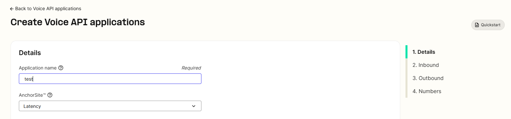

#### Send a Webhook to the URL

You will need to input a URL where all the webhook events will be sent. You can also set up a fail-over URL. If two consecutive delivery attempts to the primary URL fail, Telnyx will attempt delivery to this URL. **NOTE:** Must include a scheme such as `https`.

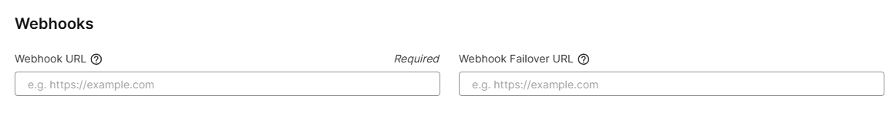

#### Use Webhook API Version

Determines which webhook format will be used based on the API version V1 or V2. We recommend using API V2, as it contains a richer feature set versus the initial version which will be deprecated in the future.

#### Enable "Hang-Up" on Timeout

When enabled, you will specify the number of seconds Telnyx will wait for commands from your application before hanging up.

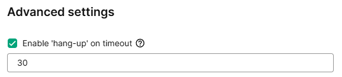

#### Custom Webhook Retry Delay (Seconds)

Specify a delay in seconds for Telnyx to wait before retrying an unsuccessful webhook delivery attempt. If not set, Telnyx will retry immediately.

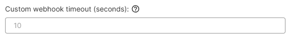

#### DTMF Type

There are three types in this field: RFC 2833, Inband, and SIP INFO.

1. **RFC 2833:** Default and preferred setting for most use cases, not audible on the call audio.
2. **Inband:** Digits are passed along just like the rest of your voice as normal audio tones.
3. **SIP INFO:** Mainly used for SIP to SIP calls. DTMF type is negotiated between parties on the call.

#### RTCP Capture

Enable capture of RTCP reports to build QoS Reports (found under Debugging > SIP Call Flow Tool). By default it's not enabled; click the "yes" radio button to enable it.

#### Call Cost Webhook Event

Specify if the call cost webhook should be sent. By default it's not enabled; click the "yes" radio button to enable it.

### Inbound Settings

You can configure your global application settings for inbound calls here.

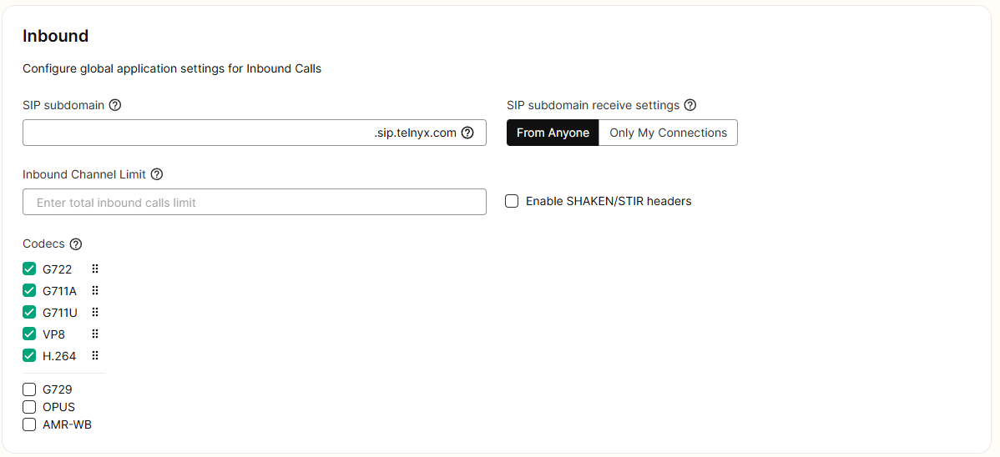

#### Subdomain

Specify a **subdomain** that can be used to receive calls to a Connection, in the same way a phone number is used, from a SIP endpoint.

- Example: the subdomain `example.sip.telnyx.com` can be called from any SIP endpoint by using the SIP URI `sip:@example.sip.telnyx.com` where the user part can be any alphanumeric value.
- You only need to specify the subdomain in this field; there is no need to specify a Telnyx domain after it.
- **SIP subdomain receive settings:** In this field, either you set up your receive SIP subdomain connection from anyone or only connections.

#### Inbound Channel Limit

You can limit the total number of inbound calls to phone numbers associated with this connection.

#### Enable Shaken Stir Headers

By default, the radio button for no is checked. Select yes and save your settings if you want to receive attestation information in the webhooks for incoming calls.

#### Codecs

Select the codecs using the check mark boxes that you would like Telnyx to offer on your calls. You can force specific codecs by only checking one of the boxes.

### Outbound Settings

You can configure your global application settings for outbound calls here.

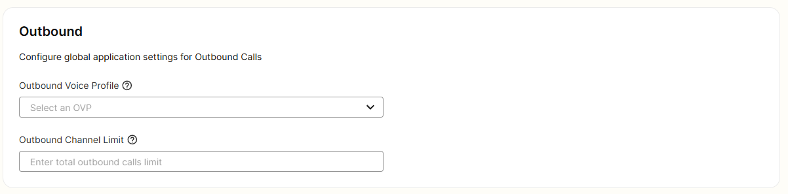

#### Outbound Voice Profile

Assign your application to an outbound voice profile in order to make outbound calls.

#### Outbound Channel Limit

You can limit the total number of outbound calls to phone numbers associated with this connection.

### Application ID

Once you've successfully created your Call Control application, it is given an application ID that can be seen within the application settings.

The application ID is used to reference or trigger your API calls programmatically. See the developer documentation to learn how to control your calls with the different API commands available.

### TeXML Applications

#### TeXML App Name

Click on "Create TeXML App" and assign a name to this application to better manage the application.

#### Voice Method

In this field, the HTTP request method Telnyx will use to interact with your XML Translator webhooks. Either "GET" or "POST".

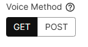

#### Send a TeXML Webhook to the URL

You will need to mention a URL where all the XML translator webhook events will be sent. You can also set up a fail-over URL. This URL is where Telnyx will deliver your XML Translator webhooks if we get an error response from your "Voice URL".

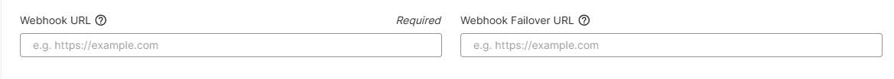

#### Status Callback Method

You will need to mention the HTTP request method Telnyx should use when requesting the "Status Callback" URL.

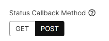

#### Send Information About Call Progress Events to the URL

Specify the URL for Telnyx to send requests to containing information about call progress events.

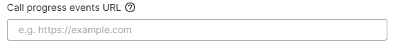

#### Enable "Hang-Up" on Timeout

When enabled, you will specify the number of seconds to wait for actual application before hanging up.

#### DTMF Type

There are three types in this field: RFC 2833, Inband, and SIP INFO.

1. **RFC 2833:** Default and preferred setting for most use cases, not audible on the call audio.
2. **Inband:** Digits are passed along just like the rest of your voice as normal audio tones.
3. **SIP INFO:** Mainly used for SIP to SIP calls. DTMF type is negotiated between parties on the call.

#### Call Cost Webhook Event

Specify if the call cost webhook should be sent. By default it's not enabled; click the "yes" radio button to enable it.

### TeXML Inbound Settings

You can configure your global application settings for inbound calls here.

#### Subdomain

Specify a **subdomain** that can be used to receive calls to a Connection, in the same way a phone number is used, from a SIP endpoint.

- Example: the subdomain `example.sip.telnyx.com` can be called from any SIP endpoint by using the SIP URI `sip:@example.sip.telnyx.com` where the user part can be any alphanumeric value.
- You only need to specify the subdomain in this field; there is no need to specify a Telnyx domain after it.
- **SIP subdomain receive settings:** In this field, either you set up your receive SIP subdomain connection from anyone or only connections.

#### Inbound Channel Limit

You can limit the total number of inbound calls to phone numbers associated with this connection.

#### Enable Shaken Stir Headers

By default, the radio button for no is checked. Select yes and save your settings if you want to receive attestation information in the webhooks for incoming calls.

#### Codecs

Select the codecs using the check mark boxes that you would like Telnyx to offer on your calls. You can force specific codecs by only checking one of the boxes.

### TeXML Outbound Settings

You can configure your global application settings for outbound calls here.

#### Outbound Voice Profile

Assign your application to an outbound voice profile in order to make outbound calls.

#### Outbound Channel Limit

You can limit the total number of outbound calls to phone numbers associated with this connection.

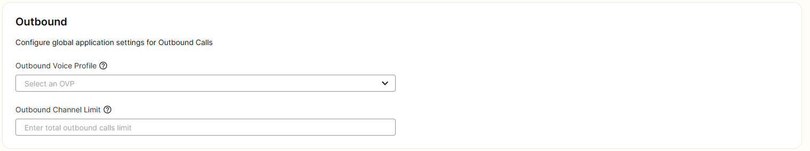

### TeXML Application ID

Once you've successfully created your TeXML application, it is given an application ID that can be seen within the application settings.

The application ID is used to reference or trigger your API calls programmatically. See the developer documentation to learn how to set up your XML instructions.
