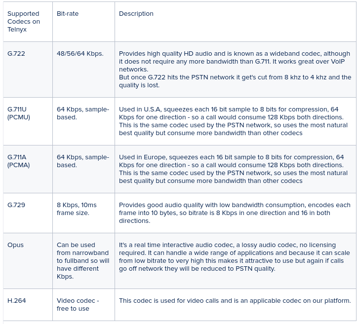

# Telnyx Voice, Messaging, and Billing Reference

*Part 2 of 8 — see also: [Part 1](telnyx-voice-messaging-and-billing-reference--part-1.md), [Part 3](telnyx-voice-messaging-and-billing-reference--part-3.md), [Part 4](telnyx-voice-messaging-and-billing-reference--part-4.md), [Part 5](telnyx-voice-messaging-and-billing-reference--part-5.md), [Part 6](telnyx-voice-messaging-and-billing-reference--part-6.md), [Part 7](telnyx-voice-messaging-and-billing-reference--part-7.md), [Part 8](telnyx-voice-messaging-and-billing-reference--part-8.md)*

This page consolidates Telnyx documentation covering VoIP and telecommunications protocols (RTP, UDP, TCP, SIP, SDP), audio codecs and SDP parameters, external call transfers, webhooks (including WhatsApp webhooks and signing key rotation), A2P vs P2P traffic types and the P2P exemption process, toll-free opt-in workflow templates, and payment methods including ACH Direct Debit and Bitcoin.

## Audio, Codecs, and SDP

When a SIP INVITE is sent or received via Telnyx, it should contain a message body with a content length greater than zero. This message body is where the Session Description Protocol (SDP) parameters live — in other words, where the multi-media session capabilities are defined. Full SDP details are documented in [RFC 4566](https://tools.ietf.org/html/rfc4566).

In VoIP, multi-media can consist of audio or video (and is not limited to those). This information is usually sent in RTP packets using UDP transport. The term "media" is often used interchangeably with audio, voice, or RTP. A list of Telnyx media IPs and supported codecs is available on the [sip.telnyx.com](https://sip.telnyx.com/) webpage.

### Debugging SDP

The [SIP Call Flow debugging tool](https://portal.telnyx.com/#/app/debugging/sip-call-flow-tool) in Mission Control lets you view the SIP call flow and read the contents of SIP messages, providing granular insight into how SIP signalling was established and with what parameters.

The SDP can be located in Telnyx's SIP INVITE message to your connection on an inbound call. Telnyx always provides an SDP in INVITEs on inbound calls (called "early offer"), which shows the accepted list of capabilities ordered in ascending priority. SDP can also be located in the 183 or 200 OK message on outbound calls. If you send an INVITE with no SDP (called "late offer"), the 200 OK with SDP is sent back to the caller when the call is answered, and the caller responds with an ACK. The caller's ACK will then contain the SDP that would generally have been sent in the INVITE, allowing the caller to decide which codec will be used for the session.

### Codecs

A codec (coder-decoder) converts analog voice signals to digital form and converts the compressed digital form back to the original analog voice signals so it can be replayed. There are many different types of codecs; some can be used freely while others require purchasing a license. Lossless codecs retain everything in the original stream, while lossy codecs use lower bandwidth and compress the stream, reducing audio quality.



**Note on DTMF:** DTMF tones are not transported reliably in G.729 and cannot be expected to work under any conditions. They are also not expected to work reliably with G.722, but may do so. DTMF should always work perfectly in any G.711 stream, because DTMF tone frequencies were chosen to work with the PSTN and must work reliably when encoded with G.711. Outband DTMF tones can be used with any codec.

**Note on Fax:** Fax tones work best with G.711 (for which they were designed — uncompressed). A fax call cannot work with G.729 because G.729 transports audio at 8 kbps but fax transmissions must work at higher bit rates. Faxes are also not expected to work over G.722. The only codecs for fax are G.711 mu-law and A-law. Sometimes T.38 is a better option for fax transmissions. Some fax calls may work with G.722, but reliability should not be expected. For PSTN-based calls, ensure that G.711 is prioritized as the preferred codec if you wish to send and receive faxes through the Telnyx network.

### SDP Parameters

In a SIP INVITE message, the message body is SDP when specified as:

```
Content-Type: application/sdp
```

The message body length is specified in the Content-Length header, for example:

```
Content-Length: 344
```

An example SDP body message:

```
v=0
o=Telnyx 1564556150 1564556151 IN IP4 64.16.248.213
s=Telnyx
c=IN IP4 64.16.248.213
t=0 0
m=audio 21250 RTP/AVP 9 0 8 18 101
a=rtpmap:9 G722/8000
a=rtpmap:0 PCMU/8000
a=rtpmap:8 PCMA/8000
a=rtpmap:18 G729/8000
a=fmtp:18 annexb=no
a=rtpmap:101 telephone-event/8000
a=fmtp:101 0-16
a=rtcp:21251 IN IP4 64.16.248.213
a=ptime:20
```

The parameters break down as follows:

- **Version (`v=0`)** — The current version of SDP is 0.
- **Originator (`o=Telnyx 1564556150 1564556151 IN IP4 64.16.248.213`)** — Identifies the sender, the protocol used, and the sender's IP address. In this example, Telnyx is the sender, using IPv4, at 64.16.248.213.
- **Session (`s=Telnyx`)** — The session title.
- **Connection Information (`c=IN IP4 64.16.248.213`)** — Defines the connection type and address. Here, IPv4 is used and the sender's media address is 64.16.248.213.
- **Timing (`t=0 0`)** — Indicates the start and stop times for a session. Start and stop times of 0 indicate that the session is permanent and not bounded time-wise.
- **Media Descriptor (`m=audio 21250 RTP/AVP 9 0 8 18 101`)** — A media line is present for each media type advertised within an SDP message. In this example, the media line informs the called party that the caller supports RTP audio on port 21250. The values 9, 0, 8, 18, and 101 are the various codecs described by attribute lines.
- **Attribute Lines** — Each attribute line refers back to the Media Descriptor and the `<fmt>` values. With five formats (9, 0, 8, 18, 101) there are at least five attribute lines. Codec 18 describes itself twice, hence two lines. The format is `a=rtpmap:<payload type> <encoding name>/<clock rate> [/<encoding parameters>]`. In the example, the SDP advertises that the client supports G.722 at 8000 Hz, G.711 (PCMU and PCMA — pulse code modulation u-law and a-law) at 8000 Hz, and G.729 at 8000 Hz.

The DTMF entries indicate that telephone events from RFC 2833 are available and that format 0-16 represents the ten digits plus `*`, `#`, A, B, D, E, and Flash:

```
a=rtpmap:101 telephone-event/8000
a=fmtp:101 0-16
```

The RTCP entry reports statistics about the ongoing call. Telnyx provides the ability to use either RTCP+1 or RTCP mux at the connection level. Most of the time RTCP+1 is employed; in the example, the RTP port is 21250 and the RTCP port is 21251. RTCP mux multiplexes both RTP and RTCP through a single UDP port, which simplifies NAT traversal. See [RFC 3550](https://tools.ietf.org/html/rfc3550) for more details.

The `ptime` entry is the packetization interval. It is optional but recommended for the encoding/packetization of the media. If no ptime is specified, the remote SIP entity uses whatever packetization time it prefers. Telnyx generally specifies a packetization time of 20 ms, meaning RTP packets are sent and expected to be received every 20 ms. Telnyx does not support any other ptimes; specifying a different ptime may cause audio quality issues, so ptimes should match.
