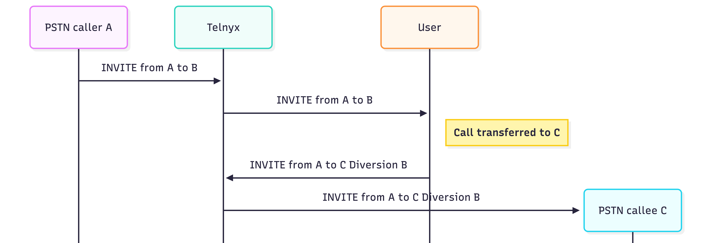

# Telnyx Voice, Messaging, and Billing Reference

*Part 3 of 8 — see also: [Part 1](telnyx-voice-messaging-and-billing-reference--part-1.md), [Part 2](telnyx-voice-messaging-and-billing-reference--part-2.md), [Part 4](telnyx-voice-messaging-and-billing-reference--part-4.md), [Part 5](telnyx-voice-messaging-and-billing-reference--part-5.md), [Part 6](telnyx-voice-messaging-and-billing-reference--part-6.md), [Part 7](telnyx-voice-messaging-and-billing-reference--part-7.md), [Part 8](telnyx-voice-messaging-and-billing-reference--part-8.md)*

This page consolidates Telnyx documentation covering VoIP and telecommunications protocols (RTP, UDP, TCP, SIP, SDP), audio codecs and SDP parameters, external call transfers, webhooks (including WhatsApp webhooks and signing key rotation), A2P vs P2P traffic types and the P2P exemption process, toll-free opt-in workflow templates, and payment methods including ACH Direct Debit and Bitcoin.

## External Call Transfers

The External Call Transfer scenario happens when a SIP endpoint receives an inbound call from the PSTN through Telnyx and then transfers that call to an outside number, keeping the original PSTN number as the originator.

From Telnyx's perspective, these are two different calls, and the transferred call by itself is considered an outbound call from a non-Telnyx number. Telnyx has implemented a mechanism to handle External Call Transfer scenarios so that these outbound calls are automatically allowed and routed to the destination.

### How the Flow Works

1. Caller A dials your Telnyx number B.
2. The call is delivered by Telnyx to your SIP endpoint, from A to B.
3. Your SIP endpoint decides to transfer the call to number C.
4. Your endpoint places a new outbound call, from A to C.
5. This outbound call must include proper diversion information to indicate that it is a transfer of the original inbound call from A to B for it to be automatically allowed by Telnyx.

### What Telnyx Checks

To allow the External Call Transfer, Telnyx performs two validations when it receives an outbound call attempt:

1. **Active inbound call match** — Telnyx confirms that there is an active inbound call from A to B.
2. **Presence of Diversion Headers** — The new outbound call from A to C must include a SIP Diversion header showing B.

Example of an accepted call flow:

### When the Transfer Is Rejected

If the Diversion header is missing or incorrect, or Telnyx cannot match the outbound call to an active inbound call, Telnyx will reject the request by default with `403 Unverified origination number D51`. This prevents unauthorized or spoofed calls from being placed using your number.

Example of a rejected flow:

### Programmable Voice

It is possible to transfer an inbound call to the Telnyx network to an external PSTN number using Programmable Voice while preserving the non-Telnyx origination number. There are different mechanisms to do this:

- **Voice API Transfer Command** — Instructs Telnyx to transfer an established inbound call to a new destination. The non-Telnyx origination number is allowed.
- **Voice API Dial + Bridge** — A Voice API Dial request triggers a new outbound call, and if that request is bridged to an existing inbound call then the non-Telnyx origination number is allowed. For the Dial request to be considered a bridge it should contain the `link_to` parameter set to `call_control_id` of the bridging call, and the `bridge_intent` parameter set to `true`.
- **TeXML `<Dial>` Command** — Instructs Telnyx to place a new outbound call and connect it to the existing inbound call. The non-Telnyx origination number is allowed.
