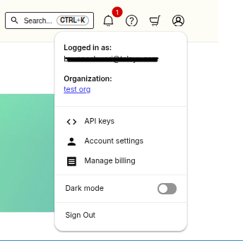
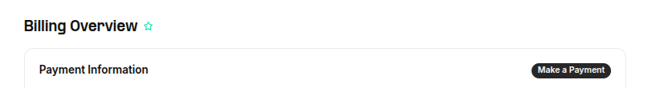
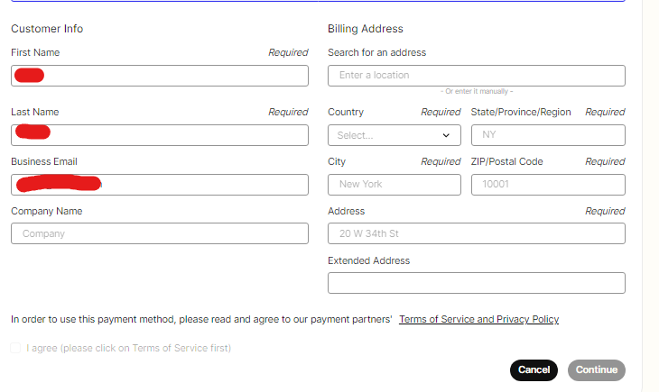
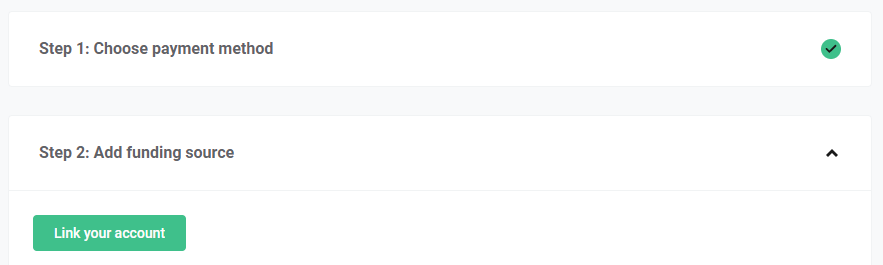
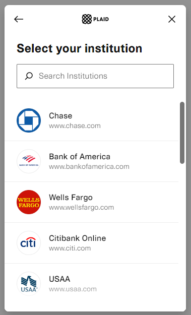
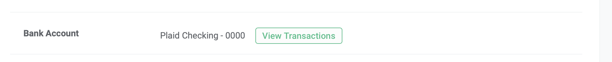

# Telnyx Voice, Messaging, and Billing Reference

*Part 7 of 8 — see also: [Part 1](telnyx-voice-messaging-and-billing-reference--part-1.md), [Part 2](telnyx-voice-messaging-and-billing-reference--part-2.md), [Part 3](telnyx-voice-messaging-and-billing-reference--part-3.md), [Part 4](telnyx-voice-messaging-and-billing-reference--part-4.md), [Part 5](telnyx-voice-messaging-and-billing-reference--part-5.md), [Part 6](telnyx-voice-messaging-and-billing-reference--part-6.md), [Part 8](telnyx-voice-messaging-and-billing-reference--part-8.md)*

This page consolidates Telnyx documentation covering VoIP and telecommunications protocols (RTP, UDP, TCP, SIP, SDP), audio codecs and SDP parameters, external call transfers, webhooks (including WhatsApp webhooks and signing key rotation), A2P vs P2P traffic types and the P2P exemption process, toll-free opt-in workflow templates, and payment methods including ACH Direct Debit and Bitcoin.

## ACH Direct Debit Payment Method

Automated Clearing House (ACH) transfers are electronic money transfers between banks. This payment method on the Telnyx portal allows customers to make USD payments through their United States bank account.

### Settlement Timing

ACH Direct Debit can take time to be processed and to receive payment confirmation, depending on the time of day and the day of the week you initiate it. ACH transfers can be initiated at any time, but they only process on business days that aren't banking holidays.

| Transfer Initiation Time (US Central Time) | Settlement |
| --- | --- |
| Between 9AM & 3PM on a business day | Same day |
| After 3 PM on a business day | Next business day |

You can make multiple ACH payments manually (even before an existing one finishes clearing). ACH auto-recharge will not run if there is an already-existing still-pending charge. ACH payments are not processed on weekends and on bank holidays.

### Permission Requirement

When getting started with ACH, you will be presented with a mandate asking permission to share your information and for Telnyx to process payment, which you'll need to complete before proceeding to the next step. As part of this mandate, you agree to the Privacy Policy and Terms and Conditions of Telnyx as well as our payment partners. Additionally, the bank account you wish to link for payment must be verified to comply with ACH Direct Debit rules. Telnyx lets you share and link your financial account securely through our payment partner and does not store any financial information.

### Linking a Bank Account

1. Sign into the Telnyx Portal.
2. Select **Manage billing** under your profile Settings in the portal.

3. Select **Make a Payment** to access the payment options.

4. Select **ACH Direct Debit** under the Select mode of payment section.

5. Input your Name, Business Email, and Billing Address in the Customer Info section.

6. Once you have reviewed and agreed to our payment partners' terms of service and privacy policy, select **Continue** to progress to the next steps.

7. On the add funding source page, select **Link your account**.

8. At this point you will be presented with a pop-up which will direct you to our payment partner's workflow to complete the process.

Bank accounts with most major financial institutions can be verified instantly by securely sharing routing number and account number or account credentials with our payment partner. If you are unable to verify your bank account this way, you can still complete verification manually through micro-deposits, which takes 1-3 business days to complete. Once a bank account is confirmed as successfully linked to a user by our payment partner, the user will be able to make ACH payments through the linked funding source.

### FAQs

- **Which bank accounts are allowed with ACH?** A United States bank account of consumer or corporate type.
- **How do I know when my payment is processed?** You'll receive email notifications from Telnyx for each payment status right from initiation to completion.
- **My payment failed — what should I do?** Reach out to support for additional info as well as next steps.
- **I would like to cancel my payment or would like a refund on a recent payment — how do I request this?** Reach out at [payments@telnyx.com](mailto:payments@telnyx.com) for resolution. If you have already contacted your bank account, mention that in your communication.
- **I'm unable to make an ACH payment through my linked bank account on the Telnyx portal — what should I do?** There are multiple reasons why your bank account can get blocked from making ACH payments. Reach out to support for additional information.
- **How do I identify a payment made to Telnyx on my bank account statement?** Through the statement descriptor on the bank account statement.
- **Where can I find ACH payment history?** ACH payments history is available on the Payments page.

- **Is there a transaction fee associated with use of ACH Direct Debit payments?** Currently, making payments through ACH Direct Debit incurs no fee to customers.
- **Why is my portal balance not updated after making ACH payment?** ACH payment processing is not instantaneous and can take anywhere from 0 to 1 business day to settle. Although your portal balance is not updated while an ACH payment is in pending state, you can see the amount reflected in the new ACH pending balance as well as your available credit limit on the portal. Once the ACH payment is successfully processed, you will see an update to your portal balance.

- **Can I continue using Credit Card or PayPal for making payments on the Telnyx portal?** Yes. Note that Credit Card and PayPal payments will incur an additional 3% transaction fee. You should also have a credit card on file as backup, so auto recharge can fail over to the card in case of emergency.
- **Can I auto-recharge with my bank account?** Yes, you can use a bank account to make an auto-recharge top-up to your portal balance, but using a credit card or PayPal is recommended since ACH settlement can be delayed. If you set bank account as the preferred method for auto-recharge, note that if the previous ACH auto-recharge payment is in pending/failed status, Telnyx will attempt to process auto-recharge payment via Credit Card/PayPal stored on your account to keep your portal balance in a healthy state.
- **Can sub members in my organization access ACH?** Yes, sub members with account management permissions enabled on the permission group created by the account organisation owner can access ACH configurations.
- **How can I enable ACH payment on my account?** ACH is not yet a default available payment method; access can be granted by the support team. Email [support@telnyx.com](mailto:support@telnyx.com) for ACH access.
