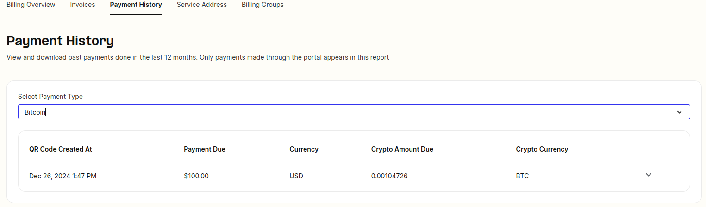

# Telnyx Voice, Messaging, and Billing Reference

*Part 8 of 8 — see also: [Part 1](telnyx-voice-messaging-and-billing-reference--part-1.md), [Part 2](telnyx-voice-messaging-and-billing-reference--part-2.md), [Part 3](telnyx-voice-messaging-and-billing-reference--part-3.md), [Part 4](telnyx-voice-messaging-and-billing-reference--part-4.md), [Part 5](telnyx-voice-messaging-and-billing-reference--part-5.md), [Part 6](telnyx-voice-messaging-and-billing-reference--part-6.md), [Part 7](telnyx-voice-messaging-and-billing-reference--part-7.md)*

This page consolidates Telnyx documentation covering VoIP and telecommunications protocols (RTP, UDP, TCP, SIP, SDP), audio codecs and SDP parameters, external call transfers, webhooks (including WhatsApp webhooks and signing key rotation), A2P vs P2P traffic types and the P2P exemption process, toll-free opt-in workflow templates, and payment methods including ACH Direct Debit and Bitcoin.

## Bitcoin Payment Method

Bitcoin is a decentralized digital currency. It operates on a global network of computers and uses a public ledger called the blockchain for transactions. Think of it as digital gold with a maximum supply of 21 million. You need a digital wallet to use Bitcoin.

Unlike traditional currencies, Bitcoin isn't governed by a central authority. It's purely digital, secured by cryptography, and has a finite supply, which makes it unique.

### Making a Payment

Choose Bitcoin on the [Payments](https://portal.telnyx.com/#/app/billing/payment) page.

- Only bitcoin on the bitcoin blockchain is accepted.
- Refunds are not processed for bitcoin transactions.
- The minimum required payment for bitcoin is $100, and payment of a lesser amount will not reflect in portal balance unless at least the minimum is settled towards a bitcoin invoice.

You can either scan the QR code or manually enter the payment amount and bitcoin address. Once confirmed, your portal balance updates. Note the requirement for a minimum amount of $100 as a payment.

### Transaction Times

Most Bitcoin transactions on the platform confirm in about 10 minutes, as one confirmation is relied on for deposits capped at $1000. This duration can extend during high network activity.

### Refunds

Refunds for Bitcoin payments cannot be issued at this time. Make sure to transfer only what you'll use in the Telnyx portal.

### Payment Statuses

- **No Payment** — Payment not received.
- **Processing** — Payment made but awaiting confirmations.
- **Settled** — Payment confirmed and portal balance updated.
- **Invalid** — Payment not sufficiently confirmed.

### QR Code Expiration

Bitcoin QR codes have a 15-minute lifespan due to market fluctuations. The Bitcoin amount is locked based on the BTC value at that moment, but the settlement can occur later.

### Payment History

Visit the [Payment History page](https://portal.telnyx.com/#/app/billing/history) to view your transactions.

### Other Cryptocurrencies

Currently, only Bitcoin is accepted. Lightning network options are being explored for the future.
