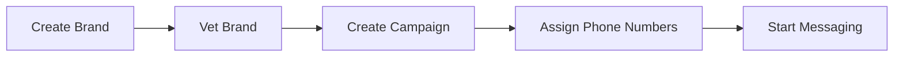

# Getting Started with 10DLC

Register your brand and campaign for 10DLC A2P messaging. Complete guide with Portal walkthrough and API/SDK examples.

10DLC (10-Digit Long Code) is the industry standard for application-to-person (A2P) messaging on US long code numbers. Registering your brand and campaigns provides higher throughput, better deliverability, and reduced carrier filtering.

## Registration overview



| Step                   | What happens                                                     | Timeline                           |
| ---------------------- | ---------------------------------------------------------------- | ---------------------------------- |
| **1. Create Brand**    | Register your business identity with The Campaign Registry (TCR) | Instant                            |
| **2. Vet Brand**       | Third-party vetting determines your trust score (0-100)          | 1-7 business days                  |
| **3. Create Campaign** | Register your messaging use case                                 | Instant (pending carrier approval) |
| **4. Assign Numbers**  | Link phone numbers to your campaign                              | Instant                            |

> **Warning:** **Vetting is critical.** Your brand's vetting score directly determines your throughput limits — especially on AT\&T and T-Mobile. See [10DLC Rate Limits](../runbooks/10dlc-rate-limits-throughput.md) for details.

***

## Step 1: Create a brand

A brand represents the business entity sending messages.

### API

      ```bash
      curl -X POST https://api.telnyx.com/v2/10dlc/brand \
        -H "Content-Type: application/json" \
        -H "Authorization: Bearer YOUR_API_KEY" \
        -d '{
          "entityType": "PRIVATE_PROFIT",
          "displayName": "Acme Corp",
          "companyName": "Acme Corporation",
          "ein": "12-3456789",
          "phone": "+15551234567",
          "street": "123 Main St",
          "city": "New York",
          "state": "NY",
          "postalCode": "10001",
          "country": "US",
          "email": "admin@acmecorp.com",
          "website": "https://acmecorp.com",
          "vertical": "TECHNOLOGY"
        }'
      ```

      ```python
      import os
      import requests

      API_KEY = os.environ.get("TELNYX_API_KEY")
      headers = {
          "Authorization": f"Bearer {API_KEY}",
          "Content-Type": "application/json",
      }

      brand_data = {
          "entityType": "PRIVATE_PROFIT",
          "displayName": "Acme Corp",
          "companyName": "Acme Corporation",
          "ein": "12-3456789",
          "phone": "+15551234567",
          "street": "123 Main St",
          "city": "New York",
          "state": "NY",
          "postalCode": "10001",
          "country": "US",
          "email": "admin@acmecorp.com",
          "website": "https://acmecorp.com",
          "vertical": "TECHNOLOGY",
      }

      response = requests.post(
          "https://api.telnyx.com/v2/10dlc/brand",
          headers=headers,
          json=brand_data,
      )
      brand = response.json()
      print(f"Brand created: {brand['data']['brandId']}")
      ```

      ```javascript
      const axios = require('axios');

      const headers = {
        Authorization: `Bearer ${process.env.TELNYX_API_KEY}`,
        'Content-Type': 'application/json',
      };

      const brandData = {
        entityType: 'PRIVATE_PROFIT',
        displayName: 'Acme Corp',
        companyName: 'Acme Corporation',
        ein: '12-3456789',
        phone: '+15551234567',
        street: '123 Main St',
        city: 'New York',
        state: 'NY',
        postalCode: '10001',
        country: 'US',
        email: 'admin@acmecorp.com',
        website: 'https://acmecorp.com',
        vertical: 'TECHNOLOGY',
      };

      const response = await axios.post(
        'https://api.telnyx.com/v2/10dlc/brand',
        brandData,
        { headers }
      );
      console.log(`Brand created: ${response.data.data.brandId}`);
      ```

      ```ruby
      require "net/http"
      require "json"
      require "uri"

      uri = URI("https://api.telnyx.com/v2/10dlc/brand")
      http = Net::HTTP.new(uri.host, uri.port)
      http.use_ssl = true

      request = Net::HTTP::Post.new(uri)
      request["Authorization"] = "Bearer #{ENV['TELNYX_API_KEY']}"
      request["Content-Type"] = "application/json"
      request.body = {
        entityType: "PRIVATE_PROFIT",
        displayName: "Acme Corp",
        companyName: "Acme Corporation",
        ein: "12-3456789",
        phone: "+15551234567",
        street: "123 Main St",
        city: "New York",
        state: "NY",
        postalCode: "10001",
        country: "US",
        email: "admin@acmecorp.com",
        website: "https://acmecorp.com",
        vertical: "TECHNOLOGY"
      }.to_json

      response = http.request(request)
      brand = JSON.parse(response.body)
      puts "Brand created: #{brand['data']['brandId']}"
      ```

      ```go
      package main

      import (
        "bytes"
        "encoding/json"
        "fmt"
        "net/http"
        "os"
      )

      func main() {
        brandData := map[string]string{
          "entityType":  "PRIVATE_PROFIT",
          "displayName": "Acme Corp",
          "companyName":  "Acme Corporation",
          "ein":          "12-3456789",
          "phone":        "+15551234567",
          "street":       "123 Main St",
          "city":         "New York",
          "state":        "NY",
          "postalCode":   "10001",
          "country":      "US",
          "email":        "admin@acmecorp.com",
          "website":      "https://acmecorp.com",
          "vertical":     "TECHNOLOGY",
        }

        body, _ := json.Marshal(brandData)
        req, _ := http.NewRequest("POST", "https://api.telnyx.com/v2/10dlc/brand", bytes.NewBuffer(body))
        req.Header.Set("Authorization", "Bearer "+os.Getenv("TELNYX_API_KEY"))
        req.Header.Set("Content-Type", "application/json")

        resp, err := http.DefaultClient.Do(req)
        if err != nil {
          panic(err)
        }
        defer resp.Body.Close()

        var result map[string]interface{}
        json.NewDecoder(resp.Body).Decode(&result)
        data := result["data"].(map[string]interface{})
        fmt.Printf("Brand created: %s\n", data["brandId"])
      }
      ```

      ```php
      <?php
      $apiKey = getenv('TELNYX_API_KEY');

      $brandData = [
          'entityType' => 'PRIVATE_PROFIT',
          'displayName' => 'Acme Corp',
          'companyName' => 'Acme Corporation',
          'ein' => '12-3456789',
          'phone' => '+15551234567',
          'street' => '123 Main St',
          'city' => 'New York',
          'state' => 'NY',
          'postalCode' => '10001',
          'country' => 'US',
          'email' => 'admin@acmecorp.com',
          'website' => 'https://acmecorp.com',
          'vertical' => 'TECHNOLOGY',
      ];

      $ch = curl_init('https://api.telnyx.com/v2/10dlc/brand');
      curl_setopt_array($ch, [
          CURLOPT_POST => true,
          CURLOPT_RETURNTRANSFER => true,
          CURLOPT_HTTPHEADER => [
              "Authorization: Bearer {$apiKey}",
              'Content-Type: application/json',
          ],
          CURLOPT_POSTFIELDS => json_encode($brandData),
      ]);

      $response = json_decode(curl_exec($ch), true);
      curl_close($ch);

      echo "Brand created: {$response['data']['brandId']}\n";
      ```

    **Required fields:**

    | Field                                              | Description        | Example                                                       |
    | -------------------------------------------------- | ------------------ | ------------------------------------------------------------- |
    | `entityType`                                       | Business type      | `PRIVATE_PROFIT`, `PUBLIC_PROFIT`, `NON_PROFIT`, `GOVERNMENT` |
    | `displayName`                                      | Brand display name | `Acme Corp`                                                   |
    | `companyName`                                      | Legal company name | `Acme Corporation`                                            |
    | `ein`                                              | EIN/Tax ID         | `12-3456789`                                                  |
    | `phone`                                            | Business phone     | `+15551234567`                                                |
    | `street`, `city`, `state`, `postalCode`, `country` | Business address   | —                                                             |
    | `email`                                            | Contact email      | `admin@acmecorp.com`                                          |
    | `vertical`                                         | Industry vertical  | `TECHNOLOGY`, `HEALTHCARE`, `RETAIL`, etc.                    |

### Portal

1. **Navigate to Brands**

        Go to [Brands](https://portal.telnyx.com/#/messaging-10dlc/brands) in Mission Control Portal.

2. **Create a brand**

        Click **Create Brand** and enter your business information including legal name, EIN, address, and industry vertical.

3. **Save**

        Click **Save**. Your brand is now registered with The Campaign Registry.

***

## Step 2: Vet your brand

Brand vetting determines your trust score (0-100), which directly affects your messaging throughput. Higher scores unlock more messages per minute.

### API

    ```bash
    # Request vetting for a brand
    curl -X POST https://api.telnyx.com/v2/10dlc/brand/{brandId}/vetting \
      -H "Content-Type: application/json" \
      -H "Authorization: Bearer YOUR_API_KEY" \
      -d '{
        "vettingProvider": "AEGIS",
        "vettingClass": "STANDARD"
      }'
    ```

    Check vetting status:

    ```bash theme={null}
    curl -s https://api.telnyx.com/v2/10dlc/brand/{brandId} \
      -H "Authorization: Bearer YOUR_API_KEY" | jq '.data.vettingScore'
    ```

### Portal

4. **Select your brand**

        Click on the brand you want to vet on the [Brands](https://portal.telnyx.com/#/messaging-10dlc/brands) page.

5. **Request vetting**

        Under the Vetting Request section, select **Aegis Mobile** as the provider and **Standard** as the vetting class.

6. **Submit**

        Click **Apply for Vetting**. Results typically arrive within 1-7 business days.

> **Note:** **Timeline:** Standard vetting takes 1-7 business days. Enhanced vetting (for higher scores) may take longer. You can create campaigns before vetting completes, but throughput will be limited until a score is assigned.

***

## Step 3: Create a campaign

A campaign defines your messaging use case and is required for each distinct type of messaging you do.

### API

      ```bash
      curl -X POST https://api.telnyx.com/v2/10dlc/campaignBuilder \
        -H "Content-Type: application/json" \
        -H "Authorization: Bearer YOUR_API_KEY" \
        -d '{
          "brandId": "your_brand_id",
          "usecase": "MIXED",
          "description": "Order confirmations and delivery updates",
          "sample1": "Your order #12345 has been confirmed. Track at https://acme.com/track/12345",
          "sample2": "Your package is out for delivery and will arrive by 5 PM today.",
          "messageFlow": "Customers opt in at checkout by checking a box to receive order updates via SMS.",
          "helpMessage": "Reply HELP for support. Contact us at support@acmecorp.com or call +15551234567.",
          "optinKeywords": "START, YES",
          "optoutKeywords": "STOP, UNSUBSCRIBE",
          "helpKeywords": "HELP, INFO",
          "embeddedLink": true,
          "numberPool": false,
          "ageGated": false
        }'
      ```

      ```python
      campaign_data = {
          "brandId": "your_brand_id",
          "usecase": "MIXED",
          "description": "Order confirmations and delivery updates",
          "sample1": "Your order #12345 has been confirmed.",
          "sample2": "Your package is out for delivery.",
          "messageFlow": "Customers opt in at checkout.",
          "helpMessage": "Reply HELP for support.",
          "optinKeywords": "START, YES",
          "optoutKeywords": "STOP, UNSUBSCRIBE",
          "helpKeywords": "HELP, INFO",
          "embeddedLink": True,
          "numberPool": False,
          "ageGated": False,
      }

      response = requests.post(
          "https://api.telnyx.com/v2/10dlc/campaignBuilder",
          headers=headers,
          json=campaign_data,
      )
      campaign = response.json()
      print(f"Campaign created: {campaign['data']['campaignId']}")
      ```

      ```javascript
      const campaignData = {
        brandId: 'your_brand_id',
        usecase: 'MIXED',
        description: 'Order confirmations and delivery updates',
        sample1: 'Your order #12345 has been confirmed.',
        sample2: 'Your package is out for delivery.',
        messageFlow: 'Customers opt in at checkout.',
        helpMessage: 'Reply HELP for support.',
        optinKeywords: 'START, YES',
        optoutKeywords: 'STOP, UNSUBSCRIBE',
        helpKeywords: 'HELP, INFO',
        embeddedLink: true,
        numberPool: false,
        ageGated: false,
      };

      const response = await axios.post(
        'https://api.telnyx.com/v2/10dlc/campaignBuilder',
        campaignData,
        { headers }
      );
      console.log(`Campaign created: ${response.data.data.campaignId}`);
      ```

    **Common use case types:**

    | Use Case                | Description                          |
    | ----------------------- | ------------------------------------ |
    | `MIXED`                 | Multiple message types (most common) |
    | `MARKETING`             | Promotional messages                 |
    | `CUSTOMER_CARE`         | Support and service messages         |
    | `DELIVERY_NOTIFICATION` | Order/delivery updates               |
    | `ACCOUNT_NOTIFICATION`  | Account alerts                       |
    | `2FA`                   | Two-factor authentication            |
    | `SECURITY_ALERT`        | Security notifications               |
    | `POLLING_VOTING`        | Surveys and polls                    |
    | `CHARITY`               | Nonprofit messaging                  |
    | `POLITICAL`             | Political campaigns                  |

### Portal

7. **Navigate to Campaigns**

        Go to [Campaigns](https://portal.telnyx.com/#/messaging-10dlc/campaigns) and click **Create New Campaign**.

8. **Select use case**

        Choose the use case that best matches your messaging purpose and click **Next**.

9. **Review terms**

        Review the carrier terms and your brand score. Click **Next**.

10. **Configure campaign details**

        Add industry vertical, sample messages, and campaign attributes. Accept the terms and conditions.

> **Warning:** **Sample messages matter.** Carriers review your sample messages during approval. Make them realistic and representative of your actual messaging. Include opt-out language (e.g., "Reply STOP to unsubscribe").

***

## Step 4: Assign phone numbers

Link your phone numbers to the campaign so they can send messages under that campaign's registration.

### API

      ```bash
      curl -X POST https://api.telnyx.com/v2/10dlc/phoneNumberCampaign \
        -H "Content-Type: application/json" \
        -H "Authorization: Bearer YOUR_API_KEY" \
        -d '{
          "phoneNumber": "+15551234567",
          "campaignId": "your_campaign_id"
        }'
      ```

      ```python
      response = requests.post(
          "https://api.telnyx.com/v2/10dlc/phoneNumberCampaign",
          headers=headers,
          json={
              "phoneNumber": "+15551234567",
              "campaignId": "your_campaign_id",
          },
      )
      print(f"Number assigned: {response.json()['data']['phoneNumber']}")
      ```

      ```javascript
      const response = await axios.post(
        'https://api.telnyx.com/v2/10dlc/phoneNumberCampaign',
        {
          phoneNumber: '+15551234567',
          campaignId: 'your_campaign_id',
        },
        { headers }
      );
      console.log(`Number assigned: ${response.data.data.phoneNumber}`);
      ```

### Portal

11. **Select your campaign**

        Go to [Campaigns](https://portal.telnyx.com/#/messaging-10dlc/campaigns) and click on your campaign.

12. **Assign numbers**

        Navigate to the **Assign Numbers** panel. Select the messaging profile, then enter the phone number(s) to assign.

> **Note:** Phone numbers must already be assigned to a [messaging profile](../concepts/messaging-profiles-overview.md) before they can be assigned to a campaign. See the [Send Your First Message](../runbooks/send-your-first-message.md) guide to set this up.

***

## Troubleshooting

**Brand registration rejected**

    Common causes:

    * **EIN mismatch:** The EIN must match the legal business name exactly as registered with the IRS
    * **Invalid address:** Use the physical business address, not a P.O. box
    * **Missing website:** A working website is strongly recommended for higher vetting scores

    **Fix:** Correct the information and resubmit. Brand registration is free to retry.

---

**Low vetting score**

    Vetting scores depend on:

    * Business age and size
    * Online presence and reputation
    * EIN verification
    * Industry vertical

    **Options:**

    * Request **Enhanced Vetting** for a more thorough review (may improve score)
    * Ensure your website is live, professional, and matches your brand information
    * Check that your EIN and business name match IRS records exactly

    See [10DLC Rate Limits](../runbooks/10dlc-rate-limits-throughput.md) for how scores map to throughput.

---

**Campaign rejected by carrier**

    Carriers may reject campaigns for:

    * Vague or misleading sample messages
    * Missing opt-out language in samples
    * Use case doesn't match message content
    * Prohibited content (cannabis, gambling in some states, etc.)

    **Fix:** Review and update your sample messages, ensure opt-out language is included, and verify your use case is accurate.

---

**Messages still being filtered after registration**

    Even with 10DLC registration, messages can be filtered if:

    * Content doesn't match the registered campaign use case
    * Messages look like spam (identical content to many recipients)
    * Links are flagged by carrier content filters
    * Volume exceeds your campaign's throughput allocation

    **Fix:** Ensure message content matches your campaign description. Personalize messages. Use link shorteners carefully. Monitor [Message Detail Records](../runbooks/message-detail-records.md) for delivery issues.

---

***

## Next steps

  - [10DLC Rate Limits](../runbooks/10dlc-rate-limits-throughput.md) — Understand carrier-specific throughput based on your vetting score.

  - [Event Notifications](../runbooks/10dlc-event-notifications.md) — Receive webhooks for brand vetting, campaign approval, and more.

  - [Sole Proprietor](../runbooks/sole-proprietor-10dlc-registration.md) — Special 10DLC registration for sole proprietors without an EIN.

  - [Send Your First Message](../runbooks/send-your-first-message.md) — Start sending messages once your 10DLC setup is complete.


## Related Pages

- [Getting Started with Video](../runbooks/getting-started-with-video.md)
- [Getting Started with Telnyx Voice API](../runbooks/getting-started-with-telnyx-voice-api.md)
- [Getting started with port-in orders](../tutorial/getting-started-with-port-in-orders.md)
- [Getting Started with iOS Client SDK](../runbooks/getting-started-with-ios-client-sdk.md)
- [Getting Started with Android Client SDK](../runbooks/getting-started-with-android-client-sdk.md)
