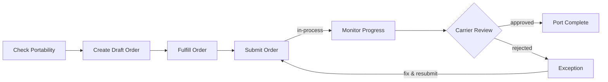

# Getting started with port-in orders

Transfer your existing phone numbers to Telnyx by creating and submitting port-in orders

## Overview

Port-in orders allow you to transfer existing phone numbers from another carrier to Telnyx. The porting process involves creating a draft order, providing required information and documents, and submitting the order for processing with the losing carrier.

Port orders are processed asynchronously through coordination between Telnyx and the losing carrier. Processing times vary based on carrier, country, and phone number type—ranging from same-day for FastPort-eligible numbers to several weeks for international ports.

For general information about the porting process, timelines, and international requirements, see the [porting support articles](https://support.telnyx.com/en/collections/133126-porting-articles-and-guides).

## Constraints

* Phone numbers must pass a portability check before creating a port order. Non-portable numbers will result in API errors.
* Port orders may be automatically split into multiple orders based on country, number type, SPID (for US/CA), and FastPort eligibility.
* Each split order must be updated and submitted independently.
* A Letter of Authorization (LOA) and recent invoice are required for most port orders.
* Requested FOC dates are not guaranteed—the losing carrier determines the actual activation date.

## Order splitting

When you create a port order with multiple phone numbers, the API may split them into separate orders. Numbers are grouped based on:

* **Country**: Numbers from different countries are split into separate orders.
* **Number type**: Local, toll-free, and mobile numbers are processed separately.
* **SPID**: For US and CA numbers, numbers with different Service Provider IDs are split.
* **FastPort eligibility**: FastPort-eligible numbers are separated from standard port orders.

If your order is split, the API returns multiple port order IDs. You must complete and submit each order individually.

## How it works

### Step 1: Check portability

Use the [Portability check endpoint](https://developers.telnyx.com/api-reference/phone-number-porting/run-a-portability-check) to verify your numbers can be ported to Telnyx before creating an order. Phone numbers must be submitted in E.164 format.

The response indicates whether each number is `portable` and includes additional details like `fast_portable` eligibility and `messaging_capable` status. If a number is not portable, the `not_portable_reason` field explains why.

### Step 2: Create a draft port order

Use the [Create porting order endpoint](https://developers.telnyx.com/api-reference/porting-orders/create-a-porting-order) to create a draft order with your phone numbers.

The API validates the numbers and may split them into multiple orders. Each order is created in `draft` status, allowing you to add required information before submission.

### Step 3: Fulfill the porting order

Use the [Edit porting order endpoint](https://developers.telnyx.com/api-reference/porting-orders/edit-a-porting-order) to provide the required information:

* **End user information**: The name and account details of the current account holder with the losing carrier.
* **Service address**: The address associated with the phone numbers being ported.
* **Regulatory requirements**: Documents and information required for the port, such as a Letter of Authorization (LOA) and recent invoice. See the [port-in requirements guide](https://developers.telnyx.com/docs/numbers/porting/port-in-requirements) for details.
* **Phone number configuration**: Optionally assign a `connection_id`, `messaging_profile_id`, or `emergency_address_id` to apply settings to all ported numbers.
* **FOC date**: Select your requested firm order commitment (FOC) date—the date your numbers will port to Telnyx. See the [allowed FOC dates guide](https://developers.telnyx.com/docs/numbers/porting/allowed-foc-dates) for details on retrieving available windows and setting your preferred date.

### Step 4: Submit the port order

Use the [Submit porting order endpoint](https://developers.telnyx.com/api-reference/porting-orders/submit-a-porting-order) to submit your order.

The order transitions from `draft` to `in-process` status. Telnyx validates the submission and coordinates with the losing carrier to complete the port.

### Step 5: Monitor order progress

Track your order status using the [Retrieve porting order endpoint](https://developers.telnyx.com/api-reference/porting-orders/retrieve-a-porting-order) or configure webhooks to receive status change notifications.

If the order enters `exception` status, check the order comments for details about the rejection. Update the required information and resubmit.

## Notifications

Configure webhooks to receive real-time updates about your port orders. The `porting_order.status_changed` event fires whenever an order transitions to a new status.

For more information about configuring notifications and viewing event history, see the [port-in notifications guide](https://developers.telnyx.com/docs/numbers/porting/port-in-notifications) and [port-in events guide](https://developers.telnyx.com/docs/numbers/porting/port-in-events).

## Comments

Comments allow you to communicate directly with Telnyx Porting Operations during the porting process. Use the [Create comment endpoint](https://developers.telnyx.com/api-reference/porting-orders/create-a-comment-for-a-porting-order) to send messages or respond to requests from the porting team.

Monitor your port orders for new comments using the [List comments endpoint](https://developers.telnyx.com/api-reference/porting-orders/list-all-comments-of-a-porting-order). Porting Operations may add comments to request additional information or provide updates about your order. Subscribe to the `porting_order.new_comment` webhook event to receive notifications when new comments are added.

## Additional resources

* [Port-in requirements](https://developers.telnyx.com/docs/numbers/porting/port-in-requirements) - View and fulfill regulatory requirements on your port orders.
* [Allowed FOC dates](https://developers.telnyx.com/docs/numbers/porting/allowed-foc-dates) - Request and set a specific date for your port order to complete.
* [On-demand activations](https://developers.telnyx.com/docs/numbers/porting/on-demand-activations) - Take control of your port order with FastPort on-demand activations.
* [Cancel port order](https://developers.telnyx.com/docs/numbers/porting/cancel-port-order) - Cancel a port order before it completes.

## Related Pages

- [Getting Started with Video](../runbooks/getting-started-with-video.md)
- [Getting Started with 10DLC](../tutorial/getting-started-with-10dlc.md)
- [Getting Started with iOS Client SDK](../runbooks/getting-started-with-ios-client-sdk.md)
- [Bundles with porting orders](../runbooks/bundles-with-porting-orders.md)
- [Getting Started with Android Client SDK](../runbooks/getting-started-with-android-client-sdk.md)
